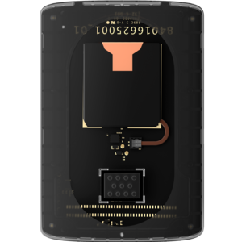

# Examples: Battery Personality Card

## Overview {#overview}

The Battery Personality Card provides an example of a Moto Mod™ with a rechargeable battery that serves the purpose of extending the battery life of a Moto Z smartphone.

This example card includes a 300 mAh Lithium Ion battery along with fuel gauge (MAX17050 [ModelGauge m3 Fuel Gauge](https://www.maximintegrated.com/en/products/power/battery-management/MAX17050.html)) and battery charger ([BQ25896](http://www.ti.com/product/BQ25896)) ICs. The battery can power the Reference Moto Mod and/or charge an attached Moto Z. This battery can only be charged by external charging sources connected to the Moto Z. The Reference Moto Mod USB connectors cannot be used to charge the battery in the card.

The Reference Moto Mod battery is not used and is not charged when the Battery Personality Card is used.



## Before you begin... {#before-you-begin}

#### Required Hardware {#required-hardware}

This app and example requires a **Moto Z**, **Reference Moto Mod**, and a **Battery Personality Card**. To get started, you'll need to buy the required hardware.

#### Software and Tools {#software-and-tools}

See the [Build > Tools](../tools/index.md) section to set up your development environment and learn about building from source, flashing firmware, and how to debug & log.

#### Download Example Source Code {#download-example-source-code}

- **Open source application code** for the MDK Battery App is available at <https://github.com/jksim/mdkbattery>.
- **Open source firmware code** for this example is located at <https://github.com/jksim/nuttx> - specifically:
  - Build Target: <https://github.com/jksim/nuttx/tree/master/nuttx/configs/hdk/muc/battery>
  - Source Directory: <https://github.com/jksim/nuttx/tree/master/nuttx/configs/hdk/muc/src>

#### Download Schematics & More {#download-schematics-more}

We also provide schematics, layouts, BOMs, and CAD files for this example. See the [Downloads](#downloads) section at the end of this page.

#### ‘MDK Battery’ App {#-mdk-battery-app}

MDK Battery is a simple app that shows charge level and status of your Moto Z and the Battery Personality card attached to your Reference Moto Mod. It provides an end-to-end example for how to interface with a Moto Mod that contains a battery.

The MDK Battery App will only work on Moto Z devices.

- [MDK Battery app (archived APK)](../../assets/apks/mdkbattery.apk)
- [MDK Battery app on Lenovo App Store](http://www.lenovomm.com/appdetail/com.motomodsdev.mdkbattery/0)

For more details, see the [Moto Mods Android Application](#application) section further down this page.

#### Community and Support {#community-and-support}

Ask questions, engage with the developer community, and get support for this example in the [Moto Mods group at element14.com](https://www.element14.com/community/groups/moto-mods). Also check out our [Support](../../support/index.md) page.

## Electrical Details {#electrical}

#### Block Diagram

[DIAGRAM GOES HERE]

#### Pin Connection Table {#pin-connection-table}

[TABLE GOES HERE]

#### Schematic & Layout {#schematic-layout}

See the [Downloads](#downloads) section at the end of this page for the schematic, layout and more.

#### Battery Specifications {#battery-specifications}

- Capacity: **300 mAh**
- Charge Termination Current: **15.5 mA**

[TABLE GOES HERE]

## Hardware Setup {#hardware}

To use the Battery Personality Card, first detach the Reference Moto Mod from the Moto Z. Locate [dip switch B3](../mdk-user-guide/reference-moto-mod.md#overview) on the Mod and turn it on to to enable using battery from the example card, then insert the card into the Mod following [these instructions](../mdk-user-guide/reference-moto-mod.md#example-personality-cards). The Reference Moto Mod can be attached back to the Moto Z after that.

## Firmware Development {#firmware}

Follow [these instructions](../tools/index.md) to setup your development environment and download source code if it has not been done already.

The Moto Mods base firmware has a target for the Battery Personality Card. The information below details the steps to create firmware for the Battery Personality Card as if this support did not exist and needed to be added.

#### New Build Target {#new-build-target}

Create a new build target for the Battery Personality Card using hdk/muc/base_unpowered target as the base.

```console
$ cd $BUILD_TOP/nuttx/nuttx/configs/hdk/muc
$ mkdir example-battery
$ cp base_unpowered/* example-battery/
```

Switch to using the new build target.

```console
$ cd $BUILD_TOP/nuttx/nuttx/tools
$ ./configure.sh hdk/muc/example-battery
```

The new target does not support required functionality yet. The [Battery](../../explore/firmware/battery.md) and [Power Transfer](../../explore/firmware/power-transfer.md) protocols need to be added to support necessary functionality.

#### Battery Protocol {#battery-protocol}

##### Files {#files}

- `nuttx/drivers/greybus/battery.c` - battery protocol

##### Configuration Changes {#configuration-changes}

Set the configuration options to enable battery protocol.

```console
$ cd $BUILD_TOP/nuttx/nuttx
$ make menuconfig
```
```
Device Drivers  --->  
[*] Greybus support  --->
[*]   Battery support
```

#### Battery Protocol Device Drivers {#battery-protocol-device-drivers}

The [Battery Transfer Protocol](../../explore/firmware/battery.md) uses a hardware specific device driver to report battery state information. The Battery Personality Card has a [MAX17050 fuel gauge IC](https://www.maximintegrated.com/en/products/power/battery-management/MAX17050.html). The Moto Mod Micro Controller (MuC) communicates with the fuel gauge over I2C bus and the fuel gauge interrupt line is connected to the MuC general purpose input/output pin (GPIO).

The MAX17050 IC operates when battery voltage is above 2.5V and requires initialization with the battery specific profile after power-on reset (POR). [The MuC has a dual power source](../../explore/firmware/power-transfer.md) and can run while the battery on the Personality Card is completely depleted. The MAX17050 IC does not have means to notify the MuC when it goes through the POR, so the MuC uses its voltage comparator to detect when battery voltage raises above the fuel gauge POR threshold.

The fuel gauge approximates battery temperature based on the battery thermistor voltage. This approximation is not sufficiently accurate, hence a lookup table to convert fuel gauge battery temperature readings needs to be used.

The baseline code has all the device drivers needed by the Battery Protocol.

##### Files

- `nuttx/include/nuttx/device_battery.h` - battery protocol device driver interface
- `nuttx/include/nuttx/device_battery_good.h` - device driver to detect fuel gauge POR interface
- `nuttx/include/nuttx/power/battery.h` - standard Nuttx battery driver framework interface
- `nuttx/configs/hdk/muc/src/stm32_battery.c` - battery protocol device driver that reads data from a Nuttx battery driver
- `nuttx/configs/hdk/muc/src/stm32_battery_good.c` - battery voltage comparator driver
- `nuttx/configs/hdk/muc/src/stm32_thermistor.c` - lookup table to convert fuel gauge battery temperature to actual
- `nuttx/drivers/power/max17050.c` - fuel gauge driver that implements standard Nuttx battery driver framework interface
- `nuttx/drivers/power/max17050_sample_cfg.c` - battery profile for the WX30 battery

[INSERT DIAGRAM]

##### Configuration Changes

Set the configuration options to enable battery framework, I2C and comparator support along with the rest of low level device drivers.

```console
$ cd $BUILD_TOP/nuttx/nuttx
$ make menuconfig
```
```
System Type  --->
STM32 Peripheral Support  --->
[*] COMP
[*] I2C2

I2C Configuration  --->
[ ] Alternate I2C implementation
[*] Use dynamic timeouts
(500) Timeout Microseconds per Byte
(500) Timeout for Start/Stop (Milliseconds)
(0) Timeout seconds
[ ] Frequency with Tlow/Thigh = 16/9

Device Drivers  --->  
[*] Power Management Support  --->
[*]   Battery support
[*]   MAX17050 battery fuel gauge support
[ ]    Sense resistor is connected in reverse to the IC inputs
[*]     Accurate temperature from thermistor
[ ]     Correct inaccurate metering caused by wrong sense traces
Select Battery Specific Configuration (Sample configuration)

Board Selection  --->
[*] MAX17050 battery device
[*] Battery good detection with voltage comparator
```

Modify IS_BATT_PCARD macro in nuttx/configs/hdk/muc/include/mods.h to indicate that the Battery Personality Card is used.

```
- #define IS_BATT_PCARD   ((CONFIG_ARCH_BOARDID_PID & 0x0000FF00) == 0x00000800)
+#define IS_BATT_PCARD            (1)
```

##### Driver and Device Initialization {#driver-and-device-initialization}

Device drivers are initialized in nuttx/configs/hdk/muc/src/stm32_boot.c. The GPIOs and resources for battery voltage comparator driver are defined in nuttx/configs/hdk/muc/include/mods.h

**Fuel Gauge Driver**

```c
#if IS_BATT_PCARD
# define GPIO_MODS_CC_ALERT      CALC_GPIO_NUM('G', 12)
#else
# define GPIO_MODS_CC_ALERT      CALC_GPIO_NUM('B',  1)
#endif
```
```c
#ifdef CONFIG_BATTERY_MAX17050
# if IS_BATT_PCARD
#  define MAX17050_I2C_BUS          2
# else
#  define MAX17050_I2C_BUS          3
# endif
# define MAX17050_I2C_FREQ         400000
#endif
```

The board_initialize() function.

```c
#ifdef CONFIG_BATTERY_MAX17050
   struct i2c_dev_s *i2c = up_i2cinitialize(MAX17050_I2C_BUS);
   if (i2c) {
      g_battery = max17050_initialize(i2c, MAX17050_I2C_FREQ,
                  GPIO_MODS_CC_ALERT);
      if (!g_battery) {
         up_i2cuninitialize(i2c);
      }
   }
#endif
```

**Battery Protocol Device and Driver**

Entry in the devices[] array.

```c
#ifdef CONFIG_MAX17050_DEVICE
    {
        .type = DEVICE_TYPE_BATTERY_DEVICE,
        .name = "max17050_battery",
        .desc = "MAX17050 Battery Driver",
        .id   = 0,
    },
#endif
```

Part of the board_initialize() function.

```c
#ifdef CONFIG_MAX17050_DEVICE
  extern struct device_driver batt_driver;
  device_register_driver(&batt_driver);
#endif
```

**Battery Voltage Comparator Device and Driver**

```c
/* Battery voltage comparator */
#if IS_BATT_PCARD
# define BATT_COMP                            STM32_COMP1                           /* Comparator */
# define BATT_COMP_INP           STM32_COMP_INP_PIN_2     /* Input plus */
#else
# define BATT_COMP                            STM32_COMP2                           /* Comparator */
# define BATT_COMP_INP           STM32_COMP_INP_PIN_1     /* Input plus */
#endif
#define BATT_COMP_INM            STM32_COMP_INM_VREF     /* Input minus */
#define BATT_COMP_HYST           STM32_COMP_HYST_HIGH    /* Hysteresis */
#define BATT_COMP_SPEED          STM32_COMP_SPEED_LOW    /* Speed */
#define BATT_COMP_INV            false                                            /* Output not inverted */
```

Entry in the devices[] array.

```c
#ifdef CONFIG_BATTERY_GOOD_DEVICE_COMP
    {
        .type = DEVICE_TYPE_BATTERY_GOOD_HW,
        .name = "comp_batt_good",
        .desc = "Battery good detection with voltage comparator",
        .id   = 0,
    },
#endif
```

Part of the board_initialize() function.

```c
#ifdef CONFIG_BATTERY_GOOD_DEVICE_COMP
  extern struct device_driver comp_batt_good_driver;
  device_register_driver(&comp_batt_good_driver);
#endif
```

#### Power Transfer Protocol {#power-transfer-protocol}

##### Files

- `nuttx/drivers/greybus/ptp.c` - power transfer protocol

##### Configuration Changes

Set the configuration options to enable power transfer protocol define appropriate power transfer capabilities for this example.

```console
$ cd $BUILD_TOP/nuttx/nuttx
$ make menuconfig
```
```
Device Drivers  --->  
[*] Greybus support  --->
          [*]   Power transfer support                                                     
                         Select Internal Source Send Power Capabilities (Sent with no restrictions)
                      Select Internal Source Receive Power Capabilities (Received after Handset)
                          Select External Power Sources Capabilities (Not supported)
```

#### Power Transfer Protocol Device Drivers {#power-transfer-protocol-device-drivers}

The [Power Transfer Protocol](../../explore/firmware/power-transfer.md) uses a device driver to control the transfer of charge between the battery on the Personality Card and Moto Z. The baseline has a hardware independent driver that controls battery charging and discharging based on the battery state and power transfer commands issued by Moto Z. The driver in turn uses hardware specific device drivers to establish a power path and control battery charger IC.

The Battery Personality Card has a [BQ25896 battery charger IC](http://www.ti.com/product/BQ25896). The MuC communicates with the battery charger over I2C bus and the battery charger interrupt and charge enable lines are connected to the MuC GPIOs.

The baseline has a hardware independent battery state notifier that uses hardware specific device drivers to monitor battery temperature and level. The abovementioned [MAX17050 fuel gauge IC](https://www.maximintegrated.com/en/products/power/battery-management/MAX17050.html) is used to monitor the battery.

The baseline code has all the device drivers needed for this example card.

##### Files

- `nuttx/drivers/power/battery_level.h` - battery level monitor interface
- `nuttx/drivers/power/battery_temp.h` - battery temperature monitor interface
- `nuttx/include/nuttx/device_battery_level.h` - battery level monitor device driver interface
- `nuttx/include/nuttx/device_battery_temp.h` - battery temperature monitor device driver interface
- `nuttx/include/nuttx/device_charger.h` - battery charger device driver interface
- `nuttx/include/nuttx/device_ptp.h` - power transfer protocol device driver interface
- `nuttx/include/nuttx/device_ptp_chg.h` - power path controller device driver interface
- `nuttx/include/nuttx/power/battery_state.h` - battery state notifier interface
- `nuttx/include/nuttx/power/bq25896.h` - bq25896 charger IC base driver interface
- `nuttx/drivers/greybus/mods/mods-ptp.c` - hardware independent power transfer protocol device driver
- `nuttx/drivers/greybus/mods/switch-ptp-chg.c` - power path controller device driver
- `nuttx/drivers/power/battery_level.c` - battery level monitor
- `nuttx/drivers/power/battery_state.c` - battery state notifier
- `nuttx/drivers/power/battery_temp.c` - battery temperature monitor
- `nuttx/drivers/power/bq25896.c` - base driver that provides access to device registers
- `nuttx/drivers/power/bq25896_charger.c` - battery charger device driver
- `nuttx/drivers/power/max17050.c` - device drivers for battery temperature and level monitors

[INSERT DIAGRAM]

##### Configuration Changes

Set the configuration options to enable the power transfer protocol device driver and battery state notifier along with the rest of low level device drivers. Set battery charging and monitoring thresholds in accordance with the battery specifications.

```console
$ cd $BUILD_TOP/nuttx/nuttx
$ make menuconfig
```
```
Device Drivers  --->
[*] Greybus support  --->
[*]   Mods Protocol  --->
[*]   PTP device to be used for charger and/or battery devices
[*]     PTP device has a battery  --->
(300)    Quick charging current limit in mA
(4350)    Full charging voltage limit in mV
(300)    Restricted charging current limit in mA
(4200)    Restricted charging voltage limit in mV
(300)    Slow charging current limit in mA
(4500)    Input voltage limit in mV
(500)    Maximum output current from normal battery in mA
(300)    Maximum output current from low battery in mA
[*]   PTP charger driver controlling power path through switches

[*] Power Management Support  --->
[*]   TI bq25896 charger support  --->
--- TI bq25896 charger support
      (2)   BQ25896 I2C Bus Number
(400000) BQ25896 I2C Bus Speed
[*]   Charger device driver  --->
--- Charger device driver
Select Boost Mode Current Limit (500 mA) 

-*-   Battery level and temp notifier
[*]     Battery temp monitor  --->
--- Battery temp monitor                    
(-20)    Cold temp (deg C)
(0)    Cool temp (deg C)
(45)    Warm temp (deg C)
(60)    Hot temp (deg C)
(70)    Cool down temp (deg C)
(2)    Temp hysteresis (deg C)
Select low level driver (Use MAX17050)

[*]     Battery level monitor  --->
--- Battery level monitor
(20)  Low battery capacity threshold (%)
(1)   Hysteresis to transition from Empty to Low (%)
(1)   Hysteresis to transition from Low to Normal (%)
(1)   Hysteresis to transition from Full to Normal (%) 
      Select low level driver (Use MAX17050)
Use MAX17050
      (99)      Min voltage based battery capacity to detect end of charging (%)
(16)      Max charge current to detect end of charging (mA)
(5)       Min charge current to detect end of charging (mA)
(3000)    Battery voltage threshold to detect empty battery (mV)
```

##### Driver and Device Initialization

Device drivers are initialized in nuttx/configs/hdk/muc/src/stm32_boot.c. The GPIOs are defined in nuttx/configs/hdk/muc/include/mods.h

**Power Transfer Protocol Device and Driver**

Entry in the devices[] array.

```c
#ifdef CONFIG_GREYBUS_MODS_PTP_DEVICE
    {
        .type = DEVICE_TYPE_PTP_HW,
        .name = "mods_ptp",
        .desc = "Power transfer protocol for devices",
        .id   = 0,
    },
#endif
```

Part of the board_initialize() function.

```c
#ifdef CONFIG_GREYBUS_MODS_PTP_DEVICE
  extern struct device_driver mods_ptp_driver;
  device_register_driver(&mods_ptp_driver);
#endif
```

**Power Path Controller Device and Driver**

```c
#if defined (CONFIG_GREYBUS_MODS_PTP_CHG_DEVICE_SWITCH) && defined (CONFIG_GREYBUS_PTP_EXT_SUPPORTED)
static struct device_resource switch_ptp_chg_resources[] = {
    {
       .name   = "base_path",
       .type   = DEVICE_RESOURCE_TYPE_GPIO,
       .start  = GPIO_MODS_CHG_VINA_EN,
       .count  = 1,
    },
    {
       .name   = "wrd_path",
       .type   = DEVICE_RESOURCE_TYPE_GPIO,
       .start  = GPIO_MODS_CHG_VINB_EN,
       .count  = 1,
    },
};

struct ptp_chg_init_data switch_ptp_chg_init_data = {
       .wls_active_low = false,
       .wrd_active_low = false,
       .base_active_low = false,
};
#endif
```

Entry in the devices[] array.

```c
#ifdef CONFIG_GREYBUS_MODS_PTP_CHG_DEVICE_SWITCH
    {
        .type = DEVICE_TYPE_PTP_CHG_HW,
        .name = "switch_ptp_chg",
        .desc = "Charger driver with switches for power transfer protocol",
        .id   = 0,
#ifdef CONFIG_GREYBUS_PTP_EXT_SUPPORTED
        .resources      = switch_ptp_chg_resources,
        .resource_count = ARRAY_SIZE(switch_ptp_chg_resources),
        .init_data = &switch_ptp_chg_init_data,
#endif
    },
#endif
```

Part of the board_initialize() function.

```c
#ifdef CONFIG_GREYBUS_MODS_PTP_CHG_DEVICE_SWITCH
  extern struct device_driver switch_ptp_chg_driver;
  device_register_driver(&switch_ptp_chg_driver);
#endif
```

**Battery Charger Device and Driver**

```c
#if IS_BATT_PCARD
# define GPIO_MODS_CHG_INT_N     CALC_GPIO_NUM('C',  7)
# define GPIO_MODS_CHG_EN        GPIO_MODS_DEMO_ENABLE
#else
# define GPIO_MODS_CHG_INT_N     CALC_GPIO_NUM('C',  4)
# define GPIO_MODS_CHG_EN        CALC_GPIO_NUM('D',  4)
#endif
```
```c
#ifdef CONFIG_CHARGER_DEVICE_BQ25896
static struct device_resource bq25896_charger_resources[] = {
    {
       .name   = "int_n",
       .type   = DEVICE_RESOURCE_TYPE_GPIO,
       .start  = GPIO_MODS_CHG_INT_N,
       .count  = 1,
    },
    {
       .name   = "chg_en",
       .type   = DEVICE_RESOURCE_TYPE_GPIO,
       .start  = GPIO_MODS_CHG_EN,
       .count  = 1,
    },
};

static struct bq25896_reg bq25896_regs[] = {
    { BQ25896_REG02, BQ25896_REG02_ICO_MASK,        BQ25896_REG02_ICO_DIS        },
    { BQ25896_REG05, BQ25896_REG05_IPRECHG_MASK,    BQ25896_REG05_IPRECHG_64MA   },
    { BQ25896_REG06, BQ25896_REG06_BATLOWV_MASK,    BQ25896_REG06_BATLOWV_2800MV },
    { BQ25896_REG07, BQ25896_REG07_WATCHDOG_MASK | BQ25896_REG07_TERM_MASK,
                     BQ25896_REG07_WATCHDOG_DIS  | BQ25896_REG07_TERM_DIS        },
};

struct bq25896_config bq25896_charger_init_data = {
    .reg        = bq25896_regs,
    .reg_num    = sizeof(bq25896_regs) / sizeof(struct bq25896_reg),
};
#endif
```

Entry in the devices[] array.

```c
#ifdef CONFIG_CHARGER_DEVICE_BQ25896
    {
        .type = DEVICE_TYPE_CHARGER_HW,
        .name = "bq25896_charger",
        .desc = "Charger driver for TI bq25896 IC",
        .id   = 0,
        .resources      = bq25896_charger_resources,
        .resource_count = ARRAY_SIZE(bq25896_charger_resources),
        .init_data      = &bq25896_charger_init_data,
    },
#endif
```

Part of the board_initialize() function.

```c
#ifdef CONFIG_CHARGER_DEVICE_BQ25896
  extern struct device_driver bq25896_charger_driver;
  device_register_driver(&bq25896_charger_driver);
#endif
```

**Battery State Notifier**

Part of the board_initialize() function.

```c
# if defined(CONFIG_BATTERY_STATE)
   /* Must be initialized after MAX17050 core driver has been initialized */
   battery_state_init();
# endif
```

**Battery Temperature Monitoring Device and Driver**

Entry in the devices[] array.

```c
#ifdef CONFIG_BATTERY_TEMP_DEVICE_MAX17050
    {
        .type = DEVICE_TYPE_BATTERY_TEMP_HW,
        .name = "max17050_battery_temp",
        .desc = "Battery temperature monitoring with MAX17050",
        .id   = 0,
    },
#endif
```

Part of the board_initialize() function.

```c
#ifdef CONFIG_BATTERY_TEMP_DEVICE_MAX17050
  extern struct device_driver max17050_battery_temp_driver;
  device_register_driver(&max17050_battery_temp_driver);
#endif
```

**Battery Level Monitoring Device and Driver**

Entry in the devices[] array.

```c
#ifdef CONFIG_BATTERY_LEVEL_DEVICE_MAX17050
    {
        .type = DEVICE_TYPE_BATTERY_LEVEL_HW,
        .name = "max17050_battery_level",
        .desc = "Battery level monitoring with MAX17050",
        .id   = 0,
    },
#endif
```

Part of the board_initialize() function.

```c
#ifdef CONFIG_BATTERY_LEVEL_DEVICE_MAX17050
  extern struct device_driver max17050_battery_level_driver;
  device_register_driver(&max17050_battery_level_driver);
#endif
```

#### State of Charge LEDs {#state-of-charge-leds}

The Reference Moto Mod has Red and Green LEDs and the baseline has a driver that uses them to indicate battery state of charge (SOC).

##### Files

- `nuttx/configs/hdk/muc/src/stm32_battery_indicator.c` - red and green LEDs driver to show battery SOC level

##### Configuration Changes

Set the configuration options to use LEDs to show battery SOC level.

```console
$ cd $BUILD_TOP/nuttx/nuttx
$ make menuconfig
```
```
Board Selection  --->
*** Common Board Options *** 
[*] Board button support
[*] Button interrupt support
```

#### Hardware Manifest {#hardware-manifest}

##### New Manifest {#new-manifest}

Create hardware manifest for the Battery Personality Card using apps/greybus-utils/manifests/hdk.mnfs as the base.

```console
$ cd $BUILD_TOP/nuttx/apps/greybus-utils/manifests
$ cp hdk.mnfs battery-example.mnfs
```

Edit the battery-example.mnfs file to change the interface string and add Battery and Power Transfer Interfaces and Bundle.

```ini
[string-descriptor 2]
-string = MDK-MHB
+string = BATTERY-EXAMPLE
```
```ini
; Battery on CPort 2
[cport-descriptor 2]
bundle = 2
protocol = 0x08

; PTP on CPort 3
[cport-descriptor 3]
bundle = 2
protocol = 0xef

; Battery related Bundle 2
[bundle-descriptor 2]
class = 0x08
```

##### Setting the Manifest {#setting-the-manifest}

Set the configuration options to use the newly created manifest.

```console
$ cd $BUILD_TOP/nuttx/nuttx
$ make menuconfig
```
```
Application Configuration  --->
-*- Greybus utility  --->
Select a predefined Manifest (Custom manifest)       
(hdk-battery) manifest name
```

#### Building and Flashing Firmware {#building-and-flashing-firmware}

The new target supports all required functionality now. The firmware can be built and flashed into the Reference Moto Mod. Make sure that the Moto Mod is running in development mode as per [these instructions](index.md) or build and flash the development bootloader yourself as [documented here](../tools/build-from-source.md).

## Moto Mods Android Application {#application}

#### ‘MDK Battery’ App

MDK Battery is a simple app that shows charge level and status of your Moto Z and the Battery Personality card attached to your Reference Moto Mod. It provides an end-to-end example for how to interface with a Moto Mod that contains a battery.

The MDK Battery App will only work on Moto Z devices.

- [MDK Battery app (archived APK)](../../assets/apks/mdkbattery.apk)
- [MDK Battery app on Lenovo App Store](http://www.lenovomm.com/appdetail/com.motomodsdev.mdkbattery/0)

#### Battery card sample APK {#battery-card-sample-apk}

The Moto Battery card sample APK is an open source project, works as a downloadable Android app, to show the capability of Battery personality card.

#### Install APK {#install-apk}

Download and install the Battery card sample APK - see [MDK Battery app (archived APK)](../../assets/apks/mdkbattery.apk)

#### Source code {#source-code}

The source code of the MDK Battery APK is published at <https://github.com/jksim/mdkbattery>.

To build the sample APK from source code, please [download and install Android Studio from Android Developer Site](http://developer.android.com/sdk/index.html), then import the [mdkbattery](https://github.com/jksim/mdkbattery) project into Android Studio. See [Developer Tools: Setup Your Development Environment](../tools/setup-environment.md) for more info.

#### Reference for ModManager interface & query Mod statues: {#reference-for-modmanager-interface-query-mod-statues-}

See [Hello World! documentation](hello-world.md#reference) for implementation of MotoMods interface creation and query.

#### Reference for Query Mod Battery: {#reference-for-query-mod-battery-}

```java
/** Get the ModBattery interface */
modBattery = modManager.getClassManager(ModBattery.class);
if (null == modBattery) {
   Log.e(Constants.TAG, "Failed to get ModBattery");
   return;
}

/**
* Get the mod battery data.
* Care IllegalStateException exception in case mod is removed or invalid during query.
*/
try {
   modUsageType = modBattery.getIntProperty(ModBattery.BATTERY_USAGE_TYPE);
   modEfficiency = modBattery.getIntProperty(ModBattery.BATTERY_EFFICIENCY_MODE);

   mod.rechargeStart = modBattery.getIntProperty(ModBattery.BATTERY_RECHARGE_START_SOC);
   mod.rechargeStop = modBattery.getIntProperty(ModBattery.BATTERY_RECHARGE_STOP_SOC);

   mod.level = modBattery.getBatteryLevel(intent);
   mod.status = modBattery.getBatteryStatus(intent);
   mod.plugged = modBattery.isPlugTypeMod(intent) ? 1 : 0;
   mod.capFull = modBattery.getBatteryCapacity(context);
} catch (IllegalStateException e) {
   e.printStackTrace();
}
```

#### Verify {#verify}

Attach Temperature card to phone, then install and launch Temperature card sample apk

*(Screenshot coming soon...)*

## Downloads {#downloads}

This section contains the downloadable files associated with this example.

Before downloading, please read through the [Moto Mods Development Kit Terms & Conditions](../../legal/mdk-terms-and-conditions.md):
