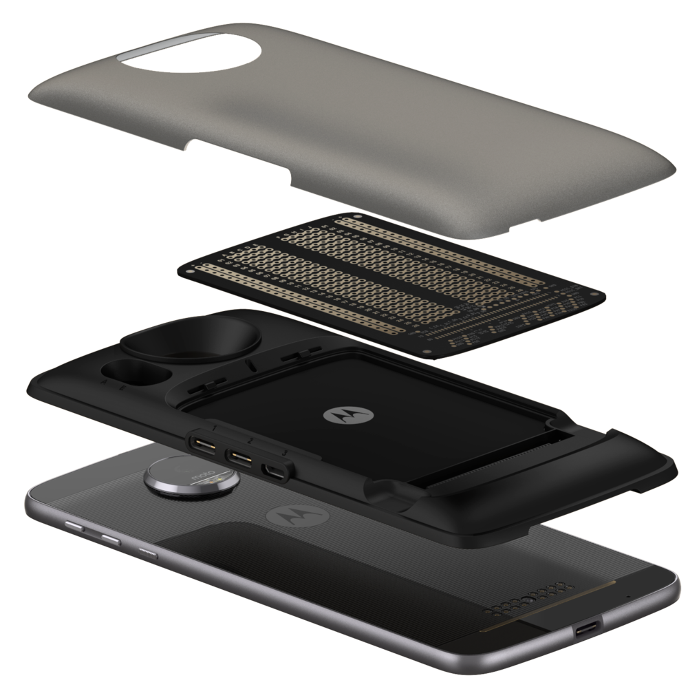
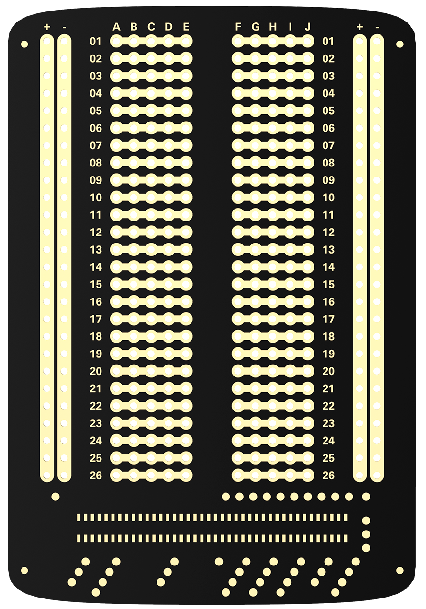
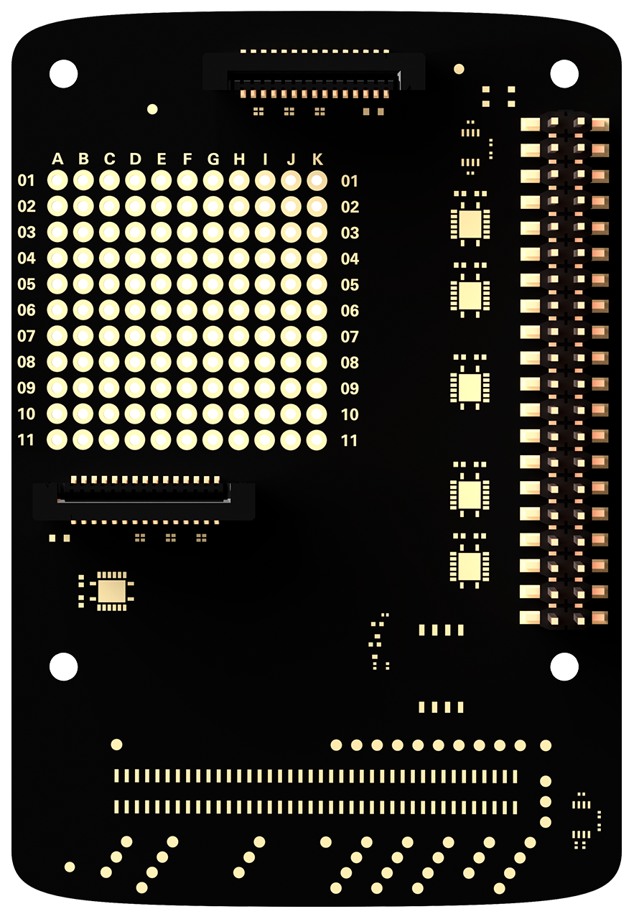
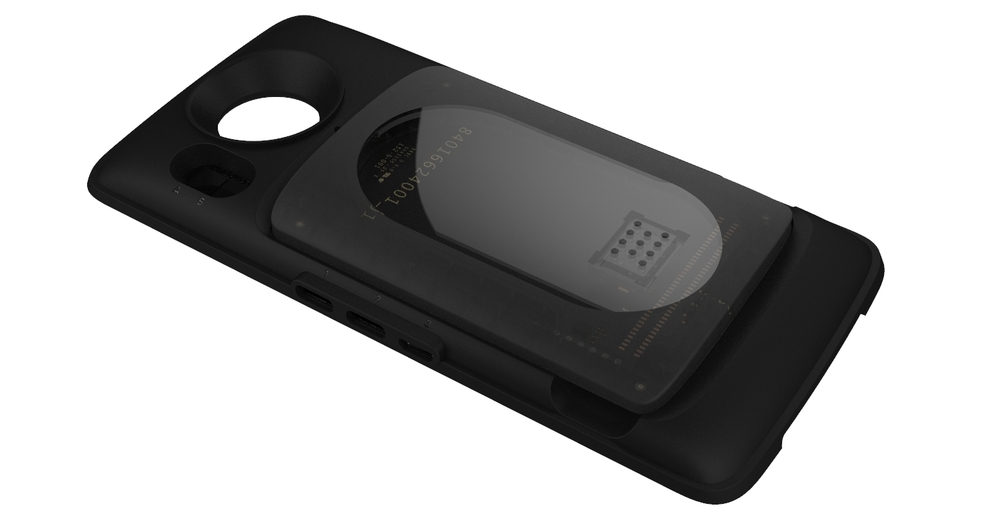
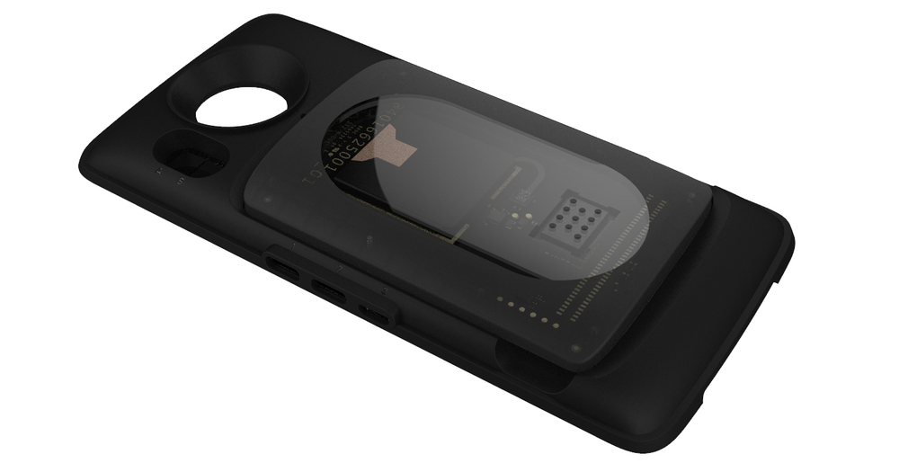
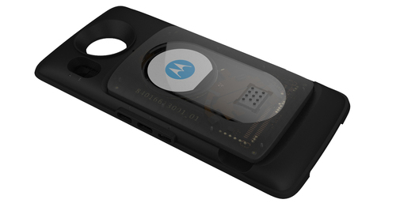
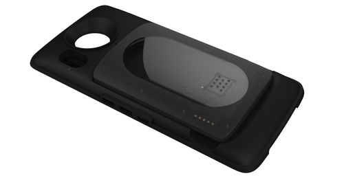

# Build Prototype

## Moto Mods Development Kit

You shouldn’t have to worry about your prototype draining the battery, interfering with the phone’s antenna, or any of the other headaches typical to developing phone hardware.

The MDK was designed to solve this problem by allowing you to focus on getting your idea prototyped as quickly as possible. It includes:

- A [Reference Moto Mod](mdk-user-guide/reference-moto-mod.md) with all core computing function
- A [Perforated Board](mdk-user-guide/perforated-board.md) with 364 solder points
- Rear housing to carry your prototype around

To learn more, visit the [**MDK Architecture Overview**](mdk-user-guide/index.md)

## Getting Started

Simply connect the MDK to your Moto Z and you’ll be able to test out and explore the “Hello, World!” example.  From there you can start developing your own Moto Mod prototype. You can also design and build your own 3D-printed housing to protect your prototype during development.

There are two ways to get started with your prototype with the Reference Moto Mod: the Perforated Board or Pi HAT Adapter Board.

**[Perforated Board](mdk-user-guide/perforated-board.md)**

The [Perforated Board](mdk-user-guide/perforated-board.md) is a blank slate for soldering your own electrical components in place. Perfect for experimentation.

**[HAT Adapter Board](../hardware/hat-adapter-board.md)**

The [HAT Adapter Board](mdk-user-guide/hat-adapter-board.md) allows you to extend the Reference Moto Mod by attaching and use any Raspberry Pi HAT.

## Example Personality Cards

To help you on your way, Motorola has created several Personality Cards that can be inserted into the Reference Moto Mod. These provide end to end working examples of several Moto Mod interfaces for you to reference. Each card demonstrates a different aspect (but not nearly all) of what the platform can do.

**[Temperature Sensor](examples/sensor.md)**

The [Temperature Sensor Personality Card example](examples/sensor.md) shows how you would connect a unique sensor on your device and map that sensor data to a graph in your app UI.

**[Display](examples/display.md)**

**[Battery](examples/battery.md)**

The [Battery Personality Card example](examples/battery.md) shows how you would extend the life of your phone or use it to run your Moto Mod even when it's not attached to a Moto Z.

**[Audio](../hardware/audio-personality-card.md)**

The [Display Personality Card example](examples/display.md) shows how to interface and control a display and backlight.

The [Audio Personality Card example](examples/audio.md) shows how simple it is to add a loudspeaker or other audio device to your project.

**When you decide to take your prototype to market**, contact us through our [Partner page](../partner/certification-program.md) and we’ll show you how.

[**Overview**](mdk-user-guide/index.md)

[**MDK User Guide**](mdk-user-guide/reference-moto-mod.md)

**[Developer Tools](tools/index.md)**

**[Examples](examples/index.md)**
