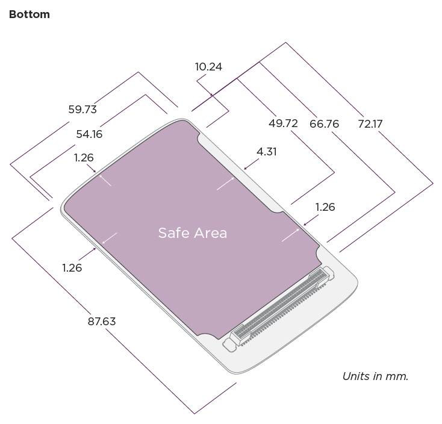
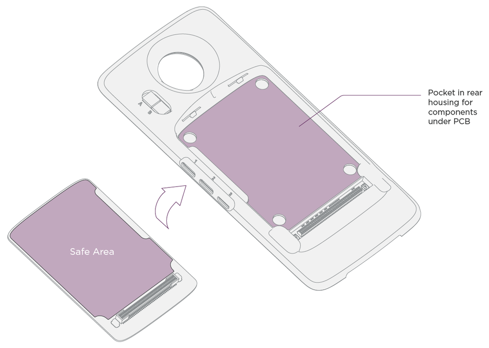
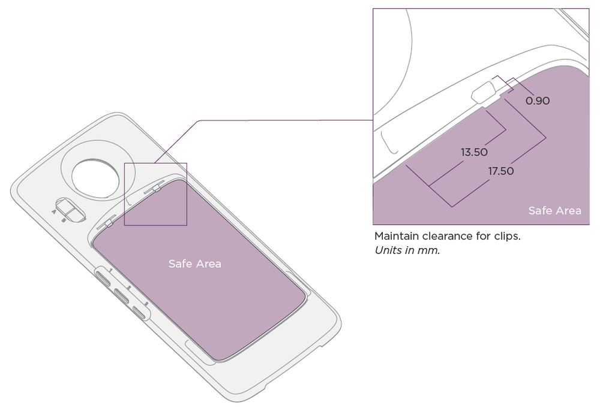
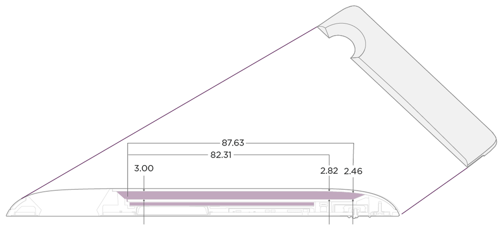
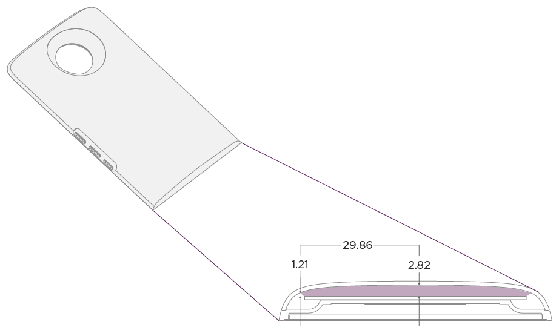

# MDK User Guide: Custom Circuit Board

## Introduction

You can make your own Custom Circuit Board hardware modules to interface with the Reference Moto Mod via the 80-pin board-to-board connector. This page will provide guidelines for making your own.

After prototyping your initial circuit with the Perforated Board, generating a Custom Circuit Board of your own can be a useful interim step in your development process. Not only does it help package and protect your creation, it helps with portability and allows further testing close to final form factor and in real world conditions.

Once you’re confident in your product, Moto can help connect with external design and manufacturing partners to integrate the Reference Moto Mod and your Custom Circuit Board together into your svelte, self-contained Moto Mod to sell.

## Mechanical Details {#mechanical-details}

### Custom Circuit Board Constraints {#custom-circuit-board-constraints}

These constraints are provided to help prevent damage from occurring.

> **NOTE:** All dimensions are in mm.

#### Bottom Side Component Placement and Height Constraints {#bottom-side-component-placement-and-height-constraints}

- **X/Y Constraints**
  - Components can only be placed in the X/Y regions shown below.
- **Z Constraints**
  - Max component heights (Z) must not exceed 1.3 mm (this is a constant height limit across the entire surface).
  - If component heights exceed 1.3 mm, your components may be damaged when inserted.

---

### Top Side Component Placement and Height Constraints {#top-side-component-placement-and-height-constraints}

- **X/Y Constraints**
  - Components can only be placed in the X/Y regions shown below.
  - As the diagram shows, these regions are where the assembly snaps are located (to hold the Circuit Board into the Reference Moto Mod).
- **Z Constraints**
  - If a custom rear cover is used: there are no height restrictions.
  - Otherwise, if the in-box rear cover is used: the maximum component heights will vary between 1.2 mm ~ 3 mm depending on component placement. See diagram below.

#### Diagram of Top Side X/Y Constraints: {#diagram-of-top-side-x-y-constraints-}

#### Diagrams of Top Side Z Height Constraints {#diagrams-of-top-side-z-height-constraints}

> **Note:** The following heights assume you are using the in-box rear cover. If you use your own custom cover (or no cover at all), there are no Z height constraints for the top side.

##### Vertical (X) Cross-section of the Z height limitations, when using in-box rear cover: {#vertical-x-cross-section-of-the-z-height-limitations-when-using-in-box-rear-cover-}

> **Note:** These values represent a chosen cross-section at the center of the device. Values may differ as you move towards to the edge of the device.

---

##### Horizontal (Y) Cross-section of the Z height limitations, when using in-box rear cover: {#horizontal-y-cross-section-of-the-z-height-limitations-when-using-in-box-rear-cover-}

> **Note:** These values represent a chosen cross-section of the device. Values may differ as you move closer to the edge of the device.

[< Previous Page
**HAT Adapter Board**](hat-adapter-board.md)
