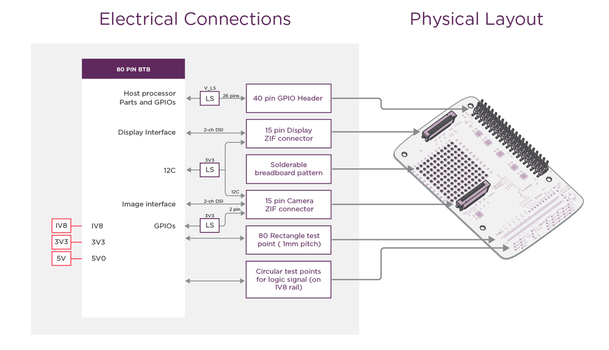
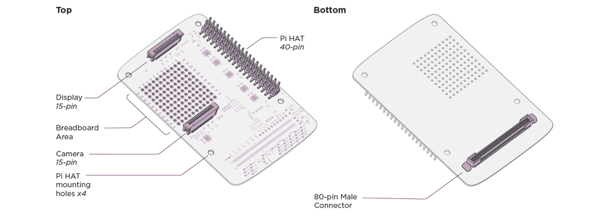
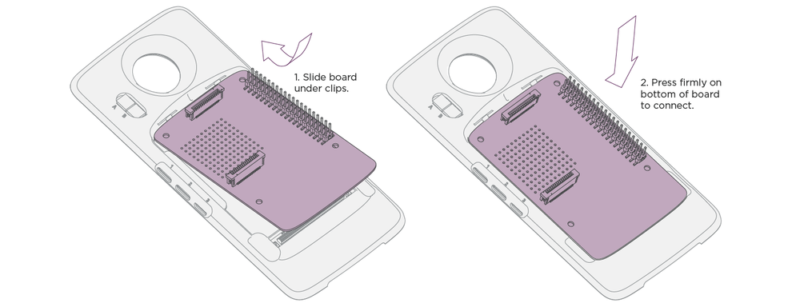
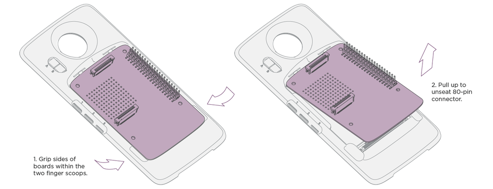
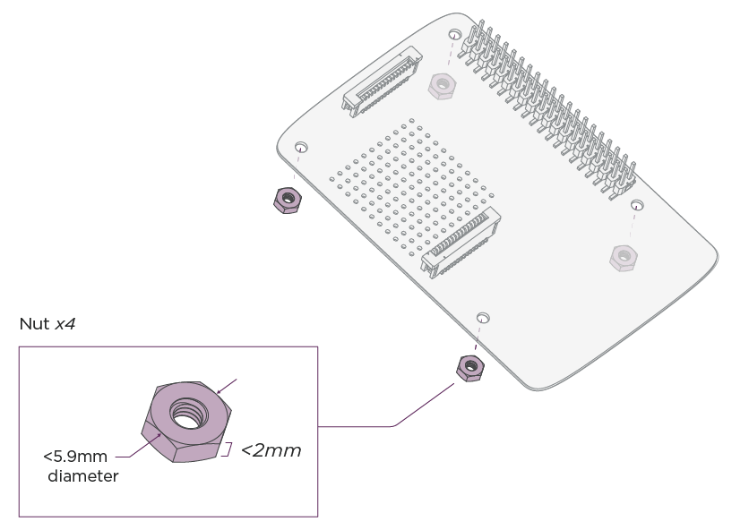

# MDK User Guide: HAT Adapter Board

## Before you begin... {#before-you-begin}

### Required Hardware {#required-hardware}

The HAT Adapter Board requires a [Moto Z](https://jksim.github.io/Moto-Z) and [Reference Moto Mod](../../hardware/mdk.md). If you don't have these, you'll need to buy the required hardware.

## Introduction {#introduction}

The Raspberry Pi ecosystem contains a wide variety of existing HATs (Hardware Attached on Top) that can be used to start your project, or maybe you have an existing Pi project to port to Moto Mods.

The Moto Mods HAT Adapter Board is Raspberry Pi HAT compatible and allows the use of commercially available HATs. It includes the 40-pin Header, Camera, and Display connectors in the proper locations.

*Raspberry Pi is a trademark of the Raspberry Pi Foundation*

## Software Considerations {#software}

When working with the Moto Mods HAT adapter board, existing Pi firmware must be ported to the MuC. For example, drivers written for the Raspian OS based on Debian Linux need to be ported to NuttX. In addition tasks and queues may require redesign to operate in the Moto Mods embedded environment.

## Electrical Details {#electrical}

### Overview {#overview}

This section covers:

- [**Raspberry Pi HAT-compatible 40-pin Header**](#hat-compliant-header)
- [**Camera Connector**](#camera-connector)
- [**Display Connector**](#display-connector)

---

### Raspberry Pi HAT-compliant 40-pin Header {#hat-compliant-header}

#### Raspberry Pi HAT 40-pin Connector Signal Cross-Reference {#raspberry-pi-hat-40-pin-connector-signal-cross-reference}

<table class="pure-table pure-table-bordered">
<thead>
<tr>
<td colspan="2">MotoMods HAT Adaptor 40-pin Name</td>
<td colspan="2">Raspberry Pi 40-pin Name</td>
</tr>
</thead>
<thead>
<tr>
<td>Pin #</td>
<td>Signal (LS: Level Shifted)</td>
<td>Pin #</td>
<td>rPi Equivalent function</td>
</tr>
</thead>
<tr>
<td>2</td>
<td>VIO (Refer to Dip switch position)  
    - off : 3P3 (Default)  
    - on : 1P8</td>
<td>1</td>
<td>3V3 Power</td>
</tr>
<tr>
<td>1</td>
<td>5P0</td>
<td>2</td>
<td>5V Power</td>
</tr>
<tr>
<td>4</td>
<td>PB11_LS</td>
<td>3</td>
<td>GPIO2 (SDA1)</td>
</tr>
<tr>
<td>3</td>
<td>5P0</td>
<td>4</td>
<td>5V Power</td>
</tr>
<tr>
<td>6</td>
<td>PB10_LS</td>
<td>5</td>
<td>GPIO3 (SCL1)</td>
</tr>
<tr>
<td>5</td>
<td>GND</td>
<td>6</td>
<td>Ground</td>
</tr>
<tr>
<td>8</td>
<td>PB2_LS</td>
<td>7</td>
<td>GPIO4 (GPIO_GCLK)</td>
</tr>
<tr>
<td>7</td>
<td>PA2_LS</td>
<td>8</td>
<td>GPIO14 (TXD0)</td>
</tr>
<tr>
<td>10</td>
<td>GND</td>
<td>9</td>
<td>Ground</td>
</tr>
<tr>
<td>9</td>
<td>PA3_LS</td>
<td>10</td>
<td>GPIO15 (RXD0)</td>
</tr>
<tr>
<td>12</td>
<td>PA0_LS</td>
<td>11</td>
<td>GPIO17 (GPIO_GEN0)</td>
</tr>
<tr>
<td>11</td>
<td>PC14_LS</td>
<td>12</td>
<td>GPIO18 (GPIO_GEN1/PCM_CLK)</td>
</tr>
<tr>
<td>14</td>
<td>PA10_LS</td>
<td>13</td>
<td>GPIO27 (GPIO_GEN2)</td>
</tr>
<tr>
<td>13</td>
<td>GND</td>
<td>14</td>
<td>Ground</td>
</tr>
<tr>
<td>16</td>
<td>PC12_LS</td>
<td>15</td>
<td>GPIO22 (GPIO_GEN3)</td>
</tr>
<tr>
<td>15</td>
<td>PC7_LS</td>
<td>16</td>
<td>GPIO23 (GPIO_GEN4)</td>
</tr>
<tr>
<td>18</td>
<td>VIO (Refer to Dip switch position) 
    - off : 3P3 (Default)  
    - on : 1P8</td>
<td>17</td>
<td>3V3 Power</td>
</tr>
<tr>
<td>17</td>
<td>PC8_LS</td>
<td>18</td>
<td>GPIO24 (GPIO_GEN5)</td>
</tr>
<tr>
<td>20</td>
<td>PA7_LS</td>
<td>19</td>
<td>GPIO10 (SPI_MOSI)</td>
</tr>
<tr>
<td>19</td>
<td>GND</td>
<td>20</td>
<td>Ground</td>
</tr>
<tr>
<td>22</td>
<td>PA6_LS</td>
<td>21</td>
<td>GPIO9 (SPI_MISO)</td>
</tr>
<tr>
<td>21</td>
<td>PD6_LS</td>
<td>22</td>
<td>GPIO25 (GPIO_GEN6)</td>
</tr>
<tr>
<td>24</td>
<td>PA5_LS</td>
<td>23</td>
<td>GPIO11 (SPI_SCLK)</td>
</tr>
<tr>
<td>23</td>
<td>PA4_LS</td>
<td>24</td>
<td>GPIO8 (SPI_CE0_N)</td>
</tr>
<tr>
<td>26</td>
<td>GND</td>
<td>20</td>
<td>Ground</td>
</tr>
<tr>
<td>25</td>
<td>PA15_LS</td>
<td>26</td>
<td>GPIO7 (SPI_CE1_N)</td>
</tr>
<tr>
<td>28</td>
<td>PC1_LS (reserved for I2C)</td>
<td>27</td>
<td>GPIO0 (ID_SD)</td>
</tr>
<tr>
<td>27</td>
<td>PC0_LS (reserved for I2C)</td>
<td>28</td>
<td>GPIO1 (ID_SC)</td>
</tr>
<tr>
<td>30</td>
<td>PG9_LS</td>
<td>29</td>
<td>GPIO5</td>
</tr>
<tr>
<td>29</td>
<td>GND</td>
<td>30</td>
<td>Ground</td>
</tr>
<tr>
<td>32</td>
<td>PG10_LS</td>
<td>31</td>
<td>GPIO6</td>
</tr>
<tr>
<td>31</td>
<td>PG12_LS</td>
<td>32</td>
<td>GPIO12</td>
</tr>
<tr>
<td>34</td>
<td>PH0_LS</td>
<td>33</td>
<td>GPIO13</td>
</tr>
<tr>
<td>33</td>
<td>GND</td>
<td>34</td>
<td>Ground</td>
</tr>
<tr>
<td>36</td>
<td>PC15_LS</td>
<td>35</td>
<td>GPIO19 (PCM_FS)</td>
</tr>
<tr>
<td>35</td>
<td>PA1_LS</td>
<td>36</td>
<td>GPIO16</td>
</tr>
<tr>
<td>38</td>
<td>PC3_LS</td>
<td>37</td>
<td>GPIO26</td>
</tr>
<tr>
<td>37</td>
<td>PE7_LS</td>
<td>38</td>
<td>GPIO20 (PCM_DIN)</td>
</tr>
<tr>
<td>40</td>
<td>GND</td>
<td>34</td>
<td>Ground</td>
</tr>
<tr>
<td>39</td>
<td>PD7_LS</td>
<td>40</td>
<td>GPIO21 (PCM_DOUT)</td>
</tr>
</table>

---

### Camera Connector {#camera-connector}

#### Camera Connector Signal Cross-Reference {#camera-connector-signal-cross-reference}

<table class="pure-table pure-table-bordered">
<thead>
<tr>
<td colspan="2">MotoMods HAT Adaptor Camera Connector</td>
<td colspan="2">Raspberry Pi Camera Connector</td>
</tr>
</thead>
<thead>
<tr>
<td>Pin #</td>
<td>Signal</td>
<td>Pin #</td>
<td>rPi Equivalent function</td>
</tr>
</thead>
<tr>
<td>15</td>
<td>GND</td>
<td>1</td>
<td>Ground</td>
</tr>
<tr>
<td>14</td>
<td>C_CSI1_D0N</td>
<td>2</td>
<td>CAM1_DN0</td>
</tr>
<tr>
<td>13</td>
<td>C_CSI1_D0P</td>
<td>3</td>
<td>CAM1_DP0</td>
</tr>
<tr>
<td>12</td>
<td>GND</td>
<td>4</td>
<td>Ground</td>
</tr>
<tr>
<td>11</td>
<td>C_CSI1_D1N</td>
<td>5</td>
<td>CAM1_DN1</td>
</tr>
<tr>
<td>10</td>
<td>C_CSI1_D1P</td>
<td>6</td>
<td>CAM1_DP1</td>
</tr>
<tr>
<td>9</td>
<td>GND</td>
<td>7</td>
<td>Ground</td>
</tr>
<tr>
<td>8</td>
<td>C_CSI1_CN</td>
<td>8</td>
<td>CAM1_CN</td>
</tr>
<tr>
<td>7</td>
<td>C_CSI1_CP</td>
<td>9</td>
<td>CAM1_CP</td>
</tr>
<tr>
<td>6</td>
<td>GND</td>
<td>10</td>
<td>Ground</td>
</tr>
<tr>
<td>5</td>
<td>PC9_3P3</td>
<td>11</td>
<td>CAM_GPIO0</td>
</tr>
<tr>
<td>4</td>
<td>PA9_3P3</td>
<td>12</td>
<td>CAM_GPIO1</td>
</tr>
<tr>
<td>3</td>
<td>PC0_LS (reserved for I2C)</td>
<td>13</td>
<td>SCL0</td>
</tr>
<tr>
<td>2</td>
<td>PC1_LS (reserved for I2C)</td>
<td>14</td>
<td>SDA0</td>
</tr>
<tr>
<td>1</td>
<td>3P3</td>
<td>15</td>
<td>3V3</td>
</tr>
</table>

---

### Display Connector {#display-connector}

#### Display Connector Signal Cross-Reference {#display-connector-signal-cross-reference}

<table class="pure-table pure-table-bordered">
<thead>
<tr>
<td colspan="2">MotoMods HAT Adaptor Display Connector</td>
<td colspan="2">Raspberry Pi Display Connector</td>
</tr>
</thead>
<thead>
<tr>
<td>Pin #</td>
<td>Signal</td>
<td>Pin #</td>
<td>rPi Equivalent function</td>
</tr>
</thead>
<tr>
<td>15</td>
<td>GND</td>
<td>1</td>
<td>Ground</td>
</tr>
<tr>
<td>14</td>
<td>C_DSI1_D1N</td>
<td>2</td>
<td>DSI1_DN1</td>
</tr>
<tr>
<td>13</td>
<td>C_DSI1_D1P</td>
<td>3</td>
<td>DSI1_DP1</td>
</tr>
<tr>
<td>12</td>
<td>GND</td>
<td>4</td>
<td>Ground</td>
</tr>
<tr>
<td>11</td>
<td>C_DSI1_CN</td>
<td>5</td>
<td>DSI1_CN</td>
</tr>
<tr>
<td>10</td>
<td>C_DSI1_CP</td>
<td>6</td>
<td>DSI1_CP</td>
</tr>
<tr>
<td>9</td>
<td>GND</td>
<td>7</td>
<td>Ground</td>
</tr>
<tr>
<td>8</td>
<td>C_DSI1_D0N</td>
<td>8</td>
<td>DSI1_DN0</td>
</tr>
<tr>
<td>7</td>
<td>C_DSI1_D0P</td>
<td>9</td>
<td>DSI1_DP0</td>
</tr>
<tr>
<td>6</td>
<td>GND</td>
<td>10</td>
<td>Ground</td>
</tr>
<tr>
<td>5</td>
<td>PC0_LS (reserved for I2C)</td>
<td>11</td>
<td>SCL0</td>
</tr>
<tr>
<td>4</td>
<td>PC1_LS (reserved for I2C)</td>
<td>12</td>
<td>SDA0</td>
</tr>
<tr>
<td>3</td>
<td>GND</td>
<td>13</td>
<td>Ground</td>
</tr>
<tr>
<td>2</td>
<td>3P3</td>
<td>14</td>
<td>3V3</td>
</tr>
<tr>
<td>1</td>
<td>3P3</td>
<td>15</td>
<td>3V3</td>
</tr>
</table>

## Configurable Logic Levels {#configurable-logic-levels}

The Raspberry Pi HAT Adapter Board contains level shifters to handle logic voltage levels at the 40-pin header. The DIP switch allows you to configure the level shifters for either a 1.8-volt or 3.3-volt interface at the 40-pin header. The MuC in the Reference Moto Mod uses 1.8-volt logic. Therefore, when using an existing Pi HAT set DIP switch to shift voltage levels to/from the Pi standard 3.3 volts.

> **NOTE:** DIP switch settings have no effect on voltages at the display or camera connectors.

## Mechanical Details {#mechanical}

### Inserting and Removing Raspberry Pi HAT Adapter Board {#inserting-and-removing-raspberry-pi-hat-adapter-board}

The physical dimensions and location of the 40-pin header on the Raspberry Pi HAT Adapter Board match the Raspberry Pi 2 Model B.

> **NOTE:** You must insert and remove the Raspberry Pi HAT Adapter Board by performing the following steps, in order to prevent damage from occurring.

#### Inserting Raspberry Pi HAT Adapter Board Into Reference Moto Mod {#inserting-raspberry-pi-hat-adapter-board-into-reference-moto-mod}

- **Step 1:** Toe-in top edge of board under housing tabs.
- **Step 2:** Press board down to seat the 80 pin connector.

#### Removing Raspberry Pi HAT Adapter Board from Reference Moto Mod {#removing-raspberry-pi-hat-adapter-board-from-reference-moto-mod}

- **Step 1:** Grip sides of board within two finger scoops.
- **Step 2:** Pull up to unseat the 80 pin connector.

---

### Securing a Pi HAT to the Raspberry Pi HAT Adapter Board {#securing-a-pi-hat-to-the-raspberry-pi-hat-adapter-board}

Mounting hardware can be used to physically secure a Pi HAT to the Raspberry Pi HAT Adapter Board. However, fasteners used to secure the Pi HAT to the Raspberry Pi HAT Adapter Board **must be 2mm tall or less**. Fasteners over 2mm tall will interfere with the Reference Moto Mod during assembly, and **may cause damage**.

This diagram shows where the mounting hardware is placed within the Raspberry Pi HAT Adapter Board:

[< Previous Page
**Perforated Board**](perforated-board.md)

[Next Page >
**Custom Circuit Board**](custom-circuit-board.md)
