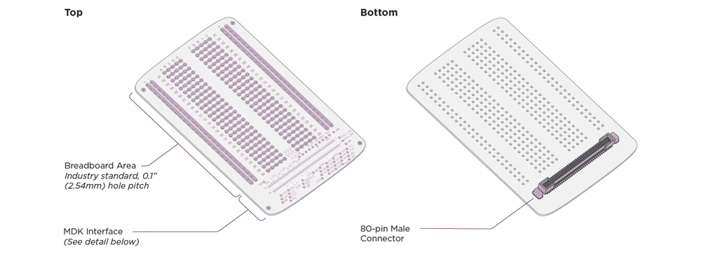
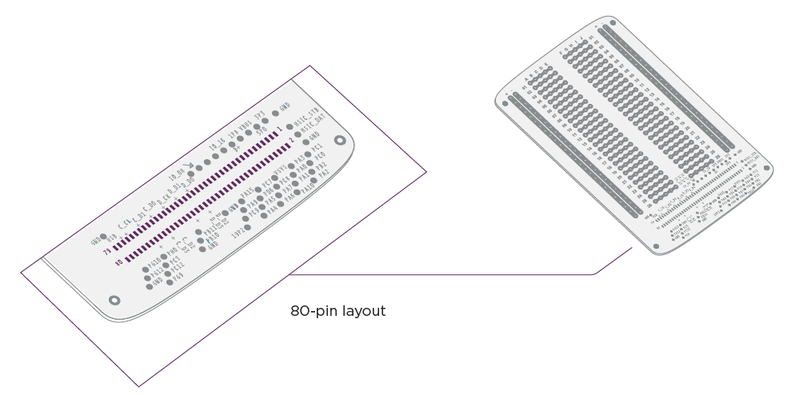
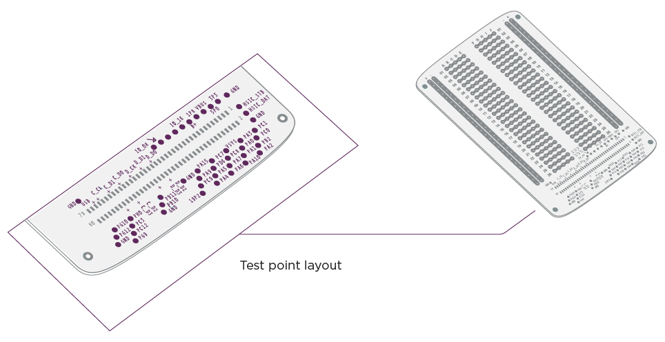

# MDK User Guide: Perforated Board

## Before you begin... {#before-you-begin}

#### Required Hardware {#required-hardware}

The Perforated Board requires a [Moto Z](http://www.motomods.com) and [Reference Moto Mod](../../hardware/mdk.md). If you don't have these, you'll need to buy the required hardware.

**Note:** One Perforated Board is included in-box along with the [MDK](../../hardware/mdk.md). You can also [buy more Perforated Boards](../../hardware/perforated-board.md) as needed.

## Electrical Details {#electrical}

### Overview {#overview}

The Perforated Board is the primary vehicle for starting development of your Moto Mods Development Kit project.

The **bottom side** contains the mating connector to attach the Perforated Board to the Reference Moto Mod.

The **top side** consists of 3 distinct areas:

- [**Breadboard Area:**](#breadboard-area) place and connect hardware components needed to realize your project here.
- [**MDK Interface (80-pin connector breakout):**](#mdk-interface-connector-breakout) all connector signals are accessible to probe with test equipment or attach to your project’s hardware.
- [**MDK Interface (Test Points):**](#mdk-interface-test-points) easy access to signals you’re likely to use most often during development of your project, clearly marked with silkscreen.

### Breadboard Area {#breadboard-area}

The breadboard area contains an arrangement of gold-plated holes to simplify installation and connection of your project’s hardware. In each row, holes a-e are electrically connected, and holes f-j are electrically connected. At the left and right edges of the breadboard area each column (two on each edge, marked with + and -) is electrically connected to provide convenient attachment and connection for power and ground rails used in your design - of course you can use the columns for other purposes, but supply rails are the most common application.

### MDK Interface (80-pin connector breakout) {#mdk-interface-connector-breakout}

All interfaces to the Reference Moto Mod are accessible here. High speed interfaces such as DSI, CSI and USB2.0/MyDP are available only in the breakout area. The pitch of the gold plated pads is 1 mm.

#### Test Pattern: {#test-pattern-}

<table class="pure-table pure-table-bordered">
<thead>
<tr>
<td><strong>Pin</strong></td>
<td><strong>Signal Name</strong></td>
<td><strong>Signal Type</strong></td>
<td><strong>Primary Function</strong></td>
<td><strong>Alternated Function</strong> 
      (see note 6)</td>
<td><strong>Interrupt Group</strong> 
      (see note 7)</td>
</tr>
</thead>
<tbody>
<tr>
<td>1</td>
<td>3P3</td>
<td>Power</td>
<td>Regulated 3.3-volt, 500mA power source (see note 1)</td>
<td></td>
<td></td>
</tr>
<tr>
<td>2</td>
<td>PC1</td>
<td>MuC GPIO</td>
<td>I2C3_SDA (see note 2)</td>
<td></td>
<td></td>
</tr>
<tr>
<td>3</td>
<td>HSIC_STB</td>
<td>MHB HSIC</td>
<td>HSIC Strobe. For details, see <a>USB-Ext firmware document</a></td>
<td></td>
<td></td>
</tr>
<tr>
<td>4</td>
<td>PC0</td>
<td>MuC GPIO</td>
<td>I2C3_SCL (see note 2)</td>
<td></td>
<td></td>
</tr>
<tr>
<td>5</td>
<td>HSIC_DAT</td>
<td>MHB HSIC</td>
<td>HSIC data. For details, see <a>USB-Ext firmware document</a></td>
<td></td>
<td></td>
</tr>
<tr>
<td>6</td>
<td>PB2</td>
<td>MuC GPIO</td>
<td>General-purpose input/output</td>
<td>MuC_TIMER1_OUT, 
          MuC_Comparator_IN+</td>
<td></td>
</tr>
<tr>
<td>7</td>
<td>GND</td>
<td>Ground</td>
<td>System ground</td>
<td></td>
<td></td>
</tr>
<tr>
<td>8</td>
<td>PA2</td>
<td>MuC GPIO</td>
<td>General-purpose input/output</td>
<td>MuC_UART2 TX</td>
<td></td>
</tr>
<tr>
<td>9</td>
<td>5P0</td>
<td>Power</td>
<td>Regulated 5-volt, 1.5A power source (see note 1)</td>
<td></td>
<td></td>
</tr>
<tr>
<td>10</td>
<td>PA3</td>
<td>MuC GPIO</td>
<td>General-purpose input/output</td>
<td>MuC_UART2 RX, 
          MuC_Intrrupt_IN (see note 7)</td>
<td>Group 3</td>
</tr>
<tr>
<td>11</td>
<td>VBUS</td>
<td>Power</td>
<td>VBUS power input/output from/to Moto Mod</td>
<td></td>
<td></td>
</tr>
<tr>
<td>12</td>
<td>PA0</td>
<td>MuC GPIO</td>
<td>General-purpose input/output</td>
<td>MuC_UART2 CTS, 
          MuC_UART4_TX</td>
<td></td>
</tr>
<tr>
<td>13</td>
<td>1P8</td>
<td>Power</td>
<td>Regulated 1.8-volt, 1A power source (see note 1)</td>
<td></td>
<td></td>
</tr>
<tr>
<td>14</td>
<td>PA1</td>
<td>MuC GPIO</td>
<td>General-purpose input/output</td>
<td>MuC_UART2 RTS, 
          MuC_UART4_RX</td>
<td></td>
</tr>
<tr>
<td>15</td>
<td>GND</td>
<td>Ground</td>
<td>System ground</td>
<td></td>
<td></td>
</tr>
<tr>
<td>16</td>
<td>PA10</td>
<td>MuC GPIO</td>
<td>General-purpose input/output</td>
<td>MuC_Intrrupt_IN (see note 7)</td>
<td>Group 10</td>
</tr>
<tr>
<td>17</td>
<td>VSYS</td>
<td>Power</td>
<td>System DC power from Personality Card</td>
<td></td>
<td></td>
</tr>
<tr>
<td>18</td>
<td>PC8</td>
<td>MuC GPIO</td>
<td>General-purpose input/output</td>
<td></td>
<td></td>
</tr>
<tr>
<td>19</td>
<td>B+</td>
<td>Power</td>
<td>System DC power from Moto Mod</td>
<td></td>
<td></td>
</tr>
<tr>
<td>20</td>
<td>PA7</td>
<td>MuC GPIO</td>
<td>General-purpose input/output</td>
<td>MuC_SPI1_MOSI, 
          MuC_Intrrupt_IN (see note 7)</td>
<td>Group 7</td>
</tr>
<tr>
<td>21</td>
<td>GND</td>
<td>Ground</td>
<td>System ground</td>
<td></td>
<td></td>
</tr>
<tr>
<td>22</td>
<td>PA6</td>
<td>MuC GPIO</td>
<td>General-purpose input/output</td>
<td>MuC_SPI1_MISO, 
          MuC_Intrrupt_IN (see note 7)</td>
<td>Group 6</td>
</tr>
<tr>
<td>23</td>
<td>PC7</td>
<td>MuC GPIO</td>
<td>General-purpose input/output</td>
<td>MuC_Intrrupt_In (see note 7)</td>
<td>Group 7</td>
</tr>
<tr>
<td>24</td>
<td>PD6</td>
<td>MuC GPIO</td>
<td>General-purpose input/output</td>
<td>MuC_UART2 RX, 
          MuC_Intrrupt_IN (see note 7)</td>
<td>Group 6</td>
</tr>
<tr>
<td>25</td>
<td>PC14</td>
<td>MuC GPIO</td>
<td>General-purpose input/output</td>
<td>Master_I2S_BCLK (see note 3)</td>
<td></td>
</tr>
<tr>
<td>26</td>
<td>PA5</td>
<td>MuC GPIO</td>
<td>General-purpose input/output</td>
<td>MuC_SPI1_SCK</td>
<td></td>
</tr>
<tr>
<td>27</td>
<td>PC15</td>
<td>MuC GPIO</td>
<td>General-purpose input/output</td>
<td>Master_I2S_WS (see note 3)</td>
<td></td>
</tr>
<tr>
<td>28</td>
<td>PA4</td>
<td>MuC GPIO</td>
<td>General-purpose input/output</td>
<td>MuC_SPI1_CS0</td>
<td></td>
</tr>
<tr>
<td>29</td>
<td>PE7</td>
<td>MuC GPIO</td>
<td>General-purpose input/output</td>
<td>Master_I2S_SDI (see note 3)</td>
<td></td>
</tr>
<tr>
<td>30</td>
<td>PA15</td>
<td>MuC GPIO</td>
<td>General-purpose input/output</td>
<td>MuC_SPI1_CS1, 
          MuC_Intrrupt_IN (see note 7)</td>
<td>Group 15</td>
</tr>
<tr>
<td>31</td>
<td>PD7</td>
<td>MuC GPIO</td>
<td>General-purpose input/output</td>
<td>Master_I2S_SDO (see note 3)</td>
<td></td>
</tr>
<tr>
<td>32</td>
<td>PA9</td>
<td>MuC GPIO</td>
<td>General-purpose input/output</td>
<td></td>
<td></td>
</tr>
<tr>
<td>33</td>
<td>PC9</td>
<td>MuC GPIO</td>
<td>General-purpose input/output</td>
<td></td>
<td></td>
</tr>
<tr>
<td>34</td>
<td>GND</td>
<td>Ground</td>
<td>System ground</td>
<td></td>
<td></td>
</tr>
<tr>
<td>35</td>
<td>TE</td>
<td>Input</td>
<td>Tearing Effect (Display Sync) input from personality card</td>
<td></td>
<td></td>
</tr>
<tr>
<td>36</td>
<td>19P2</td>
<td>Output</td>
<td>19.2 MHz CMOS clock output to personality card (see note 4)</td>
<td></td>
<td></td>
</tr>
<tr>
<td>37</td>
<td>GND</td>
<td>Ground</td>
<td>System ground</td>
<td></td>
<td></td>
</tr>
<tr>
<td>38</td>
<td>GND</td>
<td>Ground</td>
<td>System ground</td>
<td></td>
<td></td>
</tr>
<tr>
<td>39</td>
<td>DSI_D0-</td>
<td>Display</td>
<td>MIPI DSI_D0- output/input to/from personality card</td>
<td></td>
<td></td>
</tr>
<tr>
<td>40</td>
<td>DSI_D2-</td>
<td>Display</td>
<td>MIPI DSI_D2- output to personality card</td>
<td></td>
<td></td>
</tr>
<tr>
<td>41</td>
<td>DSI_D0+</td>
<td>Display</td>
<td>MIPI DSI_D0+ output/input to/from personality card</td>
<td></td>
<td></td>
</tr>
<tr>
<td>42</td>
<td>DSI_D2+</td>
<td>Display</td>
<td>MIPI DSI_D2+ output to personality card</td>
<td></td>
<td></td>
</tr>
<tr>
<td>43</td>
<td>GND</td>
<td>Ground</td>
<td>System ground</td>
<td></td>
<td></td>
</tr>
<tr>
<td>44</td>
<td>GND</td>
<td>Ground</td>
<td>System ground</td>
<td></td>
<td></td>
</tr>
<tr>
<td>45</td>
<td>DSI_D1-</td>
<td>Display</td>
<td>MIPI DSI_D1- output to personality card</td>
<td></td>
<td></td>
</tr>
<tr>
<td>46</td>
<td>DSI_D3-</td>
<td>Display</td>
<td>MIPI DSI_D3- output to personality card</td>
<td></td>
<td></td>
</tr>
<tr>
<td>47</td>
<td>DSI_D1+</td>
<td>Display</td>
<td>MIPI DSI_D1+ output to personality card</td>
<td></td>
<td></td>
</tr>
<tr>
<td>48</td>
<td>DSI_D3+</td>
<td>Display</td>
<td>MIPI DSI_D3+ output to personality card</td>
<td></td>
<td></td>
</tr>
<tr>
<td>49</td>
<td>GND</td>
<td>Ground</td>
<td>System ground</td>
<td></td>
<td></td>
</tr>
<tr>
<td>50</td>
<td>GND</td>
<td>Ground</td>
<td>System ground</td>
<td></td>
<td></td>
</tr>
<tr>
<td>51</td>
<td>DSI_CLK-</td>
<td>Display</td>
<td>MIPI DSI_C- output to personality card</td>
<td></td>
<td></td>
</tr>
<tr>
<td>52</td>
<td>MUC_PB11</td>
<td>MuC GPIO</td>
<td>General-purpose input/output</td>
<td>MuC_I2C2_SDA (see note 2)</td>
<td></td>
</tr>
<tr>
<td>53</td>
<td>DSI_CLK+</td>
<td>Display</td>
<td>MIPI DSI_C+ output to personality card</td>
<td></td>
<td></td>
</tr>
<tr>
<td>54</td>
<td>PB10</td>
<td>MuC GPIO</td>
<td>General-purpose input/output</td>
<td>MuC_I2C2 SCL (see note 2), MuC_Intrrupt_IN (see note 7)</td>
<td>Group 10</td>
</tr>
<tr>
<td>55</td>
<td>GND</td>
<td>Ground</td>
<td>System ground</td>
<td></td>
<td></td>
</tr>
<tr>
<td>56</td>
<td>GND</td>
<td>Ground</td>
<td>System ground</td>
<td></td>
<td></td>
</tr>
<tr>
<td>57</td>
<td>CSI_D0-</td>
<td>Camera</td>
<td>MIPI CSI_D0- input from personality card</td>
<td></td>
<td></td>
</tr>
<tr>
<td>58</td>
<td>CSI_D2-</td>
<td>Camera</td>
<td>MIPI CSI_D2- input from personality card</td>
<td></td>
<td></td>
</tr>
<tr>
<td>59</td>
<td>CSI_D0+</td>
<td>Camera</td>
<td>MIPI CSI_D0+ input from personality card</td>
<td></td>
<td></td>
</tr>
<tr>
<td>60</td>
<td>CSI_D2+</td>
<td>Camera</td>
<td>MIPI CSI_D2+ input from personality card</td>
<td></td>
<td></td>
</tr>
<tr>
<td>61</td>
<td>GND</td>
<td>Ground</td>
<td>System ground</td>
<td></td>
<td></td>
</tr>
<tr>
<td>62</td>
<td>GND</td>
<td>Ground</td>
<td>System ground</td>
<td></td>
<td></td>
</tr>
<tr>
<td>63</td>
<td>CSI_D1-</td>
<td>Camera</td>
<td>MIPI CSI_D1- input from personality card</td>
<td></td>
<td></td>
</tr>
<tr>
<td>64</td>
<td>CSI_D3-</td>
<td>Camera</td>
<td>MIPI CSI_D3- input from personality card</td>
<td></td>
<td></td>
</tr>
<tr>
<td>65</td>
<td>CSI_D1+</td>
<td>Camera</td>
<td>MIPI CSI_D1+ input from personality card</td>
<td></td>
<td></td>
</tr>
<tr>
<td>66</td>
<td>CSI_D3+</td>
<td>Camera</td>
<td>MIPI CSI_D3+ input from personality card</td>
<td></td>
<td></td>
</tr>
<tr>
<td>67</td>
<td>GND</td>
<td>Ground</td>
<td>System ground</td>
<td></td>
<td></td>
</tr>
<tr>
<td>68</td>
<td>GND</td>
<td>Ground</td>
<td>System ground</td>
<td></td>
<td></td>
</tr>
<tr>
<td>69</td>
<td>CSI_CLK-</td>
<td>Camera</td>
<td>MIPI CSI_C- input from personality card</td>
<td></td>
<td></td>
</tr>
<tr>
<td>70</td>
<td>PH0</td>
<td>MuC GPIO</td>
<td>General-purpose input/output</td>
<td></td>
<td></td>
</tr>
<tr>
<td>71</td>
<td>CSI_CLK+</td>
<td>Camera</td>
<td>MIPI CSI_C+ input from personality card</td>
<td></td>
<td></td>
</tr>
<tr>
<td>72</td>
<td>PC3</td>
<td>MuC GPIO</td>
<td>General-purpose input/output</td>
<td>MuC_ADC_IN4, 
          MuC_Intrrupt_IN (see note 7)</td>
<td>Group 3</td>
</tr>
<tr>
<td>73</td>
<td>GND</td>
<td>Ground</td>
<td>System ground</td>
<td></td>
<td></td>
</tr>
<tr>
<td>74</td>
<td>PC12</td>
<td>MuC GPIO</td>
<td>General-purpose input/output</td>
<td></td>
<td></td>
</tr>
<tr>
<td>75</td>
<td>USB_D+</td>
<td>USB</td>
<td>USB data positive (see note 5)</td>
<td></td>
<td></td>
</tr>
<tr>
<td>76</td>
<td>PG9</td>
<td>MuC GPIO</td>
<td>General-purpose input/output</td>
<td></td>
<td></td>
</tr>
<tr>
<td>77</td>
<td>USB_D-</td>
<td>USB</td>
<td>USB data negative (see note 5)</td>
<td></td>
<td></td>
</tr>
<tr>
<td>78</td>
<td>PG10</td>
<td>MuC GPIO</td>
<td>General-purpose input/output</td>
<td>MuC_TIMER1_IN1, MuC_Intrrupt_IN (see note 7)</td>
<td>Group 10</td>
</tr>
<tr>
<td>79</td>
<td>GND</td>
<td>Ground</td>
<td>System ground</td>
<td></td>
<td></td>
</tr>
<tr>
<td>80</td>
<td>PG12</td>
<td>MuC GPIO</td>
<td>General-purpose input/output</td>
<td></td>
<td></td>
</tr>
</tbody>
</table>

**Notes:**

- (1) Regulator current limit assumes source selected by DIP Switch B3 provides sufficient DC power for your application.
- (2) All MuC GPIO referenced to 1.8V.
- (3) I2S present only if DIP switches A1 and A2 set to enable I2S audio device type.
- (4) 19.2 MHz clock present DIP switch B1 set to “on” position.
- (5) USB signals present only if DIP switches A3 and A4 set to direct these signals to the personality card.
- (6) Alternate function enabler please refer to firmware document.
- (7) Only one Interrupt function allow within same group.

---

### MDK Interface (Test Points) {#mdk-interface-test-points}

The test points are 1 mm diameter gold plated surrounding the breakout area pads. A full list of the test points is provided in the table below. Silkscreen identifies the signal name at each test point.

#### Test Point Mappings: {#test-point-mappings-}

<table class="pure-table pure-table-bordered">
<thead>
<tr>
<td>Pin</td>
<td>Test Point</td>
<td>Reference Moto Mod signal</td>
</tr>
</thead>
<tr>
<td>1</td>
<td>3V3</td>
<td>Regulated 3.3 VDC</td>
</tr>
<tr>
<td>2</td>
<td>PC1</td>
<td>I2C_SDA</td>
</tr>
<tr>
<td>3</td>
<td>HSIC_STROBE</td>
<td>HSIC_STROBE</td>
</tr>
<tr>
<td>4</td>
<td>PC0</td>
<td>I2C_SCL</td>
</tr>
<tr>
<td>5</td>
<td>HSIC_DATA</td>
<td>HSIC_DATA</td>
</tr>
<tr>
<td>6</td>
<td>PB2</td>
<td>GCCLK</td>
</tr>
<tr>
<td>8</td>
<td>PA2</td>
<td>UART_TX</td>
</tr>
<tr>
<td>9</td>
<td>5V0</td>
<td>Regulated 5.0 VDC</td>
</tr>
<tr>
<td>10</td>
<td>PA3</td>
<td>UART_RX</td>
</tr>
<tr>
<td>11</td>
<td>VBUS</td>
<td>SL_VBUS</td>
</tr>
<tr>
<td>12</td>
<td>PA0</td>
<td>UART_CTS</td>
</tr>
<tr>
<td>13</td>
<td>1V8</td>
<td>Regulated 1.8 VDC</td>
</tr>
<tr>
<td>14</td>
<td>PA1</td>
<td>UART_RTS</td>
</tr>
<tr>
<td>16</td>
<td>PA10</td>
<td>PA10</td>
</tr>
<tr>
<td>17</td>
<td>VSYS</td>
<td>VSYS_PCARD</td>
</tr>
<tr>
<td>18</td>
<td>PC8</td>
<td>PC8</td>
</tr>
<tr>
<td>19</td>
<td>BPLUS</td>
<td>MOD_B+</td>
</tr>
<tr>
<td>20</td>
<td>PA7</td>
<td>SPI_MOSI</td>
</tr>
<tr>
<td>22</td>
<td>PA6</td>
<td>SPI_MISO</td>
</tr>
<tr>
<td>23</td>
<td>PC7</td>
<td>PC7</td>
</tr>
<tr>
<td>24</td>
<td>PD6</td>
<td>PD6</td>
</tr>
<tr>
<td>25</td>
<td>GPIO16</td>
<td>I2S_BCLK</td>
</tr>
<tr>
<td>26</td>
<td>PA5</td>
<td>SPI_CLK</td>
</tr>
<tr>
<td>27</td>
<td>GPIO17</td>
<td>I2S_LRCLK</td>
</tr>
<tr>
<td>28</td>
<td>PA4</td>
<td>SPI_CS0_N</td>
</tr>
<tr>
<td>29</td>
<td>GPIO20</td>
<td>I2S_SDI</td>
</tr>
<tr>
<td>30</td>
<td>PA15</td>
<td>SPI_CS1_N</td>
</tr>
<tr>
<td>31</td>
<td>GPIO19</td>
<td>I2S_SDO</td>
</tr>
<tr>
<td>32</td>
<td>PA9</td>
<td>PA9</td>
</tr>
<tr>
<td>33</td>
<td>PC9</td>
<td>PC9</td>
</tr>
<tr>
<td>35</td>
<td>GPIO8</td>
<td>TE</td>
</tr>
<tr>
<td>36</td>
<td>19.2MHZ</td>
<td>19.2 MHz Clock</td>
</tr>
<tr>
<td>52</td>
<td>PB11</td>
<td>Secondary I2C_SDA</td>
</tr>
<tr>
<td>54</td>
<td>PB10</td>
<td>Secondary I2C_SCL</td>
</tr>
<tr>
<td>70</td>
<td>PH0</td>
<td>PH0</td>
</tr>
<tr>
<td>72</td>
<td>PC3</td>
<td>PC3 (Analog input)</td>
</tr>
<tr>
<td>74</td>
<td>PC12</td>
<td>PC12</td>
</tr>
<tr>
<td>76</td>
<td>PG9</td>
<td>PG9</td>
</tr>
<tr>
<td>78</td>
<td>PG10</td>
<td>PG10</td>
</tr>
<tr>
<td>80</td>
<td>PG12</td>
<td>PG12</td>
</tr>
</table>

**Note:** To minimize impact to signal integrity, high-speed signals are not present at test points.

## Mechanical Details {#mechanical}

### General Dimensions {#general-dimensions}

- Pitch 2.54 mm
- 26 rows
- Power bus pins on the sides
- First surface soldering
- Allowable Component Height Overview with Included Cover

When using the in box cover, the height of any items added on top of the perforated board must not exceed 2.3 mm. Also ensure the height of all items on the board’s bottom side are less than 1.3mm Max Component Height.

#### Impact of exceeding limits on top side of board {#impact-of-exceeding-limits-on-top-side-of-board}

If you are using components that exceed these limits, you’ll either need to dremel a hole in the cover, create your own cover, or not use a cover.

#### Impact of exceeding limits on bottom side of board {#impact-of-exceeding-limits-on-bottom-side-of-board}

Exceeding these limits may result in damage to the Perforated Board, its added components, and your Reference Moto Mod. If the assembly does not fit together properly, circuits on the Perforated Board may work intermittently or completely fail to function.

[< Previous Page
**Reference Moto Mod**](reference-moto-mod.md)

[Next Page >
**HAT Adapter Board**](hat-adapter-board.md)
