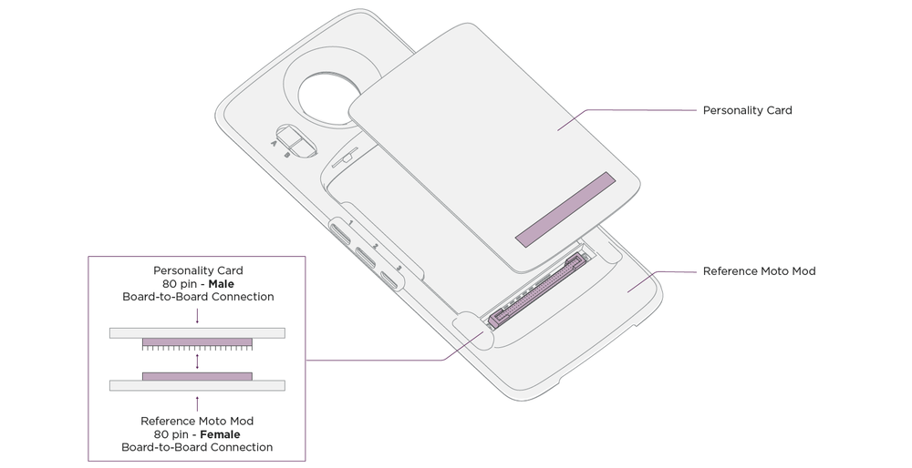
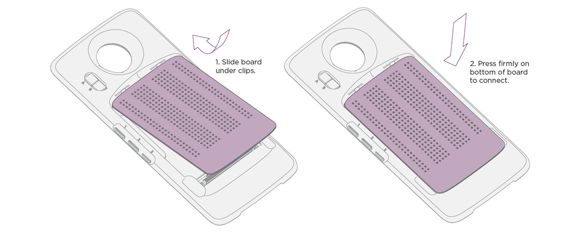
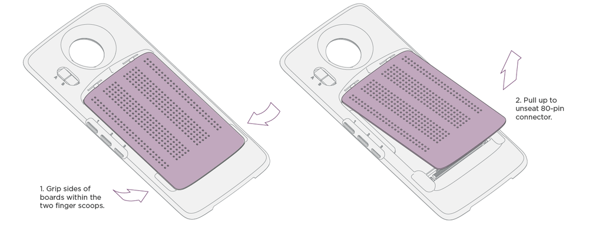

# MDK User Guide: Reference Moto Mod

## Overview {#overview}

The Reference Moto Mod is the central component for the creation of your prototypes. It provides the core interfaces to the Moto Z platform, processing resources, GPIO and standard peripheral interfaces, power and charging control, and the capability to configure these blocks appropriately for your project.

#### Download Schematics {#download-schematics}

We provide schematics for the Moto Mods Development Kit. See the [Downloads](#downloads) section at the end of this page for more.

## Key Components and Configuration {#key-components-and-configuration}

### The Moto Mod Micro Controller (MuC) {#the-moto-mod-micro-controller-muc-}

The MuC is the target for custom firmware for your Moto Mod. Powered by a Cortex-M4 based STML476, it provides onboard compute and control, GPIO, and various standard interfaces used to realize your project. The MuC is the main point of communication between the Moto Z and includes Greybus abstraction layer.

For further documentation on the STML476 used in the Reference Moto Mod:
[ST Micro website for the STM32L476](http://www.st.com/content/st_com/en/products/microcontrollers/stm32-32-bit-arm-cortex-mcus/stm32l4-series/stm32l4x6/stm32l476me.html)
[STM32L476XX Datasheet (Part Overview)](http://www.st.com/content/ccc/resource/technical/document/datasheet/c5/ed/2f/60/aa/79/42/0b/DM00108832.pdf/files/DM00108832.pdf/jcr:content/translations/en.DM00108832.pdf)
[STML4X6 Reference Manual (in depth technical detail)](http://www.st.com/content/ccc/resource/technical/document/reference_manual/02/35/09/0c/4f/f7/40/03/DM00083560.pdf/files/DM00083560.pdf/jcr:content/translations/en.DM00083560.pdf)

---

### Moto High-Speed Bridge (MHB) {#moto-high-speed-bridge-mhb-}

Industry standard CSI and DSI interfaces are supplied through the Moto Bridge as well as I2S audio for those Moto Mods requiring the camera or display interfaces.

---

### Power and charging block {#power-and-charging-block}

Contains the control, regulated and unregulated power control, battery selection, and charging paths for the Moto Mod system. See the DIP Switch B configuration section for the configuration options for this block.

---

### USB Connectors {#usb-connectors}

This set of three connectors enable connection of USB 2.0, MyDP and USB 3.1 peripherals, as well as Reference Moto Mod debug interfaces. Control and configuration of these connections is managed by the DIP switches.

#### Debug Connector (USB #1) {#debug-connector-usb-1-}

This Type C Connector is the debug port for all your projects using the Reference Moto Mod. The interfaces provided are detailed below.

- **Port 1** - MuC Serial Wire Debug (SWD)
- **Port 2** - MHB JTAG
- **Port 3** - MuC Serial Console
- **Port 4** - MHB Serial Console (Rx only)

The Moto Mod will accept 500mA of current into USB Connector 1 to power the Reference Moto Mod. USB Connector 1 will not charge the onboard battery or any battery included on your custom personality card.

#### USB Type-C Connector (USB #2) {#usb-type-c-connector-usb-2-}

This Type C Connector provides access to the following Mod interfaces:

- **USB 3.1** - host and slave
- **USB 2.0** - host only

The onboard battery on the Reference Moto Mod can be charged via this port. The port is compliant with USB C DRP.

#### MyDP connector (USB #3) {#mydp-connector-usb-3-}

This Micro B connector provides access to the following Mod interfaces:

- **USB 2.0** - host only
- **MyDP**

The Reference Moto Mod provides DC power out of the MyDP connector for USB Host mode support.

---

### DIP Switch Configuration {#dip-switch-configuration}

Two DIP switches are provided to configure the Reference Moto Mod to support your Moto Mod project development.

#### DIP Switch A: {#dip-switch-a-}

- These switches control routing and selection of High Speed Signal Groups A and B.
- Group A signals are defined as USB 2.0 and MyDP and are controlled by switches A3 and A4.
- Group B signals include M-PHY, USB 3.1 and I2S functionality and are controlled by switches A1 and A2.

##### A1/A2 High speed Group B Control: {#a1-a2-high-speed-group-b-control-}

<table class="pure-table pure-table-bordered">
<thead>
<tr>
<td>Device Type</td>
<td>A1</td>
<td>A2</td>
<td>Description</td>
</tr>
</thead>
<tr>
<td>Group B Disabled</td>
<td>Off</td>
<td>Off</td>
<td>All Group B signal paths disabled.</td>
</tr>
<tr>
<td>MHB Device</td>
<td>On</td>
<td>Off</td>
<td>Enables the Moto High-speed Bridge (MHB). Use this mode for devices requiring CSI or DSI on the 80-pin connector. When configured in this mode, I2S signals on the 80 pin connector are routed to the MHB as well. Used in the Display Personality Card example.</td>
</tr>
<tr>
<td>I2S Audio Device</td>
<td>Off</td>
<td>On</td>
<td>Use for devices requiring direct access to I2S from the Moto Z. MHB is disabled and I2S signals on the 80-pin connector are routed to the Moto Mod connection to the Moto Z. Used in the Audio Personality Card example.</td>
</tr>
<tr>
<td>USB3.1 Device</td>
<td>On</td>
<td>On</td>
<td>Use for devices requiring a USB3.1 host or client connection. MHB is disabled and USB3.1 is available on USB Type-C Connector.</td>
</tr>
<tr>
</tr></table>

##### A3/A4 High speed Group A Control: {#a3-a4-high-speed-group-a-control-}

<table class="pure-table pure-table-bordered">
<thead>
<tr>
<td>Device Type</td>
<td>A3</td>
<td>A4</td>
<td>Description</td>
</tr>
</thead>
<tr>
<td>Group A Disabled</td>
<td>Off</td>
<td>Off</td>
<td>All Group A signal paths disabled.</td>
</tr>
<tr>
<td>MyDP Device</td>
<td>On</td>
<td>Off</td>
<td>Group A connected to MyDP Connector. Use to connect a MyDP device to the MyDP connector. This mode can also support USB Client devices connected to the MyDP port. In this mode power is available from the Reference Moto Mod on the VBUS pin.</td>
</tr>
<tr>
<td>USB 2.0 Client</td>
<td>Off</td>
<td>On</td>
<td>Group A connected to USB Type-C connector. Use to connect a USB Client device on the USB Type-C connector.</td>
</tr>
<tr>
<td>USB2.0 Personality Card</td>
<td>On</td>
<td>On</td>
<td>Group A signals are routed to the 80-pin connector.</td>
</tr>
<tr>
</tr></table>

#### Dip Switch B: {#dip-switch-b-}

These switches enable the reference clock for the Personality Card, control various power and charging configurations, and select GPIO or I2S functionality to the I2S signal group of the 80-pin connector.

##### Switch B1 - Personality Card Reference Clock Control: {#switch-b1-personality-card-reference-clock-control-}

<table class="pure-table pure-table-bordered">
<thead>
<tr>
<td>Device Type</td>
<td>B1</td>
<td>Description</td>
</tr>
</thead>
<tr>
<td>Personality Card with onboard reference clock or none required</td>
<td>Off</td>
<td>19.2 MHz clock disabled, pin 36 of 80-pin connector is high impedance</td>
</tr>
<tr>
<td>Personality Card requiring 19.2 MHz reference clock</td>
<td>On</td>
<td>19.2 MHz clock enabled, present at pin 36 of 80-pin connector</td>
</tr>
<tr>
</tr></table>

##### Switch B2 - I2S Signal Group Alternate Mode: {#switch-b2-i2s-signal-group-alternate-mode-}

<table class="pure-table pure-table-bordered">
<thead>
<tr>
<td>Device Type</td>
<td>B2</td>
<td>Description</td>
</tr>
</thead>
<tr>
<td>I2S on 80-pin connector</td>
<td>Off</td>
<td>Use this mode if using I2S</td>
</tr>
<tr>
<td>GPIO alternate mode</td>
<td>On</td>
<td>Use this mode to use the pins as GPIO from the MuC (Notes 1,2)</td>
</tr>
<tr>
</tr></table>

**Note 1:** This mode disables the external 32kHz clock of the MuC.
**Note 2:** This mode disables the State of Charge LED functionality. (See On Board LEDs below).

##### Switch B3 - Battery Selection: {#switch-b3-battery-selection-}

<table class="pure-table pure-table-bordered">
<thead>
<tr>
<td>Device Type</td>
<td>B3</td>
<td>Description</td>
</tr>
</thead>
<tr>
<td>Reference Mod Battery</td>
<td>Off</td>
<td>Use this configuration if your project uses the battery provided on the Reference Moto Mod.  In this mode, pin 17 of the 80-pin connector is disabled from providing power to the system.</td>
</tr>
<tr>
<td>Personality card Battery</td>
<td>On</td>
<td>Use this configuration if your personality card includes a battery. Charging and Metering is the responsibility of the Personality Card. In this mode, battery power for the Reference Moto Mod is derived from the 80-pin connector pin 17.</td>
</tr>
<tr>
</tr></table>

##### Switch B4 - USB-C Power Source: {#switch-b4-usb-c-power-source-}

<table class="pure-table pure-table-bordered">
<thead>
<tr>
<td>Device Type</td>
<td>B4</td>
<td>Description</td>
</tr>
</thead>
<tr>
<td>USB Connector 2 Powered</td>
<td>Off</td>
<td>Use this mode to power the Reference Moto Mod from USB Type-C. Charging of onboard battery available (See Switch B3 above).</td>
</tr>
<tr>
<td>Debug connector Powered</td>
<td>On</td>
<td>Use this mode to power the Reference Moto Mod from the Debug Connector  
Note: This mode will not charge any battery (on-board or Personality Card)</td>
</tr>
<tr>
</tr></table>

#### Example Personality Card Configurations {#example-personality-card-configurations}

The table below details the DIP switch configuration for each of the available example Personality Cards.

##### Example Personality Card Configurations: {#example-personality-card-configurations-}

<table class="pure-table pure-table-bordered">
<thead>
<tr>
<td rowspan="2">Personality Card</td>
<td colspan="4">DIP Switch A</td>
<td colspan="4">DIP Switch B</td>
</tr>
<tr>
<td>A1</td>
<td>A2</td>
<td>A3</td>
<td>A4</td>
<td>B1</td>
<td>B2</td>
<td>B3</td>
<td>B4</td>
</tr>
</thead>
<tbody>
<tr>
<td>DSI Display</td>
<td>On</td>
<td>Off</td>
<td>X</td>
<td>X</td>
<td>X</td>
<td>X</td>
<td>Off</td>
<td>X</td>
</tr>
<tr>
<td>Audio</td>
<td>Off</td>
<td>On</td>
<td>X</td>
<td>X</td>
<td>X</td>
<td>Off</td>
<td>Off</td>
<td>X</td>
</tr>
<tr>
<td>Battery</td>
<td>X</td>
<td>X</td>
<td>X</td>
<td>X</td>
<td>X</td>
<td>X</td>
<td>On</td>
<td>X</td>
</tr>
<tr>
<td>Sensor</td>
<td>X</td>
<td>X</td>
<td>X</td>
<td>X</td>
<td>X</td>
<td>X</td>
<td>Off</td>
<td>X</td>
</tr>
</tbody>
</table>

**Note:** X = Not Applicable

---

### Onboard LEDs {#onboard-leds}

The Reference Moto Mod contains three LEDs. Two LEDs are used to indicate the Reference Moto Mod battery state of charge, and the other is available for you to use in your applications.

#### LED Connection and Active State: {#led-connection-and-active-state-}

<table class="pure-table pure-table-bordered">
<thead>
<tr>
<td>LED</td>
<td>GPIO</td>
<td>State</td>
<td>Usage</td>
</tr>
</thead>
<tr>
<td>Red LED (Bottom)</td>
<td>PD7</td>
<td>Low: LED On High: LED off</td>
<td>Indicates Battery State of Charge (SoC) in conjunction with the Green LED</td>
</tr>
<tr>
<td>Green LED (Bottom)</td>
<td>PE7</td>
<td>Low: LED On High: LED off</td>
<td>Indicates Battery SoC in conjunction with the Red LED</td>
</tr>
<tr>
<td>White LED (Top)</td>
<td>PE8</td>
<td>Low: LED On High: LED off</td>
<td>User defined</td>
</tr>
<tr>
</tr></table>

---

### Personality Board Connector {#personality-board-connector}

Personality cards attach to the 80-pin connector. This connector provides access to GPIO, power, and multiple standard busses. The function of some pins is controlled by the DIP switches.

#### Connector Definition {#connector-definition}

The 80-pin connector exposes various Moto Mod interfaces to make it easy for you to develop and switch between projects using a single Reference Moto Mod.

<table class="pure-table pure-table-bordered">
<thead>
<tr>
<td><strong>Pin</strong></td>
<td><strong>Signal Name</strong></td>
<td><strong>Signal Type</strong></td>
<td><strong>Primary Function</strong></td>
<td><strong>Alternate Function</strong> 
      (see note 6)</td>
<td><strong>Interrupt Group</strong> 
      (see note 7)</td>
</tr>
</thead>
<tbody>
<tr>
<td>1</td>
<td>3P3</td>
<td>Power</td>
<td>Regulated 3.3-volt, 500mA power source (see note 1)</td>
<td></td>
<td></td>
</tr>
<tr>
<td>2</td>
<td>PC1</td>
<td>MuC GPIO</td>
<td>I2C3_SDA (see note 2)</td>
<td></td>
<td></td>
</tr>
<tr>
<td>3</td>
<td>HSIC_STB</td>
<td>MHB HSIC</td>
<td>HSIC Strobe. For details, see <a>USB-Ext firmware document</a></td>
<td></td>
<td></td>
</tr>
<tr>
<td>4</td>
<td>PC0</td>
<td>MuC GPIO</td>
<td>I2C3_SCL (see note 2)</td>
<td></td>
<td></td>
</tr>
<tr>
<td>5</td>
<td>HSIC_DAT</td>
<td>MHB HSIC</td>
<td>HSIC data. For details, see <a>USB-Ext firmware document</a></td>
<td></td>
<td></td>
</tr>
<tr>
<td>6</td>
<td>PB2</td>
<td>MuC GPIO</td>
<td>General-purpose input/output</td>
<td>MuC_TIMER1_OUT, 
          MuC_Comparator_IN+</td>
<td></td>
</tr>
<tr>
<td>7</td>
<td>GND</td>
<td>Ground</td>
<td>System ground</td>
<td></td>
<td></td>
</tr>
<tr>
<td>8</td>
<td>PA2</td>
<td>MuC GPIO</td>
<td>General-purpose input/output</td>
<td>MuC_UART2 TX</td>
<td></td>
</tr>
<tr>
<td>9</td>
<td>5P0</td>
<td>Power</td>
<td>Regulated 5-volt, 1.5A power source (see note 1)</td>
<td></td>
<td></td>
</tr>
<tr>
<td>10</td>
<td>PA3</td>
<td>MuC GPIO</td>
<td>General-purpose input/output</td>
<td>MuC_UART2 RX, 
          MuC_Interrupt_IN (see note 7)</td>
<td>Group 3</td>
</tr>
<tr>
<td>11</td>
<td>VBUS</td>
<td>Power</td>
<td>VBUS power input/output from/to Moto Mod</td>
<td></td>
<td></td>
</tr>
<tr>
<td>12</td>
<td>PA0</td>
<td>MuC GPIO</td>
<td>General-purpose input/output</td>
<td>MuC_UART2 CTS, 
          MuC_UART4_TX</td>
<td></td>
</tr>
<tr>
<td>13</td>
<td>1P8</td>
<td>Power</td>
<td>Regulated 1.8-volt, 1A power source (see note 1)</td>
<td></td>
<td></td>
</tr>
<tr>
<td>14</td>
<td>PA1</td>
<td>MuC GPIO</td>
<td>General-purpose input/output</td>
<td>MuC_UART2 RTS, 
          MuC_UART4_RX</td>
<td></td>
</tr>
<tr>
<td>15</td>
<td>GND</td>
<td>Ground</td>
<td>System ground</td>
<td></td>
<td></td>
</tr>
<tr>
<td>16</td>
<td>PA10</td>
<td>MuC GPIO</td>
<td>General-purpose input/output</td>
<td>MuC_Interrupt_IN (see note 7)</td>
<td>Group 10</td>
</tr>
<tr>
<td>17</td>
<td>VSYS</td>
<td>Power</td>
<td>System DC power from Personality Card</td>
<td></td>
<td></td>
</tr>
<tr>
<td>18</td>
<td>PC8</td>
<td>MuC GPIO</td>
<td>General-purpose input/output</td>
<td></td>
<td></td>
</tr>
<tr>
<td>19</td>
<td>B+</td>
<td>Power</td>
<td>System DC power from Moto Mod</td>
<td></td>
<td></td>
</tr>
<tr>
<td>20</td>
<td>PA7</td>
<td>MuC GPIO</td>
<td>General-purpose input/output</td>
<td>MuC_SPI1_MOSI, 
          MuC_Interrupt_IN (see note 7)</td>
<td>Group 7</td>
</tr>
<tr>
<td>21</td>
<td>GND</td>
<td>Ground</td>
<td>System ground</td>
<td></td>
<td></td>
</tr>
<tr>
<td>22</td>
<td>PA6</td>
<td>MuC GPIO</td>
<td>General-purpose input/output</td>
<td>MuC_SPI1_MISO, 
          MuC_Interrupt_IN (see note 7)</td>
<td>Group 6</td>
</tr>
<tr>
<td>23</td>
<td>PC7</td>
<td>MuC GPIO</td>
<td>General-purpose input/output</td>
<td>MuC_Interrupt_In (see note 7)</td>
<td>Group 7</td>
</tr>
<tr>
<td>24</td>
<td>PD6</td>
<td>MuC GPIO</td>
<td>General-purpose input/output</td>
<td>MuC_UART2 RX, 
          MuC_Interrupt_IN (see note 7)</td>
<td>Group 6</td>
</tr>
<tr>
<td>25</td>
<td>PC14</td>
<td>MuC GPIO</td>
<td>General-purpose input/output</td>
<td>Master_I2S_BCLK (see note 3)</td>
<td></td>
</tr>
<tr>
<td>26</td>
<td>PA5</td>
<td>MuC GPIO</td>
<td>General-purpose input/output</td>
<td>MuC_SPI1_SCK</td>
<td></td>
</tr>
<tr>
<td>27</td>
<td>PC15</td>
<td>MuC GPIO</td>
<td>General-purpose input/output</td>
<td>Master_I2S_WS (see note 3)</td>
<td></td>
</tr>
<tr>
<td>28</td>
<td>PA4</td>
<td>MuC GPIO</td>
<td>General-purpose input/output</td>
<td>MuC_SPI1_CS0</td>
<td></td>
</tr>
<tr>
<td>29</td>
<td>PE7</td>
<td>MuC GPIO</td>
<td>General-purpose input/output</td>
<td>Master_I2S_SDI (see note 3)</td>
<td></td>
</tr>
<tr>
<td>30</td>
<td>PA15</td>
<td>MuC GPIO</td>
<td>General-purpose input/output</td>
<td>MuC_SPI1_CS1, 
          MuC_Interrupt_IN (see note 7)</td>
<td>Group 15</td>
</tr>
<tr>
<td>31</td>
<td>PD7</td>
<td>MuC GPIO</td>
<td>General-purpose input/output</td>
<td>Master_I2S_SDO (see note 3)</td>
<td></td>
</tr>
<tr>
<td>32</td>
<td>PA9</td>
<td>MuC GPIO</td>
<td>General-purpose input/output</td>
<td></td>
<td></td>
</tr>
<tr>
<td>33</td>
<td>PC9</td>
<td>MuC GPIO</td>
<td>General-purpose input/output</td>
<td></td>
<td></td>
</tr>
<tr>
<td>34</td>
<td>GND</td>
<td>Ground</td>
<td>System ground</td>
<td></td>
<td></td>
</tr>
<tr>
<td>35</td>
<td>TE</td>
<td>Input</td>
<td>Tearing Effect (Display Sync) input from personality card</td>
<td></td>
<td></td>
</tr>
<tr>
<td>36</td>
<td>19P2</td>
<td>Output</td>
<td>19.2 MHz CMOS clock output to personality card (see note 4)</td>
<td></td>
<td></td>
</tr>
<tr>
<td>37</td>
<td>GND</td>
<td>Ground</td>
<td>System ground</td>
<td></td>
<td></td>
</tr>
<tr>
<td>38</td>
<td>GND</td>
<td>Ground</td>
<td>System ground</td>
<td></td>
<td></td>
</tr>
<tr>
<td>39</td>
<td>DSI_D0-</td>
<td>Display</td>
<td>MIPI DSI_D0- output/input to/from personality card</td>
<td></td>
<td></td>
</tr>
<tr>
<td>40</td>
<td>DSI_D2-</td>
<td>Display</td>
<td>MIPI DSI_D2- output to personality card</td>
<td></td>
<td></td>
</tr>
<tr>
<td>41</td>
<td>DSI_D0+</td>
<td>Display</td>
<td>MIPI DSI_D0+ output/input to/from personality card</td>
<td></td>
<td></td>
</tr>
<tr>
<td>42</td>
<td>DSI_D2+</td>
<td>Display</td>
<td>MIPI DSI_D2+ output to personality card</td>
<td></td>
<td></td>
</tr>
<tr>
<td>43</td>
<td>GND</td>
<td>Ground</td>
<td>System ground</td>
<td></td>
<td></td>
</tr>
<tr>
<td>44</td>
<td>GND</td>
<td>Ground</td>
<td>System ground</td>
<td></td>
<td></td>
</tr>
<tr>
<td>45</td>
<td>DSI_D1-</td>
<td>Display</td>
<td>MIPI DSI_D1- output to personality card</td>
<td></td>
<td></td>
</tr>
<tr>
<td>46</td>
<td>DSI_D3-</td>
<td>Display</td>
<td>MIPI DSI_D3- output to personality card</td>
<td></td>
<td></td>
</tr>
<tr>
<td>47</td>
<td>DSI_D1+</td>
<td>Display</td>
<td>MIPI DSI_D1+ output to personality card</td>
<td></td>
<td></td>
</tr>
<tr>
<td>48</td>
<td>DSI_D3+</td>
<td>Display</td>
<td>MIPI DSI_D3+ output to personality card</td>
<td></td>
<td></td>
</tr>
<tr>
<td>49</td>
<td>GND</td>
<td>Ground</td>
<td>System ground</td>
<td></td>
<td></td>
</tr>
<tr>
<td>50</td>
<td>GND</td>
<td>Ground</td>
<td>System ground</td>
<td></td>
<td></td>
</tr>
<tr>
<td>51</td>
<td>DSI_CLK-</td>
<td>Display</td>
<td>MIPI DSI_C- output to personality card</td>
<td></td>
<td></td>
</tr>
<tr>
<td>52</td>
<td>MUC_PB11</td>
<td>MuC GPIO</td>
<td>General-purpose input/output</td>
<td>MuC_I2C2_SDA (see note 2)</td>
<td></td>
</tr>
<tr>
<td>53</td>
<td>DSI_CLK+</td>
<td>Display</td>
<td>MIPI DSI_C+ output to personality card</td>
<td></td>
<td></td>
</tr>
<tr>
<td>54</td>
<td>PB10</td>
<td>MuC GPIO</td>
<td>General-purpose input/output</td>
<td>MuC_I2C2 SCL (see note 2), MuC_Interrupt_IN (see note 7)</td>
<td>Group 10</td>
</tr>
<tr>
<td>55</td>
<td>GND</td>
<td>Ground</td>
<td>System ground</td>
<td></td>
<td></td>
</tr>
<tr>
<td>56</td>
<td>GND</td>
<td>Ground</td>
<td>System ground</td>
<td></td>
<td></td>
</tr>
<tr>
<td>57</td>
<td>CSI_D0-</td>
<td>Camera</td>
<td>MIPI CSI_D0- input from personality card</td>
<td></td>
<td></td>
</tr>
<tr>
<td>58</td>
<td>CSI_D2-</td>
<td>Camera</td>
<td>MIPI CSI_D2- input from personality card</td>
<td></td>
<td></td>
</tr>
<tr>
<td>59</td>
<td>CSI_D0+</td>
<td>Camera</td>
<td>MIPI CSI_D0+ input from personality card</td>
<td></td>
<td></td>
</tr>
<tr>
<td>60</td>
<td>CSI_D2+</td>
<td>Camera</td>
<td>MIPI CSI_D2+ input from personality card</td>
<td></td>
<td></td>
</tr>
<tr>
<td>61</td>
<td>GND</td>
<td>Ground</td>
<td>System ground</td>
<td></td>
<td></td>
</tr>
<tr>
<td>62</td>
<td>GND</td>
<td>Ground</td>
<td>System ground</td>
<td></td>
<td></td>
</tr>
<tr>
<td>63</td>
<td>CSI_D1-</td>
<td>Camera</td>
<td>MIPI CSI_D1- input from personality card</td>
<td></td>
<td></td>
</tr>
<tr>
<td>64</td>
<td>CSI_D3-</td>
<td>Camera</td>
<td>MIPI CSI_D3- input from personality card</td>
<td></td>
<td></td>
</tr>
<tr>
<td>65</td>
<td>CSI_D1+</td>
<td>Camera</td>
<td>MIPI CSI_D1+ input from personality card</td>
<td></td>
<td></td>
</tr>
<tr>
<td>66</td>
<td>CSI_D3+</td>
<td>Camera</td>
<td>MIPI CSI_D3+ input from personality card</td>
<td></td>
<td></td>
</tr>
<tr>
<td>67</td>
<td>GND</td>
<td>Ground</td>
<td>System ground</td>
<td></td>
<td></td>
</tr>
<tr>
<td>68</td>
<td>GND</td>
<td>Ground</td>
<td>System ground</td>
<td></td>
<td></td>
</tr>
<tr>
<td>69</td>
<td>CSI_CLK-</td>
<td>Camera</td>
<td>MIPI CSI_C- input from personality card</td>
<td></td>
<td></td>
</tr>
<tr>
<td>70</td>
<td>PH0</td>
<td>MuC GPIO</td>
<td>General-purpose input/output</td>
<td></td>
<td></td>
</tr>
<tr>
<td>71</td>
<td>CSI_CLK+</td>
<td>Camera</td>
<td>MIPI CSI_C+ input from personality card</td>
<td></td>
<td></td>
</tr>
<tr>
<td>72</td>
<td>PC3</td>
<td>MuC GPIO</td>
<td>General-purpose input/output</td>
<td>MuC_ADC_IN4, 
          MuC_Interrupt_IN (see note 7)</td>
<td>Group 3</td>
</tr>
<tr>
<td>73</td>
<td>GND</td>
<td>Ground</td>
<td>System ground</td>
<td></td>
<td></td>
</tr>
<tr>
<td>74</td>
<td>PC12</td>
<td>MuC GPIO</td>
<td>General-purpose input/output</td>
<td></td>
<td></td>
</tr>
<tr>
<td>75</td>
<td>USB_D+</td>
<td>USB</td>
<td>USB data positive (see note 5)</td>
<td></td>
<td></td>
</tr>
<tr>
<td>76</td>
<td>PG9</td>
<td>MuC GPIO</td>
<td>General-purpose input/output</td>
<td></td>
<td></td>
</tr>
<tr>
<td>77</td>
<td>USB_D-</td>
<td>USB</td>
<td>USB data negative (see note 5)</td>
<td></td>
<td></td>
</tr>
<tr>
<td>78</td>
<td>PG10</td>
<td>MuC GPIO</td>
<td>General-purpose input/output</td>
<td>MuC_TIMER1_IN1, MuC_Interrupt_IN (see note 7)</td>
<td>Group 10</td>
</tr>
<tr>
<td>79</td>
<td>GND</td>
<td>Ground</td>
<td>System ground</td>
<td></td>
<td></td>
</tr>
<tr>
<td>80</td>
<td>PG12</td>
<td>MuC GPIO</td>
<td>General-purpose input/output</td>
<td></td>
<td></td>
</tr>
</tbody>
</table>

**Notes:**

- (1) Regulator current limit assumes source selected by DIP Switch B3 provides sufficient DC power for your application.
- (2) All MuC GPIO referenced to 1.8V.
- (3) I2S present only if DIP switches A1 and A2 set to enable I2S audio device type.
- (4) 19.2 MHz clock present DIP switch B1 set to “on” position.
- (5) USB signals present only if DIP switches A3 and A4 set to direct these signals to the personality card.
- (6) Alternate function enabler please refer to firmware document.
- (7) Only one Interrupt function allow within same group.

## Using Example Personality Cards {#example-personality-cards}

### Inserting and Removing Personality Card {#inserting-and-removing-personality-card}

> **NOTE:**
> ALWAYS detach the Reference Moto Mod from Moto Z before attempting to insert or remove a Personality Card, the Perforated Board, or Raspberry Pi HAT Adapter Board.

#### Inserting Personality Card Into Reference Moto Mod {#inserting-personality-card-into-reference-moto-mod}

- **Step 1:** Toe-in top edge of board under housing tabs
- **Step 2:** Press board down to seat the connector

#### Removing Personality Card From Reference Moto Mod {#removing-personality-card-from-reference-moto-mod}

- **Step 1:** Grip sides of board within two finger scoops
- **Step 2:** Pull up to unseat the 80-pin connector

### Installation of Custom Firmware {#installation-of-custom-firmware}

The [example Personality Cards](../examples/index.md) require custom firmware on the Reference Moto Mod to run. Each Personality Card includes an onboard EEPROM queried by the MuC bootloader on attach. If needed, the MuC bootloader will request the Moto Z to download and install the latest firmware needed for the attached personality card.

**IMPORTANT:**
When using the Perforated Board, or Pi HAT Adapter Board, don’t forget to create a custom bootloader for your MuC that includes your unique VID/PID, or the prototype VID `0x42`. If you don’t you’ll end up overwriting your custom firmware with the default MuC firmware each time you boot!

## Downloads {#downloads}

This section contains the downloadable files associated with this example.

Before downloading, please read through the [Moto Mods Development Kit Terms & Conditions](https://web.archive.org/web/2017/http://developer.motorola.com/assets/html/moto-mods-dev-kit-terms-and-conditions.html):

## Safety Instructions {#safety}

### Warnings {#warnings}

- **Important:** This product contains magnets. Always keep products with magnets more than 20 cm. (8 in.) from medical devices, such as pacemakers, internal cardio defibrillators or other devices that can be affected by a magnetic field. Also, keep products with magnets away from credit cards, ID cards, and other media that use magnetically encoded information.
- Due to the nature of the product, it is not possible to fully meet ESD (Electrostatic Discharge) Protection requirements as components and interconnections are more exposed in a development kit. Should the audio/video stop unexpectedly, remove and re-attach the Personality Card.
- The reference Moto Mod shall only be powered by connecting it to a Moto Z device or through the USB Connectors 1 & 2.
- A Personality Card shall only be powered by inserting it into the Reference Moto Mod.
- Always detach the Reference Moto Mod from Moto Z before attempting to insert or remove a Personality Card, the Perforated Board, or Raspberry Pi HAT Adapter Board.
- This product should be operated in a well ventilated environment.
- This product should be placed on a stable, flat, non-conductive surface in use and should not be contacted by conductive items.
- The connection of incompatible devices to the GPIO connector may affect compliance or result in damage to the unit and invalidate the connected Moto Z’s warranty
- All peripherals used with the Moto Mods Development Kit should comply with relevant standards for the country of use and be marked accordingly to ensure that safety and performance requirements are met.
- If peripherals are connected via a cable or connector, the cable or connector used must offer adequate insulation and operation in order that the requirements of the relevant performance and safety requirements are met.
- Any damage to your Moto Z’s caused by the use of the Moto Mods Development kit is not covered by the Moto Z limited warranty.
- Motorola accepts no liability arising from the use or misuse of the MDK or Moto Mods platform, or any applications based upon it
- Apps and MDK projects must only be built by someone competent to do so.

### Instructions for safe use {#instructions-for-safe-use}

To avoid malfunction or damage to your MDK or Moto Z please observe the following:

- Always use industry standard practices for handling and developing electronic devices.
- Do not expose it to water, moisture or place on a conductive surface whilst in operation.
- Do not expose it to heat from any source; the MDK is designed for reliable operation at normal ambient room temperatures.
- Take care whilst handling to avoid mechanical or electrical damage to the printed circuit board and connectors.
- Avoid handling the printed circuit board while it is powered. Only handle by the edges to minimise the risk of electrostatic discharge damage.
- Where a protective cover is provided, it is recommended that it is used to provide mechanical and electrical protection to the components.
- Take care of sharp edges and connector pins.

*Raspberry Pi is a trademark of the Raspberry Pi Foundation.*

[Next Page >
**Perforated Board**](perforated-board.md)
