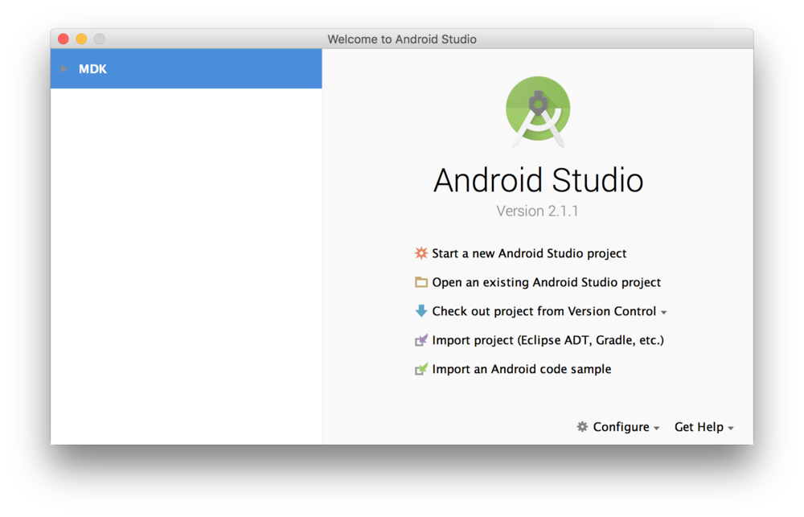
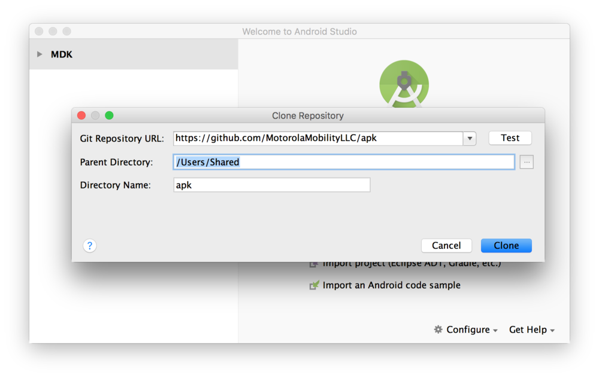
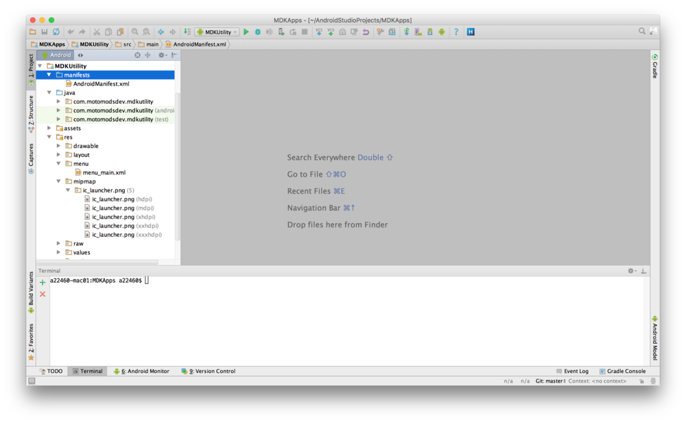
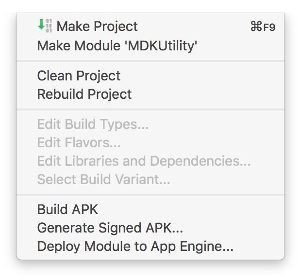
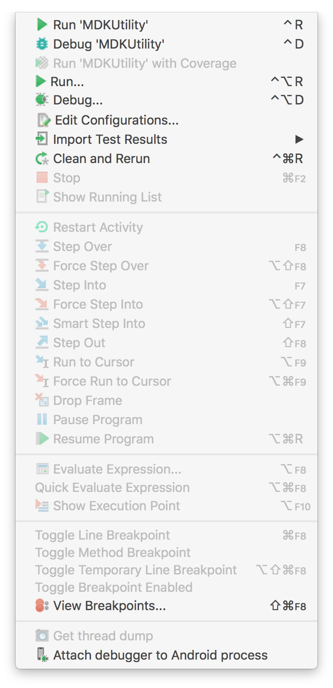

# Developer Tools: Build from Source

## Build Firmware {#build-firmware}

> **NOTE:** Before proceeding please ensure you have [setup your development environment](setup-environment.md).

### Download Source Code {#download-source-code}

Choose a directory for your build environment.

```console
$ cd <directory for your build>
$ export BUILD_TOP=`pwd`
$ git clone https://github.com/jksim/nuttx
$ git clone https://github.com/jksim/manifesto
$ git clone https://github.com/jksim/muc-loader
$ git clone https://github.com/jksim/bootrom-tools
$ git clone https://github.com/jksim/mdkutility
```
> **2016-08-04 Note:** The [mdkutility repo](https://github.com/jksim/mdkutility) is now available on github!

---

### Build kconfig-mconf {#build-kconfig-mconf}

Nuttx uses the same configuration editor that is used to build the Linux Kernel. To safely change any configurations in Nuttx (and therefore Moto Mods), you will need to build this configuration editor.

```console
$ cd $BUILD_TOP/nuttx/misc/tools/kconfig-frontends
$ ./configure --enable-mconf --disable-nconf --disable-gconf --disable-qconf
$ make
$ sudo make install
$ sudo ldconfig
```

---

### Compile Nuttx {#compile-nuttx}

```console
$ export PATH=$PATH:$BUILD_TOP/manifesto:$BUILD_TOP/bootrom-tools
$ cd $BUILD_TOP/nuttx/nuttx
$ make distclean
$ cd $BUILD_TOP/nuttx/nuttx/tools
$ ./configure.sh hdk/muc/base_unpowered
```

At this point the `configs/hdk/muc/base_unpowered/defconfig` will be copied to `$BUILD_TOP/nuttx/nuttx/.config` and the `setenv.sh` and `Make.defs` file from that same directory will be copied up to `$BUILD_TOP/nuttx/nuttx`.

```console
$ cd $BUILD_TOP/nuttx/nuttx
$ make
```

The firmware output is located in the nuttx.bin, nuttx.hex and nuttx.tftf files in your current directory. See note about file formats below.

### Making Configuration Changes - menuconfig {#making-configuration-changes-menuconfig}

Nuttx relies heavily on compile time configuration. The standard Linux menuconfig utility is used to generate this configuration.

```console
$ cd $BUILD_TOP/nuttx/nuttx
$ make menuconfig
```

You will then be presented with a text based menu system that allows you to edit the configuration. This edits the local copy of the `.config` file. If you want to return to the base configuration just go back into the tools directory and rerun the configure.sh script as described above. On the other hand, if you do want to save your changes in version control, don’t forget to copy `.config` back to the configs directory for your product.

---

### Compile bootloader {#compile-bootloader}

```console
$ cd $BUILD_TOP/muc-loader
$ ./configure hdk/developer
$ make
```

This tool is a little less sophisticated than Nuttx. If you want to change any configurations you just edit the .config file by hand. As before, copy the .config back over your defconfig to preserve the changes for future builds.

> **Quick Note about File Formats**
> There are three generated firmware image formats: ELF, bin, and TFTF. Each of these will be useful at some time. The generated bin file contains the output data and instructions for your firmware. This is what executes on the Moto Mod. Debuggers like GDB, require extra information to know the meaning and location of sections and symbols which the generated [ELF](https://en.wikipedia.org/wiki/Executable_and_Linkable_Format) files contain in a standard format. TFTF files are a small wrapper for the bin file, that provides information about where to install the binary code, and an optional signature block to allow the bootloader to validate the firmware. With the Reference Moto Mod Bootloader, it is expected that the TFTF header is located in the first 512 bytes before the main code binary.

## Build Android Application {#build-android-application}

### Android Manifest changes {#android-manifest-changes}

- As not all Android powered smartphones support the Moto Mods APIs, include `<uses-feature android:name="com.motorola.hardware.mods"/>` element in your application `AndroidManifest.xml`
- We recommend that you design your application to function correctly on smartphones without this feature, and indicate `android:required="false"` for this use feature `<uses-feature android:name="com.motorola.hardware.mods" android:required="false" />`
- Set the minimum SDK of the application to API Level 23 or higher. The Moto Mods API are not present on any smartphones with an earlier API level.
- Add `<meta-data android:name="com.motorola.mod.version" android:value="@integer/moto_mod_services_version" / >` in the Android Manifest. Also copy the `version.xml` from the SDK into `res/values/`
- If your application uses any of functionality of the ModManager, it needs to declare use of the `PERMISSION_MOD_ACCESS_INFO` permission, `<uses-permission android:name="PERMISSION_MOD_ACCESS_INFO" />`
- If your application needs access to the RAW interface, your manifest should declare that your application needs the `PERMISSION_USE_RAW_PROTOCOL` permission. Your code also needs to check for this permission grant at runtime, and prompt the user to grant this permission to your application if needed.
- Protect all your application’s receivers that handle intents from ModManager by requiring that all senders of those intents require the `PERMISSION_MOD_INTERNAL`.

#### Android Manifest Example {#android-manifest-example}

```java
<?xml version="1.0" encoding="utf-8"?>
<manifest xmlns:android="http://schemas.android.com/apk/res/android"
    package="com.motorola.samplemodapp" >

    <uses-permission android:name="com.motorola.mod.permission.MOD_ACCESS_INFO" />


    <application
        android:allowBackup="true"
        android:icon="@mipmap/ic_launcher"
        android:label="@string/app_name"
        android:supportsRtl="true"
        android:theme="@style/AppTheme" >

        <meta-data android:name="com.motorola.mod.version"
            android:value="@integer/moto_mod_services_version" />

        <activity
            android:name="com.motorola.samplemodapp.MainActivity"
            android:label="@string/app_name"
            android:theme="@style/AppTheme" >
            <intent-filter>
                <action android:name="android.intent.action.MAIN" />

                <category android:name="android.intent.category.LAUNCHER" />
            </intent-filter>
        </activity>

        <receiver
            android:name="com.motorola.samplemodapp.ModReceiver"
            android:enabled="true"
            android:exported="true" >
            <intent-filter>
                <action android:name="com.motorola.mod.action.MOD_ATTACH" />
                <action android:name="com.motorola.mod.action.MOD_DETACH" />
                <action android:name="com.motorola.mod.action.MOD_ENUMERATION_DONE" />
            </intent-filter>
        </receiver>
    </application>

</manifest>
```

For the initial release, the `version.xml` in your application res/values/ file should contain:

```xml
<?xml version="1.0" encoding="utf-8"?>
<resources>
    <integer name="moto_mod_services_version">0100000</integer>
</resources>
```

---

### Building Support for All Android Devices {#building-support-for-all-android-devices}

If your application needs to support devices which have the Moto Mod connector **as well as** generic Android devices with a single APK, you can use the `isModServiceAvailable()` to determine at runtime whether a device supports Moto Mods (and whether the version of the Moto Mods platform needed by your APK is compatible with the device it is running on).

- Include `modlib.jar` in your application
- When your application is launched, use `ModManager.isModServiceAvailable()` to determine whether the device the application is running on supports Moto Mods (or not)
- Make sure all your Moto Mods related code is only called when your application is running on a device where `ModManager.isModServiceAvailable()` returns `ModManager.SUCCESS`.

```java
if(ModManager.isModServicesAvailable(MainActivity.this) == ModManager.SUCCESS){
  //
  // Handle the case where the ModMgr version is present and compatible
  //
  } else {
  //
  // Handle the case where the ModMgr version is not compatible
  //  
  }
```

---

### Building a Sample Moto Mod aware Application {#building-a-sample-moto-mod-aware-application}

The `MDKUtility` is an sample application which listens to ATTACH and DETACH intents. The Android Studio project for the MDKUtility application is available on GitHub.

Follow these steps:

#### Step 1 {#step-1}

Open Android Studio



#### Step 2 {#step-2}

Download the Sample GitHub project by selecting “Check out project from Version Control”, and clone the APK repo posted on the [MotorolaMobilityLLC GitHub account](http://github.com/motorolamobilityllc).



#### Step 3 {#step-3}

Browse to the directory where you saved the sample code, select "MDKUtility".



#### Step 4 {#step-4}

Select **Menu > Build** / **Menu > Run** to build and run MDKUtility app.

**Menu > Run**



**Menu > Build**



#### Step 5 {#step-5}

You are all set!

[< Previous Page
**Setup Environment**](setup-environment.md)

[Next Page >
**Flashing Firmware**](flashing-firmware.md)
