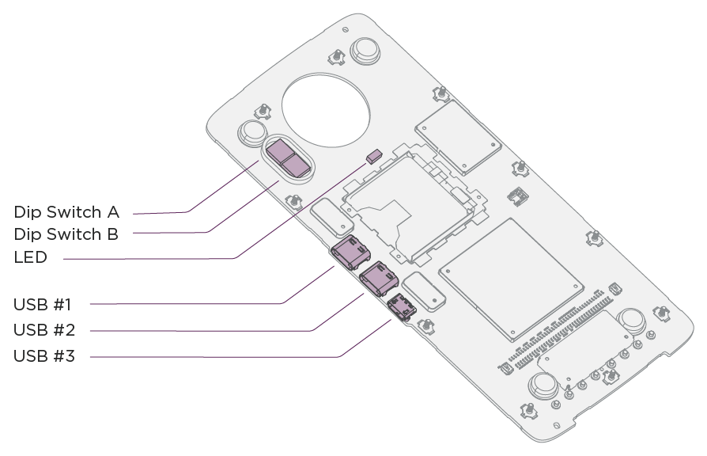

# Debug and Log

## Overview

Debugging an embedded system can be done in multiple ways.  For Moto Mod basic logging can be done along with using a Joint Test Action Group (JTAG) or Serial Wire Debug (SWD) debugger.  For convenience and to keep development costs low the MDK comes with an integrated [FTDI4232](http://www.ftdichip.com/Products/ICs/FT4232H.htm)which can be used for both JTAG and SWD as well as UART logging.  This document will cover how to use this for JTAG to the Motorola High Speed Bridge (HSB) ARM Cortex M3 as well as SWD for the Mods Microcontroller (MuC) ARM Cortex M4.

Using GNU DeBugger (GDB) with the FTDI via OpenOCD is covered in this document.  GDB will use a socket to communicate with OpenOCD, which will communicate with the target through the integrated FTDI4232.  The FTDI4232 will emulate JTAG for the Moto Bridge and emulate SWD for the MuC.

Connecting to the FTDI for JTAG or SWD requires the following:

- PC Running Linux
- USB Type C cable
- GDB ARM (See [Setup Your Development Environment](https://web.archive.org/web/2017/http://developer.motorola.com/documentation/setup-environment) for installation)
- OpenOCD (See [Setup Your Development Environment](https://web.archive.org/web/2017/http://developer.motorola.com/documentation/setup-environment) for installation)

In order for the debug Type C connector to power the phone the DIP Switch B4 must be in the on position.  See the [MDK User Guide](https://web.archive.org/web/2017/http://developer.motorola.com/documentation/reference-moto-mod) for more information on the hardware including the DIP switches.  The DIP Switch locations are called out in the figure below:



---

### Document Conventions {#document-conventions}

Commands are presented in text boxes within the document. The prompt within the box indicates which tool the command is to be used with.

- The following box and command prompt is used for commands executed on the command line (in a terminal emulator):

```
$
```

- The following box is used for command issued within the OpenOCD telnet session:

```
>
```

- The following box is used for commands issued within GDB:

```
(gdb)
```

- A hash mark (‘#’) within any of the command windows indicates a comment and does not need to be issued on the command line.
- Filenames which need to be filled in when the command is executed are indicated as <filename>.
- Commands and paths listed within the text will are in a `fixed width` font.

## Debugger Usage {#debugger-usage}

### Connecting to the Target {#connecting-to-the-target}

The procedure for connecting to the target is as follows:

1. Connect your host to debug port USB #1 with a USB Type-C cable
2. Start OpenOCD to communicate with the target
3. Start GDB and connect to the OpenOCD target interface of either the MuC or MHB
4. Configure hardware specifics for breakpoints and watchpoints
5. Load symbols into GDB
6. Optionally, load the code onto the target flash or RAM

**NOTE**: Sleep mode on the MuC complicates the connection procedure because the internal debug hardware may be powered down. The simplest fix is to disable power management mode by disabling `CONFIG_PM` in the MuC `defconfig`file. If it cannot be disabled, the MuC will exit sleep mode when receiving characters over the MuC nuttx shell. The MuC nuttx shell is attached to Port C of the FTDI4232. Simply attach to the USB UART for Port C via a terminal emulator and send characters (“enter” works well) during the connection procedures. See the section [“Accessing the MuC nuttx Shell”](#accessing-muc-shell) below for more details.

### Starting OpenOCD {#starting-openocd}

The following commands are used to start OpenOCD:

#### Starting OpenOCD Server for the MuC without Resetting {#starting-openocd-server-for-the-muc-without-resetting}

```console
$ openocd -f board/moto_mdk_muc.cfg &
```

This procedure will attach to an already running MuC. You will need to be sure the MuC is not in low power sleep mode when attaching.

#### Starting OpenOCD Server for the MuC with Reset {#starting-openocd-server-for-the-muc-with-reset}

```console
$ openocd -f board/moto_mdk_muc_reset.cfg &
```

The reset configuration will reset the MuC during the connection phase of OpenOCD. The reset will guarantee the MuC is not in low power mode. The side effect of this is that the current MuC state will be lost.

For the MuC the default OpenOCD port is **3333** for GDB and **4444** for Telnet.

#### Starting OpenOCD Server for the Motorola High-Speed Bridge {#starting-openocd-server-for-the-motorola-high-speed-bridge}

```console
$ openocd -f board/moto_mdk_hsb.cfg &
```

For the MHB the default OpenOCD port is **3334** for GDB and **4445** for Telnet.

The following scripts are involved in the startup process for OpenOCD:

<div class="md-typeset__scrollwrap"><div class="md-typeset__table">
<table><thead><tr><td>Script</td>
<td>Location</td>
<td>Description</td>
</tr></thead><tbody><tr><td><code>moto_mdk_hsb.cfg</code></td>
<td><code>openocd/tcl/board</code></td>
<td>Main configuration for the Motorola High-Speed Bridge. Includes the dependant files. Changing port numbers can be done in this configuration file.</td>
</tr><tr><td><code>moto_mdk_muc.cfg</code></td>
<td><code>openocd/tcl/board</code></td>
<td>Main configuration for the MuC. Includes the dependant files. Changing port numbers can be done in this configuration file.</td>
</tr><tr><td><code>moto_mdk_muc_reset.cfg</code></td>
<td><code>openocd/tcl/board</code></td>
<td>Same as moto_mdk_muc.cfg except this script performs a reset of the MDK before SWD attach.</td>
</tr><tr><td><code>moto_mdk_muc_common.cfg</code></td>
<td><code>openocd/tcl/board</code></td>
<td>Contains the common code and defines for the normal and reset MuC configurations. This includes the routines needed to enable and disable TSB SPI flash.</td>
</tr><tr><td><code>hsb.cfg</code></td>
<td><code>openocd/tcl/chip/motorola</code></td>
<td>Configuration for the Motorola High-Speed Bridge.</td>
</tr><tr><td><code>moto_mdk_jtag.cfg</code></td>
<td><code>openocd/tcl/interface/ftdi</code></td>
<td>Configuration of how the onboard FTDI chip communicates over JTAG.</td>
</tr><tr><td><code>moto_mdk_swd.cfg</code></td>
<td><code>openocd/tcl/interface/ftdi</code></td>
<td>Configuration of how the onboard FTDI chip communicates over SWD.</td>
</tr><tr><td><code>moto_mdk_swd_reset.cfg</code></td>
<td><code>openocd/tcl/interface/ftdi</code></td>
<td>Same as moto_mdk_swd.cfg except this script performs an FTDI reset of the MDK during configuration.</td>
</tr><tr><td><code>stm32l4x.cfg</code></td>
<td><code>openocd/tcl/target</code></td>
<td>Configuration file for connection to an STM32L4x series ARM Cortex M4. Includes convenience function definitions.</td>
</tr></tbody></table>
</div></div>

### Starting GDB {#starting-gdb}

Once OpenOCD is up and running, the next step is to start GDB:

```console
$ arm-none-eabi-gdb
```

After starting GDB you must connect to the remote target and configure hardware specifics for watchpoints and breakpoints. If you are running the debugger interface server (OpenOCD) on the same machine as the target, then you can simply connect to the correct port on the localhost. If you are running it on a different machine then you will have to specify that machine's name or ip address in instead of "localhost" below:

#### Connecting GDB to the MuC {#connecting-gdb-to-the-muc}

```
(gdb) target extended-remote localhost:3333
(gdb) set can-use-hw-watchpoints 1
```

#### Connecting GDB to the Motorola High-Speed Bridge {#connecting-gdb-to-the-motorola-high-speed-bridge}

```
(gdb) target extended-remote localhost:3334
(gdb) set remote hardware-breakpoint-limit 6
(gdb) set remote hardware-watchpoint-limit 4
```

### Loading the Code and Symbols {#loading-the-code-and-symbols}

For systems which have the code in flash memory, the symbol table must be loaded. It is also possible for the debugger to directly load the code into RAM or FLASH.

#### Loading Symbol Table Only {#loading-symbol-table-only}

Use the following command to load the symbols into the debugger manually:

```
(gdb) file <elf file>
```

Where `<elf file>` will be either `nuttx`, or `boot_hdk.elf`.

If you are developing your own Moto Mod, you may have created your own target. If so, use those files in place of the ones listed above.

#### Loading Code {#loading-code}

If you have not placed the code into the phone’s file system to be automatically loaded, it may be desirable to have the debugger load the code into the HSB RAM or the MuC flash. To do this in GDB, first run the file command as stated in “Load Symbol Table Only” section. Once symbols load, run the following command to load the code into RAM on the HSB or FLASH on the MuC:

```
(gdb) load
```

#### Additional GDB Setup {#additional-gdb-setup}

Once the code and/or symbols are loaded some additional steps may be required to debug the target. Use the following gdb commands as needed for your setup.

The default OpenOCD configuration will connect to a target which is already running. This can be changed by adding a halt command to the end of the moto_mdk_hsb.cfg. However, in most cases leaving the target running until the problem being debugged happens may be the best option. In this case gdb needs to be told that the target is running after gdb is started:

```
(gdb) continue
```

If breakpoints will be used, the watchdog timer on the HSB should be disabled. If it is not the target may reset itself when the watchdog timer expires. This must be done after the all initialization code on the HSB has run. If connecting to an already running target this initialization will most likely be completed once gdb attaches to OpenOCD. It is also recommended that a breakpoint be set at up_assert to allow for debugging of exceptions. To disable the watchdog and set a breakpoint at up_assert use the following sequence:

```
(gdb) ^C
(gdb) set *(unsigned int  *)0x40002008 = 0x00000000
(gdb) break up_assert
(gdb) continue
```

Please be aware the watchdog on the MuC will automatically stop when the MuC execution is halted, thus no disable code is needed.

### Python Enable GDB {#python-enable-gdb}

GDB can be built with support for Python scripting. This is useful to add commands which cannot be handled with simple GDB scripting. A few commands to help with nuttx debugging are included in the file `$BUILD_TOP/nuttx/nuttx/tools/gdb_nuttx_data.py`. See “Useful GDB Commands” or take a look at the file for the commands supported.

To see if Python is enabled in GDB run:

```
(gdb) show configuration
```

If the line --with-python=*(where*is a path to Python) shows up, Python is enabled. To load the Python script run:

```
(gdb) source -s <hdk_root>/nuttx/nuttx/tools/gdb_nuttx_data.py
```

### Useful GDB Commands {#useful-gdb-commands}

The table below lists useful GDB commands. For the Python based commands to work the `gdb_nuttx_data.py` script must be loaded. See “Python Enabled GDB for more details.

<div class="md-typeset__scrollwrap"><div class="md-typeset__table">
<table><thead><tr><td>Function</td>
<td>Command</td>
<td>Description</td>
<td>Location</td>
</tr></thead><tbody><tr><td rowspan="2">Dump Memory</td>
<td><code>dump<br/>
			&lt;hexb|hexh|hexw|hexl&gt;<br/>
			&lt;address&gt; &lt;size&gt;</code></td>
<td>Dumps size bytes from the address or symbol provided in both hex and character format.<br/><br/>
			Where:
			<ul><li>address is the address or a variable name to be dumped</li>
<li>size is the size in bytes to be dumped</li>
<li>hexb formats the data in hex bytes (8 bits)</li>
<li>hexh formats the data in hex half words (16 bits)</li>
<li>hexw formats the data in hex words (32 bits)</li>
<li>hexl formats the data in long words (64 bits)</li>
</ul></td>
<td>Python</td>
</tr><tr><td><code>x/&lt;n&gt;&lt;f&gt;&lt;s&gt;</code></td>
<td>Dump n memory units of size s with format x.<br/><br/>
			Where:
			<ul><li>n - Is the number of bytes (prefix with 0x for hex)</li>
<li>f - Is the format of the data</li>
<li>x - Hex</li>
<li>c - Character</li>
<li>s - Is the memory unit size</li>
<li>b - Byte (8 bits)</li>
<li>h - Halfword (16 bit)</li>
<li>w - Word (32 bit)</li>
<li>l - Long word (64 bit)</li>
</ul></td>
<td>GDB</td>
</tr><tr><td>Dump Nuttx Log</td>
<td><code>dump syslog</code></td>
<td>Prints the nuttx system log.</td>
<td>Python/Nuttx</td>
</tr><tr><td>Dump reglog</td>
<td><code>dump reglog</code></td>
<td>Prints the register log if it is configured in the nuttx build.</td>
<td>Python/Nuttx</td>
</tr><tr><td>Dump HSB I2S Regs</td>
<td><code>dump i2s</code></td>
<td>Prints the contents of the HSB I2S registers.</td>
<td>Python/HSB</td>
</tr><tr><td>Dump Registers</td>
<td><code>info regs</code></td>
<td>Dumps all registers, Can specify which ones after the command.</td>
<td>GDB</td>
</tr><tr><td>Disassemble</td>
<td><code>disassemble /m &lt;address&gt;</code></td>
<td>Disassembles the code and mixes in the high level source at address.<br/><br/>
			Where:
			<ul><li>address is an address or symbol (function name)</li>
</ul></td>
<td>GDB</td>
</tr><tr><td>Heap Info</td>
<td><code>print g_mmheap</code></td>
<td>Prints the raw nuttx heap data.</td>
<td>Nuttx</td>
</tr><tr><td>Stack Backtrace</td>
<td><code>backtrace</code></td>
<td>Prints the stack backtrace with local variables included.</td>
<td>GDB</td>
</tr><tr><td>Dump Locals</td>
<td><code>info locals</code></td>
<td>Prints the known local variables from the stack/registers.</td>
<td>GDB</td>
</tr><tr><td rowspan="2">Symbol</td>
<td><code>info symbol &lt;address&gt;</code></td>
<td>Gets the symbol name for the given address.</td>
<td>GDB</td>
</tr><tr><td><code>info address &lt;symbol&gt;</code></td>
<td>Gets the address for a symbol.</td>
<td>GDB</td>
</tr><tr><td>Start Execution</td>
<td><code>cont</code></td>
<td>Starts execution at the current program counter.</td>
<td>GDB</td>
</tr><tr><td>Set Breakpoint</td>
<td><code>break &lt;address&gt;</code></td>
<td>Sets a breakpoint at the address or symbol provided.</td>
<td>GDB</td>
</tr><tr><td>Set Watchpoint</td>
<td><code>watch &lt;address&gt;</code></td>
<td>Sets a watchpoint at the address provided. Please note if can-use-hardware-watchpoint is not set or too many watchpoints are in use this will be very slow.</td>
<td>GDB</td>
</tr><tr><td>Print Variable</td>
<td><code>print/&lt;f&gt; &lt;address&gt;</code></td>
<td>Print a high level variable. The / is optional.</td>
<td>GDB</td>
</tr><tr><td>Display uC Memory Map</td>
<td><code>info mem</code></td>
<td>Displays the memory map for the remote target.</td>
<td>GDB</td>
</tr><tr><td>Turn off press to continue</td>
<td><code>set pagination off</code></td>
<td>Turn off the prompt to press any key to continue.</td>
<td>GDB</td>
</tr><tr><td>Array Printing</td>
<td><code>set print array on<br/>
			set print elements &lt;size&gt;</code></td>
<td>Print arrays a little nicer.<br/><br/>
			Where:
			<ul><li>size - Is the number of array elements to print.</li>
</ul></td>
<td>GDB</td>
</tr></tbody></table>
</div></div>
> **NOTE**: When specifying addresses in gdb they must be prefixed with an ‘*’ for example to set a breakpoint at address 0x10000000 the command ‘break *0x10000000’ must be used.

### Standalone OpenOCD {#standalone-openocd}

As mentioned previously, OpenOCD can be used in a standalone mode. To communicate with it you must open a telnet session:

```console
# Start openocd for the MuC
$ openocd -f board/moto_mdk_muc.cfg &
$ telnet localhost 4444

# Start openocd for the HSB
$ openocd -f board/moto_mdk_hsb.cfg &
$ telnet localhost 4445
```

Once attached, a full list of commands can be obtained using the help command. Some useful commands are listed below for quick reference. For a complete list with descriptions, please see the [OpenOCD online documentation](http://openocd.org/doc/html/General-Commands.html).

<div class="md-typeset__scrollwrap"><div class="md-typeset__table">
<table><thead><tr><td>Function</td>
<td>Command</td>
<td>Description</td>
</tr></thead><tbody><tr><td>Memory Display</td>
<td><code>md&lt;size&gt; &lt;address&gt; &lt;count&gt;</code></td>
<td>Display the memory at &lt;address&gt; for &lt;count&gt; units of &lt;size&gt; where &lt;size&gt; is:
			<ul><li>b - for byte (8 bits)</li>
<li>h - for half words (16 bits)</li>
<li>w - for words (32 bits)</li>
</ul></td>
</tr><tr><td>Memory Write</td>
<td><code>mw&lt;size&gt; &lt;address&gt; &lt;data&gt;</code></td>
<td>Write &lt;data&gt; of &lt;size&gt; to the memory at &lt;address&gt; where &lt;size&gt; is:
			<ul><li>b - for byte (8 bits)</li>
<li>h - for half words (16 bits)</li>
<li>w - for words (32 bits)</li>
</ul></td>
</tr><tr><td>Memory Modify</td>
<td><code>mm&lt;size&gt; &lt;address&gt; &lt;set&gt; &lt;clear&gt;</code></td>
<td>Set the bits in &lt;set&gt; and clear the bits in &lt;clear&gt; at &lt;address&gt; where &lt;size&gt; is:
			<ul><li>b - for byte (8 bits)</li>
<li>h - for half words (16 bits)</li>
<li>w - for words (32 bits)</li>
</ul></td>
</tr><tr><td>Erase MuC Flash</td>
<td><code>stm32l4x mass_erase 0</code></td>
<td>Erase the entire MuC flash including the bootloader. Please note the last 0 is for bank 0, however all banks on the STM parts are mapped to page 0.</td>
</tr><tr><td>Program MuC Bootloader</td>
<td><code>flash write_image erase unlock mods/bin/boot_hdk-p2_mhb.bin 0x08000000</code></td>
<td>Write the bootloader to the MuC.</td>
</tr><tr><td>Halt Execution</td>
<td><code>halt</code></td>
<td>Stops the execution at it’s current location.</td>
</tr><tr><td>Resume Execution</td>
<td><code>resume [address]</code></td>
<td>Resume execution at the current program counter or <code>address</code> if specified.</td>
</tr><tr><td>Breakpoint</td>
<td><code>bp &lt;address&gt;</code></td>
<td>Set a breakpoint at &lt;address&gt;</td>
</tr></tbody></table>
</div></div>

The following commands are defined in moto_mdk_muc_common.cfg and can be used when debugging the MuC only:

<div class="md-typeset__scrollwrap"><div class="md-typeset__table">
<table><thead><tr><td>Function</td>
<td>Command</td>
<td>Description</td>
</tr></thead><tbody><tr><td>Power HSB On</td>
<td><code>hsb_pwr_on</code></td>
<td>Power up the HSB and take it out of reset.</td>
</tr><tr><td>Power HSB Off</td>
<td><code>hsb_pwr_off</code></td>
<td>Power off the HSB and assert the reset line.</td>
</tr><tr><td>Enable HSB Flash</td>
<td><code>hsb_flash_enable</code></td>
<td>Move the HSB SPI flash from HSB control to MuC control.</td>
</tr><tr><td>Disable HSB Flash</td>
<td><code>hsb_flash_disable</code></td>
<td>Move the HSB SPI flash from MuC control to HSB control.</td>
</tr><tr><td>Reset the HSB</td>
<td><code>hsb_reset_assert</code></td>
<td>Assert the HSB reset line.</td>
</tr><tr><td>Run the HSB</td>
<td><code>hsb_reset_deassert</code></td>
<td>Take the HSB out of reset.</td>
</tr><tr><td>Read the HSB flash</td>
<td><code>hsb_flash_read &lt;filename&gt;</code></td>
<td>Enables the HSB flash and reads it into a binary file <code>&lt;filename&gt;</code></td>
</tr><tr><td>Erase the HSB flash</td>
<td><code>hsb_flash_erase</code></td>
<td>Erases the entire HSB flash.</td>
</tr><tr><td>Program the HSB flash</td>
<td><code>hsb_flash_program &lt;filename&gt;</code></td>
<td>Enable the HSB flash and program it to the contents of the binary file <code>&lt;filename&gt;</code>.</td>
</tr></tbody></table>
</div></div>

### Flashing via OpenOCD {#flashing-via-openocd}

#### Programming the MuC Bootloader {#programming-the-muc-bootloader}

The Moto version of OpenOCD includes support for programming both the MuC internal flash and the HSB SPI flash. Programming of the bootloader in the MuC flash can be done with the following command run in the OpenOCD telnet session:

```
> halt
> flash write_image erase unlock out/boot_hdk.bin
```

#### Programming the HSB from the MuC {#programming-the-hsb-from-the-muc}

Programming the HSB SPI flash is a bit more complicated. The SPI flash is connected to both the MuC and the HSB. This is done so that it can be reprogrammed through the MuC during normal operation. To complicate matters further JTAG support is disabled when the HSB boots and is enabled by the code in the SPI flash. As a result it cannot be flashed through JTAG on the HSB when the flash is blank or not booting correctly. To program the flash on the HSB through the MuC use the following series of commands from the MuC OpenOCD telnet session:

```
> halt
> hsb_flash_enable
> flash erase_sector 1 0 2047
> flash write_bank 1 $BUILD_TOP/nuttx/nuttx/nuttx.tftf 0
> hsb_flash_disable
```

A shortcut command to program the flash is also available in the MuC OpenOCD telnet session:

```
> halt
> hsb_flash_program $BUILD_TOP/nuttx/nuttx/nuttx.tftf
```

Programming the SPI flash from the MuC can take 2 minutes or longer. Reading can take 11 minutes or longer. If you are working with the HSB flash on the MuC, and you do not run hsb_flash_enable, the command may not flag an error, but the result will not be what is desired. For example you will be able to read the flash with flash read_bank, but all zeros will be returned.

#### Programming the HSB from the HSB {#programming-the-hsb-from-the-hsb}

To reprogram the HSB SPI flash via HSB JTAG the following commands can be used over the OpenOCD telnet session. As noted above, JTAG is enabled in the HSB SPI flash code, this cannot be done if the HSB has not fully booted or is blank.

```
> halt
> flash erase_sector 0 0 2047
> flash write_bank 0 $BUILD_TOP/nuttx/nuttx/nuttx.tftf 0
```

Depending on the firmware loaded into the MuC it may attempt to restart the HSB when debugging or flashing. To avoid this simply start an OpenOCD debugging session on the MuC and halt execution. It can then be resumed when the HSB debugging is completed.

---

## Logging

### <a id="accessing-muc-shell"></a> Accessing the MuC nuttx Shell

Logging done on both the Motorola High-Speed Bridge (MHB) and the MuC can be accessed through the nuttx shell running on the MuC. The MHB InterProcess Communication (IPC) is used between the MuC and the MHB to move log data from the MHB to the MuC. Since the serial port on the MHB is used for IPC, the serial port is not available for nuttx communication.

The Reference Moto Mod includes an FTDI4232 to handle both JTAG/SWD debugging as well as UART to USB translation. The FTDI is attached to the debug USB Type C connector (USB #1) on the HDK. When it connects to a PC, the following will enumerate:

<div class="md-typeset__scrollwrap"><div class="md-typeset__table">
<table><thead><tr><td>Purpose</td>
<td>FTDI Port</td>
<td> </td>
</tr></thead><tbody><tr><td>MuC Serial Wire Debug</td>
<td>A (if00)</td>
<td>/dev/ttyUSB&lt;n&gt;</td>
</tr><tr><td>APBE JTAG</td>
<td>B (if01)</td>
<td>/dev/ttyUSB&lt;n+1&gt;</td>
</tr><tr><td>MuC nuttx Shell</td>
<td>C (if02)</td>
<td>/dev/ttyUSB&lt;n+2&gt;</td>
</tr><tr><td>APBE-MuC IPC</td>
<td>D (if03)</td>
<td>/dev/ttyUSB&lt;n+3&gt;</td>
</tr></tbody></table>
</div></div>

To determine the value of `n` use `ls /dev/ttyUSB*` on linux and check for new entries after plugging in the device. The following command can also assist in determining which ttyUSB the FTDI ports are connected. Match the FTDI Port from the above table to the FTDI_Quad_RS232-HS-if??-port0 string produced by the following command:

```console
$ ls /dev/ttyUSB* | xargs -I{} bash -c 'echo -n {}": "; udevadm info --name={} |grep " serial/by-id" |tail --bytes +21'
```

For the MuC nuttx shell, communications parameters must be set up as:

<div class="md-typeset__scrollwrap"><div class="md-typeset__table">
<table><thead><tr><td>Parameter</td>
<td>Value</td>
</tr></thead><tbody><tr><td>Baudrate</td>
<td>115200</td>
</tr><tr><td>Data Bits</td>
<td>8</td>
</tr><tr><td>Parity</td>
<td>None</td>
</tr><tr><td>Start Bits</td>
<td>1</td>
</tr><tr><td>Stop Bits</td>
<td>1</td>
</tr></tbody></table>
</div></div>

Before using a serial console on a Linux environment, you will need to provide your account access to the serial devices on your computer.

```console
$ sudo adduser <username> dialout
```

You will need to log out and log back in to apply the permissions. You will also need a terminal emulation program. Picocom is available on most Linux distributions and provides a simple interface. It is not installed by default. To install Picocom:

```console
$ sudo apt-get install picocom
```

After attaching the debug USB-C connector to the USB #1 port, you will have four additional tty devices added to your system. Start Picocom as follows replacing [ttyUSBx] with the appropriate interface from the above steps:

```console
$ picocom  -l -b 115200 /dev/[ttyUSBx]
```

### Enabling Moto High Speed Bridge Debugging {#enabling-moto-high-speed-bridge-debugging}

To access the HS Bridge’s debugging capabilities from the MuC Nuttx shell you need to enable the corresponding command-line app in the MuC's defconfig.

To do this, use the menuconfig tool (`make menuconfig`) and navigate to:

```
Application Configuration -->
   Mods -->
      [*] Mods MHB Client
      (apbe) Program Name
```

This will add the following config items to your `.config` file:

```ini
CONFIG_MODS_MHB_CLIENT=y
CONFIG_MODS_MHB_CLIENT_PROGNAME="apbe"
```

### Low Level Logging {#low-level-logging}

The nuttx baseline comes with simple `printf`-like logging built in. The following functions can be used to log data with this method:

<div class="md-typeset__scrollwrap"><div class="md-typeset__table">
<table><thead><tr><td>Function</td>
<td>Notes</td>
</tr></thead><tbody><tr><td><code>lldbg(fmt_str, …)</code></td>
<td>Logs the string using standard printf formats.</td>
</tr><tr><td><code>llvdbg(fmt_str, …)</code></td>
<td>Logs the string using standard printf formats only if <code>CONFIG_DEBUG_VERBOSE</code> is defined in your defconfig file.</td>
</tr></tbody></table>
</div></div>

Please be aware that it takes time to print the string and convert any numbers provided to ASCII. Please refrain for using these in an interrupt context.

The method to retrieve the log depends on which system is in use. The following table outlines the procedure for retriving the logs through the debug connection:

<div class="md-typeset__scrollwrap"><div class="md-typeset__table">
<table><thead><tr><td>System</td>
<td>Log Retrieval Method</td>
</tr></thead><tbody><tr><td>Moto Bridge</td>
<td>On the MuC in the nuttx shell run:<br/><code>apbe log</code></td>
</tr><tr><td>MuC</td>
<td>On the MuC in the nuttx shell run:<br/><code>cat /dev/ramlog</code></td>
</tr><tr><td>GDB Python Enabled and Loaded (See JTAG/SWD documentation for more details)</td>
<td>On the GDB command line run:<br/><code>dump syslog</code></td>
</tr><tr><td>GDB Python Disabled (Will print the log out of order, but is better than nothing.)</td>
<td>On the GDB command line run:<br/><code>print g_sysdev.rl_buffer</code></td>
</tr></tbody></table>
</div></div>

### Advanced reglog Logging {#advanced-reglog-logging}

Delays introduced through logging to a serial port can disrupt the realtime requirements of your code. To assist in these cases, the Moto Mods nuttx baseline includes a simple logging referred to as reglog. This was originally developed to log the time, address and value of register reads and writes and is very light-weight in processing. Reglog is also useful for general-purpose logging in time-critical code.

To do this, use the menuconfig tool (`make menuconfig`) and navigate to:

```
Device Drivers -->
        [*] Enable register logging to RAM for real time debugging
```

This will add the following config items to your `.config` file.

```ini
CONFIG_REGLOG=y
```

Once it is enabled code can be instrumented with:

```
reglog_log(address, value);
```

As mentioned previously address and value were originally intended to be register addresses and values, but they can be any `uint32_t` values. Only 3 `uint32_t` values will be added to the log:

1. 48 MHz time value at the time of the call
2. The address value
3. The data value.

Depending on which processor is being used the method for retrieving the log differs. This is because the NuttX shell on the Moto Bridge cannot be directly accessed. For the Moto Bridge, MHB must be used to retrieve the values.

<div class="md-typeset__scrollwrap"><div class="md-typeset__table">
<table><thead><tr><td>System</td>
<td>reg log dump method</td>
</tr></thead><tbody><tr><td>Moto Bridge</td>
<td>In the MuC nuttx shell run:<br/><code>apbe diag reglog</code></td>
</tr><tr><td>MuC</td>
<td>In nuttx shell run:<br/><code>cat /dev/reglog</code></td>
</tr><tr><td>GDB Python Enabled and Loaded (See JTAG/SWD documentation for more details)</td>
<td>On the GDB command line run:<br/><code>dump reglog</code></td>
</tr><tr><td>GDB Python Disabled (This will output the array, which will not be in since it is a circular buffer.)</td>
<td>On the GDB command line run:<br/><code>print/x g_reglog</code></td>
</tr></tbody></table>
</div></div>

The reglog code is capable of running in a Stack mode and a FIFO mode. By default it will startup in FIFO mode. In FIFO mode the code will treat the buffer as a circular buffer, so all calls to `reglog_log` will result in an entry being written. However, only the latest entries will be retained, due to the limited size of the buffer. If you need data at the start of a run Stack mode should be used. In this mode when the end of the buffer is reached `reglog_log` will stop adding entries. To switch between modes use the following commands:

<div class="md-typeset__scrollwrap"><div class="md-typeset__table">
<table><thead><tr><td>System</td>
<td>Stack Mode</td>
<td>FIFO Mode</td>
</tr></thead><tbody><tr><td>Moto Bridge</td>
<td>In the MuC nuttx shell run:<br/>
			   <code>apbe diagreglog_stack</code></td>
<td>In the MuC nuttx shell run:<br/>
			   <code>apbe diagreglog_fifo</code></td>
</tr><tr><td>MuC</td>
<td>In the MuC nuttx shell run:<br/>
			   <code>echo “stack” &gt; /dev/reglog</code></td>
<td>In the MuC nuttx shell run:<br/>
			   <code>echo “fifo” &gt; /dev/reglog</code></td>
</tr><tr><td>GDB</td>
<td>set var g_reglog.mode = 1<br/>
			set var g_relog.head = 0<br/>
			set var g_reglog.tail = 0</td>
<td>set var g_reglog.mode = 0<br/>
			set var g_relog.head = 0<br/>
			set var g_reglog.tail = 0</td>
</tr></tbody></table>
</div></div>
