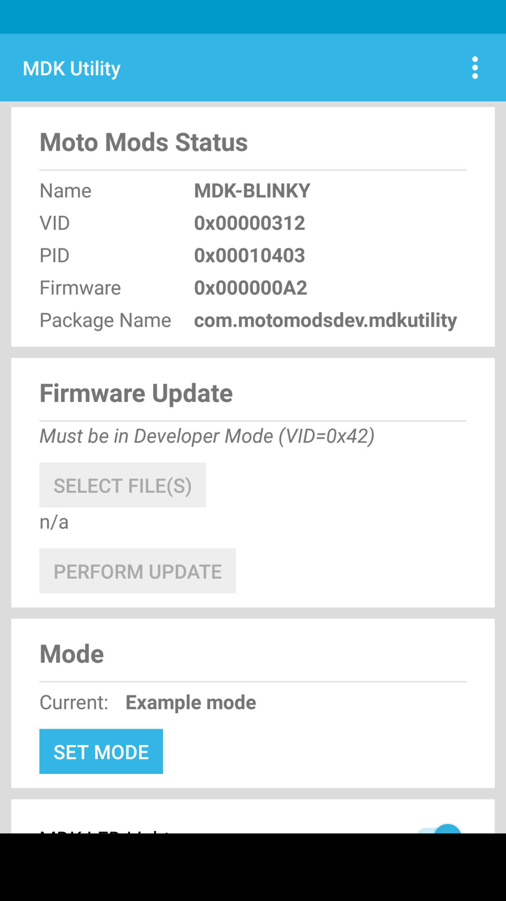
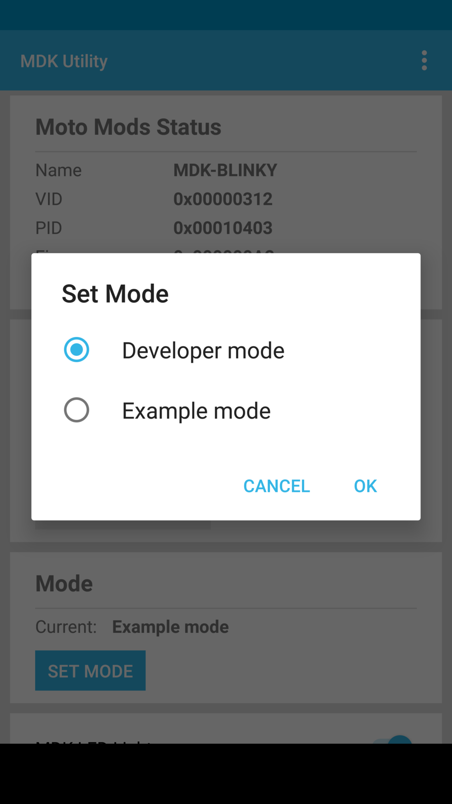
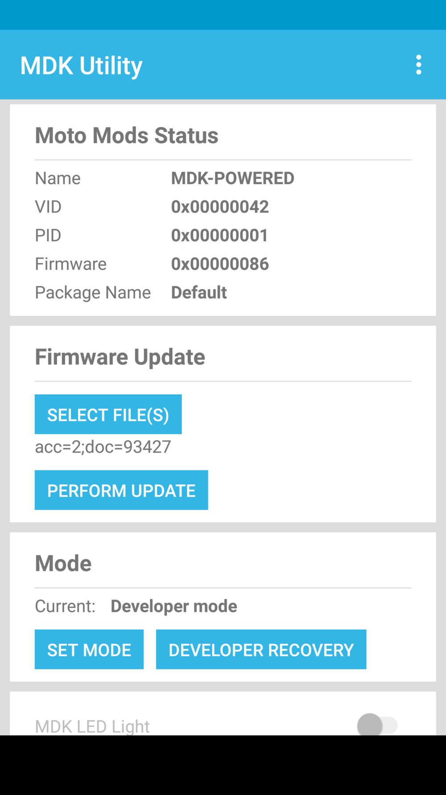

# Developer Tools: Flashing Firmware

## Overview

Once the firmware has been generated, it needs to be installed (flashed) onto the Reference Moto Mod.   The Moto Mods Development Kit (MDK) provides two mechanisms for performing a firmware flash, the MDK Utility Android Application and over Serial Wire Debug via OpenOCD.

The Reference Moto Mod Bootloader uses the Vendor ID (VID) and Product ID (PID) to ensure the correct NuttX firmware is running on the device and to provide over-the-air firmware updates.  You will need to switch between the Personality Card example mode VID and the developer prototype VID based on if you are using the example Personality Cards or developing custom code.

## Moto Mods Development Kit Utility Android Application {#moto-mods-development-kit-utility-android-application}

The MDK Utility Application which was installed when the base reference Moto Mod was connected to you Moto Z can be used to flash the bootloader and NuttX images.

Using this method requires an ‘opt-in’ from both the bootloader and NuttX when you build your custom firmware load. You will need to make sure the `CONFIG_GREYBUS_MODS_SUPPORT_VENDOR_UPDATES` parameter is set as follows:

In your bootloader defconfig:

```ini
CONFIG_GREYBUS_MODS_SUPPORT_VENDOR_UPDATES=y
```

For NuttX, use the menuconfig tool (make menuconfig) and navigate to:

```
Device Drivers  -->  
    Greybus support (GREYBUS [=y]) 
        [*] Mods Protocol
            [*] Support APK update of firmware
```

Before you will be able to flash your firmware with the MDK Utility, you must switch your Reference Moto Mod from Example to Developer Mode.

### Example and Developer Modes {#mdkutility}

The Reference Moto Mod Bootloader uses the Vendor ID (VID) and Product ID (PID) to ensure the correct NuttX firmware is running on the device and to provide over-the-air firmware updates. When you receive the Reference Moto Mod it will be in Example mode with a MDK VID and a PID derived from the Personality Card which is installed. When developing your custom firmware for prototyping, you should switch to the Developer VID of 0x42 to ensure no firmware over-the-air update attempts to reflash you Reference Moto Mod. To easily update the bootloader with Developer VID 0x42, use the Set Mode function in the MDK Utility.

The MDK Utility intentionally restricts firmware flashing to Developer VID 0x42. As a result, your prototype projects should use 0x42 for easy flashing.

### Switching Between Personality Card Modes {#switching-between-personality-card-modes}

The MDK Utility Android Application provides a simple mechanism to switch between these two VIDs as follows:





### Flashing with the MDK Utility {#flashing-with-the-mdk-utility}

From the nuttx/nuttx directory,
`$ adb push upd-<ids>.tftf /sdcard/Download/`

Then on your phone, navigate to the MDKUtility, select the file you just uploaded, and choose PERFORM UPDATE.



Should your firmware fail to boot properly, the “Name” in the MDK Utility will read “Firmware.” If this occurs, or your firmware does boot but does not work properly, use Developer Recovery to reflash the MDK-POWERED default Developer firmware.

## Serial Wire Debug Flashing with OpenOCD {#serial-wire-debug-flashing-with-openocd}

On the Reference Moto Mod provided in the MDK, the firmware may also be flashed directly through the Serial Wire Debug (SWD) interface with OpenOCD. This ensures there is a path to recovering your Reference Moto Mod if there is a error or crash in your custom firmware. Follow the procedure on the Setup Environment page for OpenOCD installation.

### Flashing MuC Bootloader {#flashing-muc-bootloader}

From the muc-loader directory:

```console
$ openocd -f board/moto_mdk_muc_reset.cfg -c "program ./out/boot_<target_name>.bin 0x08000000 reset exit"
```

### Flashing Main Firmware (Nuttx) {#flashing-main-firmware-nuttx-}

From the nuttx/nuttx directory:

```console
$ openocd -f board/moto_mdk_muc_reset.cfg -c "program upd-<ids>.tftf 0x08008000 reset exit"
```

When flashing the bootloader or firmware with OpenOCD, ensure the VID/PID matches between the two or your firmware will not boot.

[< Previous Page
**Build From Source**](build-from-source.md)

[Next Page >
**Debug And Log**](debug-and-log.md)
