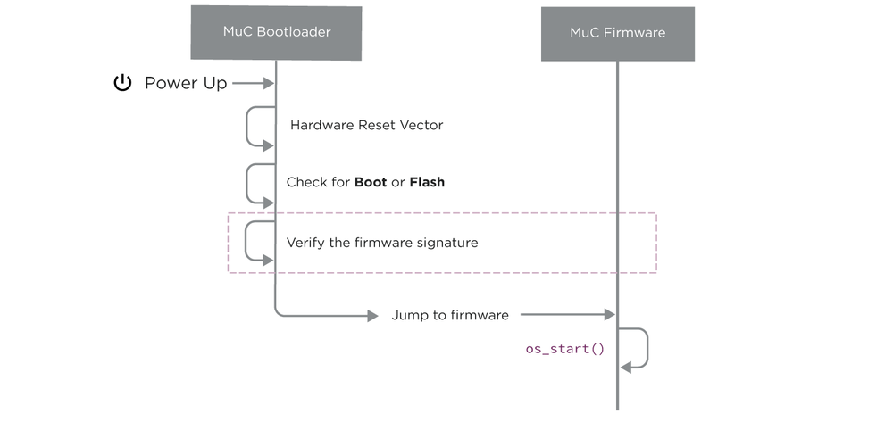
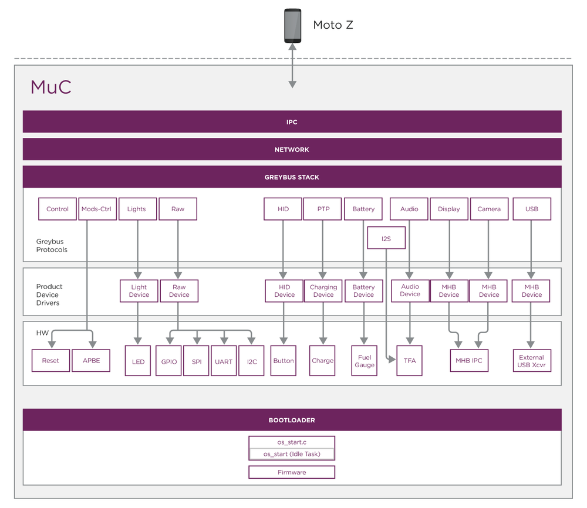
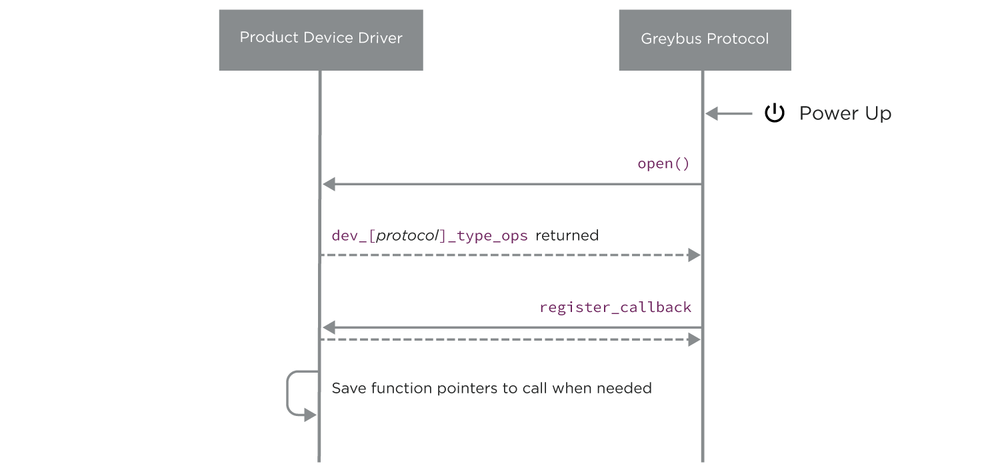
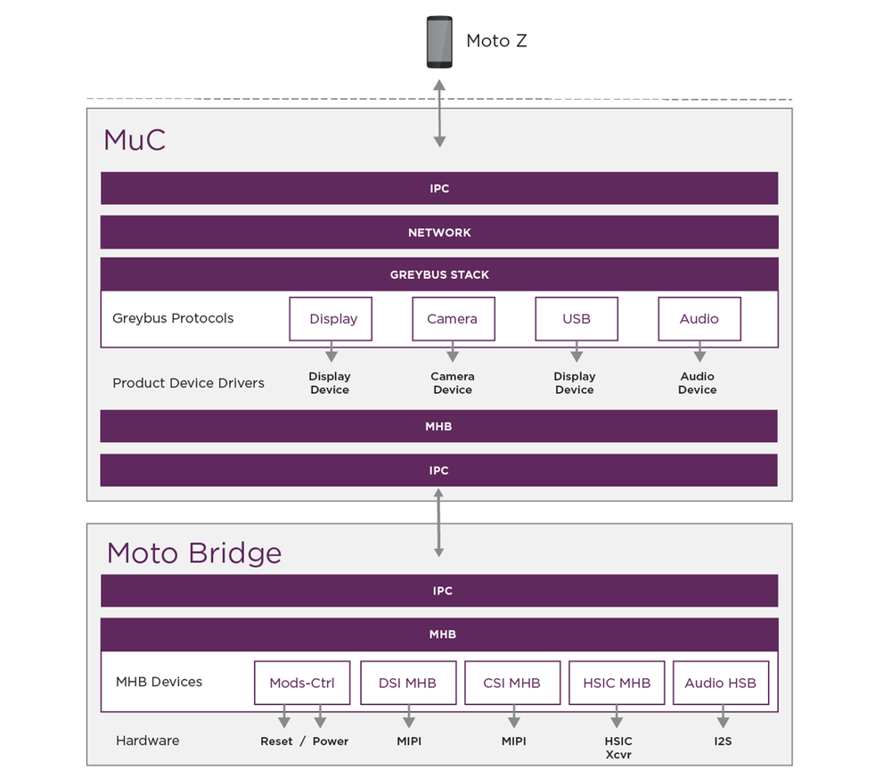

# Moto Mods Firmware: Overview

The Moto Mod Firmware covers all software that is running on the Moto Mod itself.  This is comprised of the software running on the Moto Mod Microcontroller (MuC) and the Moto High-Speed Bridge (MHB).  The MuC firmware communicates between the Moto Z and the MHB as shown in the diagram below.

The firmware for the MuC and Moto Bridge are build on top of the [NuttX Real Time OS](http://nuttx.org/).  NuttX’s small footprint and standard API support make it ideal for embedded development.  NuttX is released under the permissive BSD license and supports a wide variety of platforms, making it easier to port Greybus and Extensions to a more (or less) powerful processor.  NuttX is configured at compile time using the the same configuration tool as the Linux Kernel.  Beyond this, your firmware development is typically little more than updating the hardware Manifest with your specific configuration and writing your Device Protocol Drivers.

## MuC Firmware

The MuC firmware provides all command and control for your Moto Mod, and relays messages to the Moto Bridge as necessary.  Additionally, the MuC bootloader handles flashing updated firmware for the MuC and Moto Bridge.

### MuC Bootloader

The MuC bootloader is responsible for reliably booting and updating the main Moto Mod functionality. Firmware updates are presented in the Trusted Firmware Transfer Format (TFTF). The TFTF format provides the ability to deliver an arbitrary signature block; allowing secure validation of the firmware before booting.  The MuC bootloader is ***also*** responsible for updating the Moto Bridge’s firmware.

After verifying the proper firmware is present, the bootloader then jumps to the MuC’s main firmware.

### Main Firmware

Your main firmware is the brain of your Moto Mod.  On boot, the firmware inspects the hardware Manifest file and creates the connection for each, known as a CPort.  For each CPort found, firmware probes your devices and hooks the CPort to the your driver.  Upon attachment to the Moto Z, the MuC firmware sets up communications channels, and handles the low level signalling with the Moto Z.  The diagram below shows the overall software stack.

When your firmware powers up and the hardware Manifest is parsed, the greybus protocol driver will `open()` your device driver. As a response to the open() call, your driver shall return a `dev_[protocol]_type_ops` structure containing your function pointers for that device type. The greybus protocol driver will then call your `register_callback()` with a pointer to any callback function; your firmware should save these function pointers internally. This callback is implemented within the greybus protocol driver, your firmware calls this function when it wishes to send data to the Moto Z.

If the greybus protocol driver calls your `unregister_callback()` function, your pointers to the callback functions should be set to `NULL`.

## Moto Bridge Firmware

The Moto Bridge firmware handles configuring the high speed data paths.  Command and control is still managed by the MuC, which uses the Moto Mod High Speed Bus IPC protocol (MHB) to communicate.

### Moto Bridge Bootloader

The Moto Bridge Bootloader handles booting your bridge firmware.  As mentioned earlier, the MuC is responsible for updating the Moto Bridge Firmware.  Key distinctions between the MuC and Moto Bridge bootloaders:

- Moto Bridge bootloader resides in ROM and cannot be be updated, even during development.
- Moto Bridge bootloader performs signature check of firmware image.
- Moto Bridge bootloader copies firmware into RAM prior to execution.

### Moto Bridge Main Firmware

The Moto Bridge main firmware was designed to minimize if not eliminate the need for software changes, this is achieved via the Moto High Speed Bus IPC protocol (MHB).  Unlike the MuC firmware, the Moto Bridge is expected to be powered down when not explicitly necessary.  Where state retention may be required, this should be implemented in the MuC’s firmware.  Additionally, any related low-speed drivers (such as an LED backlight for a Display) should be in the MuC firmware.

### Moto Bridge MHB Protocol

The purpose of the MHB Protocol and IPC from the MuC is to abstract the high-speed interface configuration thus removing the need to make firmware changes to the Motorola High-Speed bridge.  This is provided in two different ways:

1. Data structures containing all configuration parameters for the interfaces
2. MHB function calls on the MuC that you edit with your particular solution

See [Display Protocol](display.md), [USB-Ext Protocol](usb-ext.md) and [Audio Protocol](audio.md) for implementation details for using the MHB to control the Moto High-Speed Bridge.

[Next Page >
**Mod Management**](mod-management.md)
