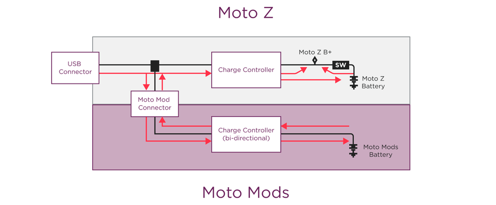

# Moto Mods Firmware: Power Transfer Protocol

## Overview

The Power Transfer protocol controls the transfer of charge between the Moto Z and the Moto Mod over the connector. The source of the charge from the Moto Mod can be either its own battery or an external charging power source.

The Moto Z is in control of the power transfer.  It issues the commands to the Moto Mod to start and stop transferring energy based on the Moto Mod capabilities and state.

To provide Power Transfer functionality, the Power Transfer protocol needs to be enabled and the Power Transfer capabilities need to be set.  In addition, a low level power transfer device driver must be implemented and the hardware manifest must be updated to include the Power Transfer Interface.



## Power Transfer Capabilities

The Moto Mod reports its power transfer capabilities to the Moto Z. The Moto Z is then responsible for controlling power transfers.

### Internal Power Sources

The Moto Mod can embed an internal power storage and source, such as a rechargeable battery. This power component can send and/or receive power from the Moto Z.

**The choices for providing power from the Moto Mod to the Moto Z are:**

- **Never** - the power is never sent to the Moto Z.
- **Supplemental** - the Moto Z may request the power at any time.
- **Low Battery Saver** - the Moto Z should not request the power unless its battery is low. (Emergency only)

For example, If the Moto Mod has a battery which primary purpose is to provide power to features embedded on the Moto Mod and cannot provide the best user experience when its battery is depleted, the Moto Mod should set this capability to the “Low Battery Saver” or “Never”.

If the only purpose of the battery on the Moto Mod is to extend the Moto Z battery life, the capability should be set to the “Supplemental”.

Please note that since the Moto Z is in charge of the power transfer logic, it is up to the Moto Z to differentiate between “Supplemental” and “Low Battery Saver” capabilities and use the power provided by the Moto Mod appropriately.

**The choices for receiving power from the Moto Mod to the Moto Z are:**

- **Never** - The Moto Mod battery is never charged by the power provided from the Moto Z.
- **First** - When attached to a power source, the Moto Z should charge the Moto Mod first before charging itself.
- **Second** - When attached to a power source, the Moto Z should charge itself before charging the Moto Mod.
- **Parallel** - When attached to a power source, the Moto Z should alternate between charging itself and the Moto Mod.

Again, since the the Moto Z is in control of all power transfers, it is responsible to  differentiate between “First”, “Second”, and “Parallel” capabilities, and implement the corresponding power-transfer logic.

### External Power Sources

The Moto Mod can optionally support accepting power from external power sources, such as a USB charger (if the Moto Mod has its own USB port) or wireless charging pad (if the Moto Mod has its own Wireless charging coil).

**The choices for the external power support are:**

- **None** - The Moto Mod does not support external power sources
- **Supported** - The Moto Mod supports external power sources

### Current Flow Direction

The Moto Z can issue commands to the Moto Mod to set the direction of current flow.  The commands are:

- **Off** - No power transfers between the Moto Z and Moto Mod.
- **To Mod** - The Mod should send the power to the Moto Z.
- **From Mod** - The Mod should receive the power from the Moto Z.

## Hardware Manifest {#hardware-manifest}

Hardware Manifest files reside in `apps/greybus-utils/manifests`, one should be created for your unique project.

0xEF is the identifier for the Power Transfer protocol.

Two entries are necessary for Power Transfer, one for the Interface and one for the Bundle.

To support Charge Only mode, the Power Transfer protocol must be in the Bundle alone or with the Battery protocol. If any other protocols are included in the bundle with Power Transfer and Battery, the Moto Mod will not be supported in Charge Only mode.

```ini
; Power Transfer interface on CPort XX
[cport-descriptor XX]
bundle = YY
protocol = 0xEF
; Battery related Bundle YY
[bundle-descriptor YY]
class = 0x08
```

**`XX`** shall be a unique integer (within your hardware manifest) defining which CPort is used for Power Transfer.

**`YY`** shall be a unique integer (within your hardware manifest) which Bundle the Power Transfer CPort is a member of.

## Implementation {#implementation}

The low level device driver specific to the hardware implements energy transfers between the Moto Z and Moto Mod.

### Files {#files}

**`nuttx/include/nuttx/device_ptp.h`**

> This file defines the device_battery_type_ops structure and provides the glue to the Greybus PTP channel.

### Methods {#methods}

The power transfer device driver must implement methods defined in the device_ptp_ops structure.

#### set_current_flow: Setting current flow direction between the Moto Z and Moto Mod {#set_current_flow-setting-current-flow-direction-between-the-moto-z-and-moto-mod}

The `set_current_flow` function enables the Moto Z to start and stop power transfers.

```c
int (*set_current_flow)(struct device *dev, uint8_t direction);
```

<div class="md-typeset__scrollwrap"><div class="md-typeset__table">
<table class="pure-table pure-table-bordered">
<thead>
<tr>
<td colspan="3">Parameters</td>
</tr>
</thead>
<tr>
<td><code>dev</code></td>
<td colspan="2">Pointer to structure of device data</td>
</tr>
<tr>
<td rowspan="4"><code>tech</code></td>
<td colspan="2">Direction of the current flow. The possible values are defined in the enum ptp_current_flow, as shown in this subtable:</td>
</tr>
<tr>
<td><code>PTP_CURRENT_OFF</code></td>
<td>No power transfers between the Moto Z and Moto Mod</td>
</tr>
<tr>
<td><code>PTP_CURRENT_TO_MOD</code></td>
<td>The Moto Z transfers power to the Moto Mod</td>
</tr>
<tr>
<td><code>PTP_CURRENT_FROM_MOD</code></td>
<td>The Moto Mod transfers power to the Moto Z</td>
</tr>
<thead>
<tr>
<td colspan="3">Return</td>
</tr>
</thead>
<tr>
<td><code>int</code></td>
<td colspan="2">0 on success, negative errno on error</td>
</tr>
</table>
</div></div>

---

#### ext_power_present: Reporting the Moto Mod external charging sources {#ext_power_present-reporting-the-moto-mod-external-charging-sources}

The `ext_power_present` function enables the Moto Z to query the presence of external power sources, such as a wireless charging pad or wired charger.

```c
int (*ext_power_present)(struct device *dev, uint8_t *present);
```

<div class="md-typeset__scrollwrap"><div class="md-typeset__table">
<table class="pure-table pure-table-bordered">
<thead>
<tr>
<td colspan="3">Parameters</td>
</tr>
</thead>
<tr>
<td><code>dev</code></td>
<td colspan="2">Pointer to structure of device data.</td>
</tr>
<tr>
<td rowspan="5"><code>present</code></td>
<td colspan="2">The output is the external charging power source(s) currently present. The possible values are defined in the enum <code>ptp_ext_power</code>, as shown in this subtable:</td>
</tr>
<tr>
<td><code>PTP_EXT_POWER_NOT_PRESENT</code></td>
<td>No sources are present</td>
</tr>
<tr>
<td><code>PTP_EXT_POWER_WIRELESS_PRESENT</code></td>
<td>Wireless charging source is present</td>
</tr>
<tr>
<td><code>PTP_EXT_POWER_WIRED_PRESENT</code></td>
<td>Wired charging source is present</td>
</tr>
<tr>
<td><code>PTP_EXT_POWER_WIRED_WIRELESS_PRESENT</code></td>
<td>Wired and wireless charging sources are present</td>
</tr>
<thead>
<tr>
<td colspan="3">Return</td>
</tr>
</thead>
<tr>
<td><code>int</code></td>
<td colspan="2">0 on success, negative errno on error</td>
</tr>
</table>
</div></div>

---

#### get_max_output_current: Reporting maximum current that can be pulled from the Moto Mod {#get_max_output_current-reporting-maximum-current-that-can-be-pulled-from-the-moto-mod}

The `get_max_output_current` function enables the Moto Z to query the maximum amount of current that it can pull from the Moto Mod.

```c
int (*get_max_output_current)(struct device *dev, uint32_t *current);
```

<div class="md-typeset__scrollwrap"><div class="md-typeset__table">
<table class="pure-table pure-table-bordered">
<thead>
<tr>
<td colspan="2">Parameters</td>
</tr>
</thead>
<tr>
<td><code>dev</code></td>
<td>Pointer to structure of device data.</td>
</tr>
<tr>
<td><code>temperature</code></td>
<td>The output is the value of current in microamps.</td>
</tr>
<thead>
<tr>
<td colspan="2">Return</td>
</tr>
</thead>
<tr>
<td><code>int</code></td>
<td>0 on success, negative errno on error.</td>
</tr>
</table>
</div></div>

---

#### power_available: Reporting power the Moto Mod can send to the Moto Z {#power_available-reporting-power-the-moto-mod-can-send-to-the-moto-z}

The `power_available` function enables the Moto Z to query whether the Moto Mod can send power to it.

```c
int (*power_available)(struct device *dev, uint8_t *available);
```

<div class="md-typeset__scrollwrap"><div class="md-typeset__table">
<table class="pure-table pure-table-bordered">
<thead>
<tr>
<td colspan="3">Parameters</td>
</tr>
</thead>
<tr>
<td><code>dev</code></td>
<td colspan="2">Pointer to structure of device data.</td>
</tr>
<tr>
<td rowspan="4"><code>available</code></td>
<td colspan="2">The output indicates if the Moto Mod can provide power to the Moto Z and whether an external or internal power source will be used to supply power. The possible values are defined in the enum <code>ptp_power_available</code>, as shown in this subtable:</td>
</tr>
<tr>
<td><code>PTP_POWER_AVAILABLE_NONE</code></td>
<td>No power is available</td>
</tr>
<tr>
<td><code>PTP_POWER_AVAILABLE_EXT</code></td>
<td>The power from external charging source will be sent</td>
</tr>
<tr>
<td><code>PTP_POWER_AVAILABLE_INT</code></td>
<td>The power from internal source (aka battery) will be sent</td>
</tr>
<thead>
<tr>
<td colspan="3">Return</td>
</tr>
</thead>
<tr>
<td><code>int</code></td>
<td colspan="2">0 on success, negative errno on error</td>
</tr>
</table>
</div></div>

---

#### power_source: Reporting the Moto Mod source of the power being sent to the Moto Z {#power_source-reporting-the-moto-mod-source-of-the-power-being-sent-to-the-moto-z}

The `power_source` function enables the Moto Z to query the source of the power the Moto Mod is sending to it.

```c
int (*power_source)(struct device *dev, uint8_t *source);
```

<div class="md-typeset__scrollwrap"><div class="md-typeset__table">
<table class="pure-table pure-table-bordered">
<thead>
<tr>
<td colspan="3">Parameters</td>
</tr>
</thead>
<tr>
<td><code>dev</code></td>
<td colspan="2">Pointer to structure of device data.</td>
</tr>
<tr>
<td rowspan="5"><code>source</code></td>
<td colspan="2">The output is the power source. The possible values are defined in the enum <code>ptp_power_source</code>, as shown in this subtable:</td>
</tr>
<tr>
<td><code>PTP_POWER_SOURCE_NONE</code></td>
<td>No power is being sent to the Moto Z</td>
</tr>
<tr>
<td><code>PTP_POWER_SOURCE_BATTERY</code></td>
<td>The Moto Mod battery power is being sent to the Moto Z</td>
</tr>
<tr>
<td><code>PTP_POWER_SOURCE_WIRED</code></td>
<td>The power from a wired charger is redirected to the Moto Z</td>
</tr>
<tr>
<td><code>PTP_POWER_SOURCE_WIRELESS</code></td>
<td>The power from a wireless charging pad is being redirected to the Moto Z</td>
</tr>
<thead>
<tr>
<td colspan="3">Return</td>
</tr>
</thead>
<tr>
<td><code>int</code></td>
<td colspan="2">0 on success, negative errno on error</td>
</tr>
</table>
</div></div>

---

#### set_max_input_current: Setting the maximum current the Moto Mod can draw from the Moto Z {#set_max_input_current-setting-the-maximum-current-the-moto-mod-can-draw-from-the-moto-z}

The `set_max_input_current` function enables the Moto Z to set the maximum amount of current the Moto Mod can draw from the Moto Z.

```c
int (*set_max_input_current)(struct device *dev, uint32_t current);
```

<div class="md-typeset__scrollwrap"><div class="md-typeset__table">
<table class="pure-table pure-table-bordered">
<thead>
<tr>
<td colspan="2">Parameters</td>
</tr>
</thead>
<tr>
<td><code>dev</code></td>
<td>Pointer to structure of device data.</td>
</tr>
<tr>
<td><code>current</code></td>
<td>The value of current in microamps.</td>
</tr>
<thead>
<tr>
<td colspan="2">Return</td>
</tr>
</thead>
<tr>
<td><code>int</code></td>
<td>0 on success, negative errno on error.</td>
</tr>
</table>
</div></div>

---

#### power_required: Reporting the Moto Mod power needs to the Moto Z {#power_required-reporting-the-moto-mod-power-needs-to-the-moto-z}

The `power_required` function enables the Moto Z to learn the Moto Mod power needs.

```c
int (*power_required)(struct device *dev, uint8_t *required);
```

<div class="md-typeset__scrollwrap"><div class="md-typeset__table">
<table class="pure-table pure-table-bordered">
<thead>
<tr>
<td colspan="3">Parameters</td>
</tr>
</thead>
<tr>
<td><code>dev</code></td>
<td colspan="2">Pointer to structure of device data.</td>
</tr>
<tr>
<td rowspan="4"><code>required</code></td>
<td colspan="2">The output indicates if the Moto Mod internal power source can be charged. The possible values are defined in the enum <code>ptp_power_required</code>, as shown in this subtable:</td>
</tr>
<tr>
<td><code>PTP_POWER_REQUIRED</code></td>
<td>The Moto Mod internal power source requires power</td>
</tr>
<tr>
<td><code>PTP_POWER_NOT_REQUIRED</code></td>
<td>The Moto Mod internal power source does not require power</td>
</tr>
<thead>
<tr>
<td colspan="3">Return</td>
</tr>
</thead>
<tr>
<td><code>int</code></td>
<td colspan="2">0 on success, negative errno on error</td>
</tr>
</table>
</div></div>

---

#### register_callback and ptp_changed: Reporting changes in the Moto Mod state through the notification callback {#register_callback-and-ptp_changed-reporting-changes-in-the-moto-mod-state-through-the-notification-callback}

The `register_callback` function provides the the `ptp_changed` callback to the device driver. Running the callback enables the Moto Mod to notify the Moto Z about state changes.

Function prototype for the Moto Mod change notification callback:

```c
typedef int (*ptp_changed)(enum ptp_change change);
```

<div class="md-typeset__scrollwrap"><div class="md-typeset__table">
<table class="pure-table pure-table-bordered">
<thead>
<tr>
<td colspan="3">Parameters</td>
</tr>
</thead>
<tr>
<td rowspan="4"><code>change</code></td>
<td colspan="2">The change in the Moto Mod state. The possible values are defined in the <code>enum ptp_change</code>, as shown in this subtable:</td>
</tr>
<tr>
<td><code>POWER_PRESENT</code></td>
<td>The Moto Mod external charging source(s) presence changed</td>
</tr>
<tr>
<td><code>POWER_REQUIRED</code></td>
<td>The Moto Mod internal power source charging needs changed</td>
</tr>
<tr>
<td><code>POWER_AVAILABLE</code></td>
<td>The Moto Mod power availability changed</td>
</tr>
<thead>
<tr>
<td colspan="3">Return</td>
</tr>
</thead>
<tr>
<td><code>int</code></td>
<td colspan="2">0 on success, negative errno on error</td>
</tr>
</table>
</div></div>

This function registers the Moto Mod change notification callback:

```c
int (*register_callback)(struct device *dev, ptp_changed cb);
```

[< Previous Page
**Battery Protocol**](battery.md)

[Next Page >
**Audio Protocol**](audio.md)
