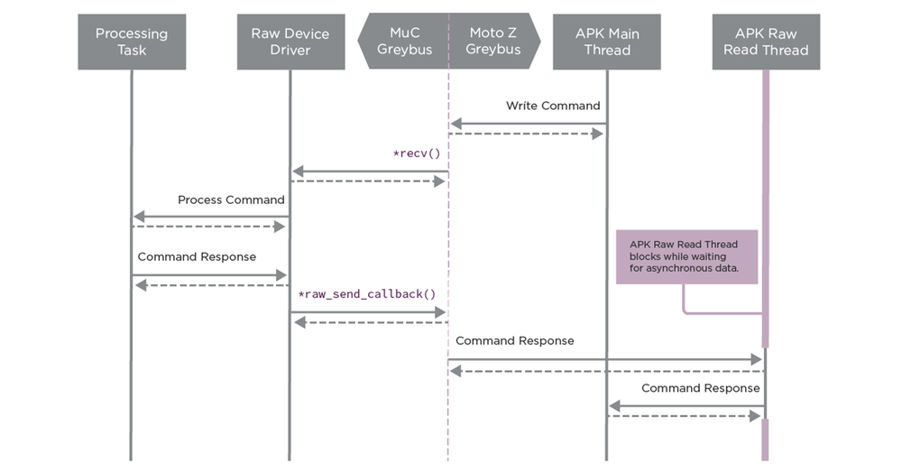

# Moto Mods Firmware: Raw Protocol

## Overview

The Raw class provides a direct channel between the Moto Mod’s Android application and the firmware itself.  At its base, it provides two way asynchronous transport.  This is the primary mechanism to implement custom behavior which will require you write a peer application.  The Moto Mods platform has no default handling of the Raw protocol, it merely provides access to the data pipe.

Any logic or higher level protocols are up to you, the developer.  When handling Raw messages, care must be taken to ensure a response is delivered within one second.  If this cannot be achieved, your implementation should separate the Raw thread from your main processing thread.

### Related Links

- [Moto Z Software: Raw Devices](../software/mod-raw-devices.md)
- [Temperature Sensor Personality Card](../../hardware/temperature-sensor-personality-card.md)

## Hardware Manifest {#hardware-manifest}

Hardware Manifest files reside in `apps/greybus-utils/manifests`, one should be created for your unique project.

**`0xFE`** is the identifier for the Raw protocol.

Two entries are necessary for Raw, one for the Interface and one for the Bundle.

```ini
; RAW interface on CPort XX
[cport-descriptor XX]
bundle = YY
protocol = 0xfe

; RAW Bundle YY
[bundle-descriptor YY]
class = 0xfe
```

**`XX`** shall be a unique integer (within your hardware manifest) defining which CPort is used for Raw.

**`YY`** shall be a unique integer (within your hardware manifest) which Bundle the Raw CPort is a member of.

## Implementation {#implementation}

### Files {#files}

**nuttx/include/nuttx/device_raw.h**

> This file defines the device_raw_type_ops structure and provides the glue to the Greybus Raw channel.

**nuttx/configs/hdk/muc/src/stm32_modsraw.c**

> This file provides the starting point for your Raw development. It should be copied into nuttx/configs/PROJECT/src for your specific Project and modified.

### Callbacks {#callbacks}

#### raw_send_callback {#raw_send_callback}

The `raw_send_callback` method is ***provided*** to your Raw device driver upon registration. Your firmware will use this function pointer to send Raw data ***TO*** the Moto Z.

```c
int (*raw_send_callback)(struct device *dev, uint32_t len, uint8_t data[])
```

<div class="md-typeset__scrollwrap"><div class="md-typeset__table">
<table class="pure-table pure-table-bordered">
<thead>
<tr>
<td colspan="2">Parameters</td>
</tr>
</thead>
<tr>
<td><code>dev</code></td>
<td>Matches dev passed to the probe function</td>
</tr>
<tr>
<td><code>len</code></td>
<td>Length in bytes of data to send (8192 bytes max)</td>
</tr>
<tr>
<td><code>data</code></td>
<td>Byte array of data</td>
</tr>
<thead>
<tr>
<td colspan="2">Returns</td>
</tr>
</thead>
<tr>
<td><code>int</code></td>
<td>0 on success, negative errno on error</td>
</tr>
</table>
</div></div>

### Structures {#structures}

#### device_raw_type_ops {#device_raw_type_ops}

The `device_raw_type_ops` structure contains pointers to your specific method implementations and is used in driver registration.

```c
struct device_raw_type_ops {
    int (*recv)(struct device *dev, uint32_t len, uint8_t data[]);
    int (*register_callback)(struct device *dev, raw_send_callback cb);
    int (*unregister_callback)(struct device *dev);
};
```

---

### Message Size {#message-size}

The Raw channel supports messages up to 8K in size. Be aware that using larger message sizes will likely require increases in stack and buffer sizes, impacting the MuC’s RAM usage.

---

### Methods {#methods}

#### recv {#recv}

You implement the `recv` method to be called when data is received ***FROM*** the Moto Z.

```c
int (*recv)(struct device *dev, uint32_t len, uint8_t data[])
```

<div class="md-typeset__scrollwrap"><div class="md-typeset__table">
<table class="pure-table pure-table-bordered">
<thead>
<tr>
<td colspan="2">Parameters</td>
</tr>
</thead>
<tr>
<td><code>dev</code></td>
<td>Matches dev passed to the probe function</td>
</tr>
<tr>
<td><code>len</code></td>
<td>Length in bytes of data received (8192  bytes max)</td>
</tr>
<tr>
<td><code>data</code></td>
<td>Byte array of data</td>
</tr>
<thead>
<tr>
<td colspan="2">Returns</td>
</tr>
</thead>
<tr>
<td><code>int</code></td>
<td>0 on success, negative errno on error</td>
</tr>
</table>
</div></div>

---

#### register_callback {#register_callback}

You implement the `register_callback` method to be called after the initial driver probe call to notify the driver of the method call used for sending Raw data.

```c
int (*register_callback)(struct device *dev, raw_send_callback cb)
```

<div class="md-typeset__scrollwrap"><div class="md-typeset__table">
<table class="pure-table pure-table-bordered">
<thead>
<tr>
<td colspan="2">Parameters</td>
</tr>
</thead>
<tr>
<td><code>dev</code></td>
<td>Matches dev passed to the probe function</td>
</tr>
<tr>
<td><code>cb</code></td>
<td>Send function pointer</td>
</tr>
<thead>
<tr>
<td colspan="2">Returns</td>
</tr>
</thead>
<tr>
<td><code>int</code></td>
<td>0 on success, negative errno on error</td>
</tr>
</table>
</div></div>

---

#### unregister_callback {#unregister_callback}

You implement the `unregister_callback` method to be called when sending data is no longer valid. The cached `raw_send_callback` pointer should be set to NULL when this is called.

It is possible to have your recv method called even after the `unregister_callback`. Your firmware must handle this gracefully.

```c
int (*unregister_callback)(struct device *dev)
```

<div class="md-typeset__scrollwrap"><div class="md-typeset__table">
<table class="pure-table pure-table-bordered">
<thead>
<tr>
<td colspan="2">Parameters</td>
</tr>
</thead>
<tr>
<td><code>dev</code></td>
<td>Matches dev passed to the probe function</td>
</tr>
<thead>
<tr>
<td colspan="2">Returns</td>
</tr>
</thead>
<tr>
<td><code>int</code></td>
<td>0 on success, negative errno on error</td>
</tr>
</table>
</div></div>

## Usage

When communicating with your APK, the below diagram shows a Command initiated via Raw from your APK and responded to by your firmware.



For an end-to-end example of using the Raw protocol, see the [Temperature Sensor Personality Card](../../hardware/temperature-sensor-personality-card.md) (example coming soon).

[< Previous Page
**Mod Management**](mod-management.md)

[Next Page >
**Display Protocol**](display.md)
