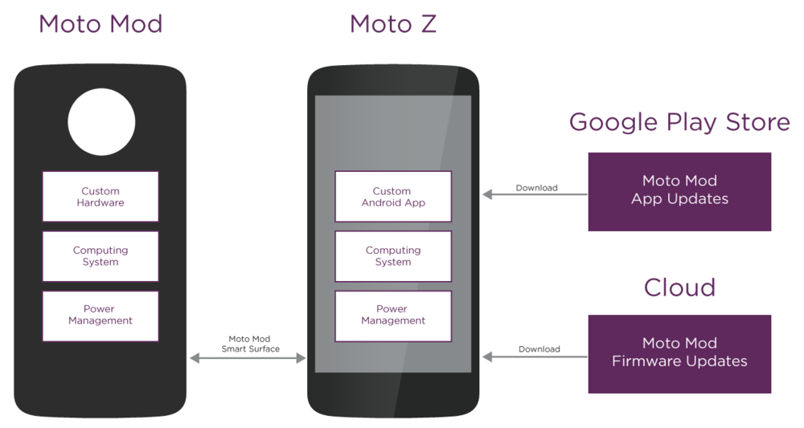
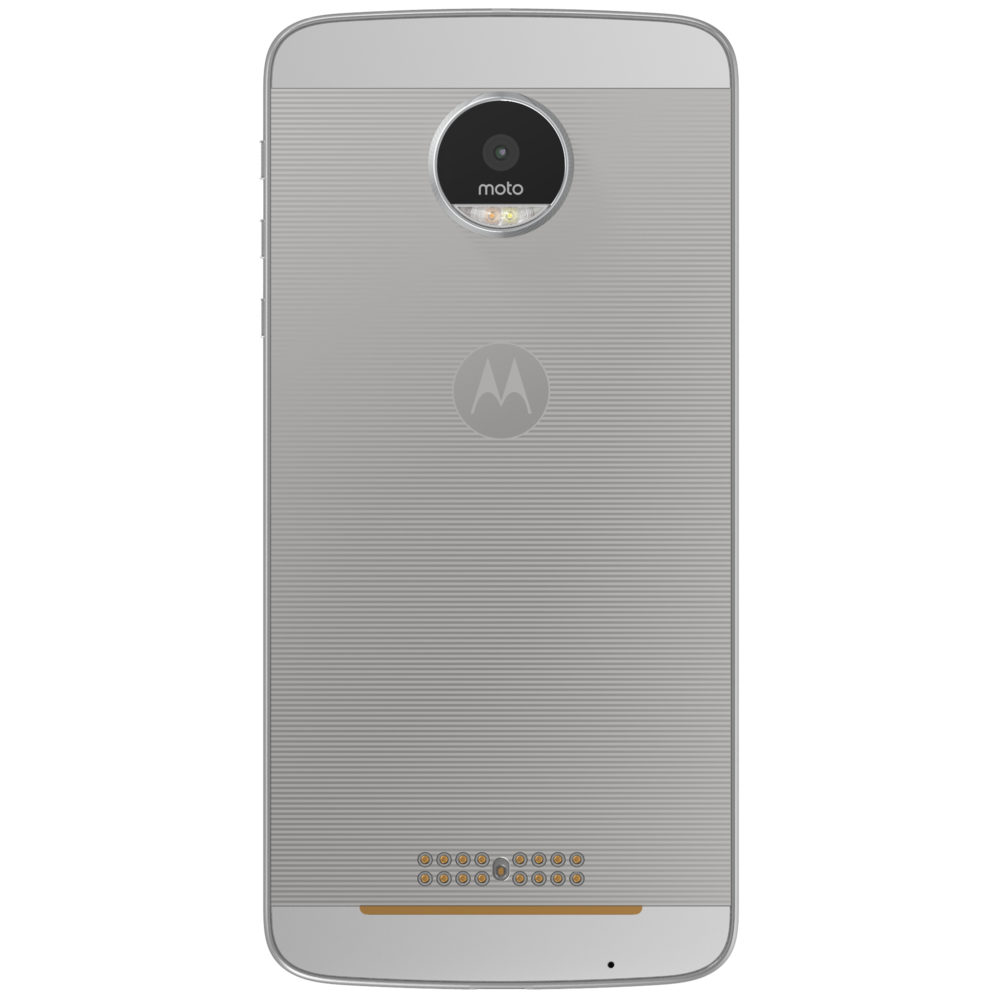
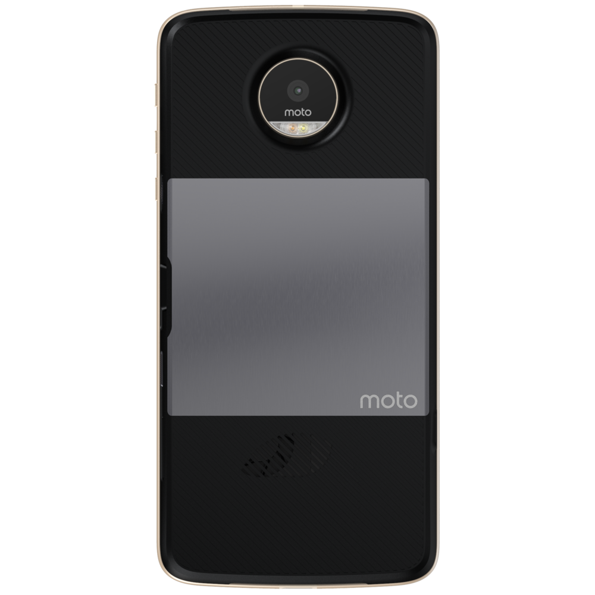
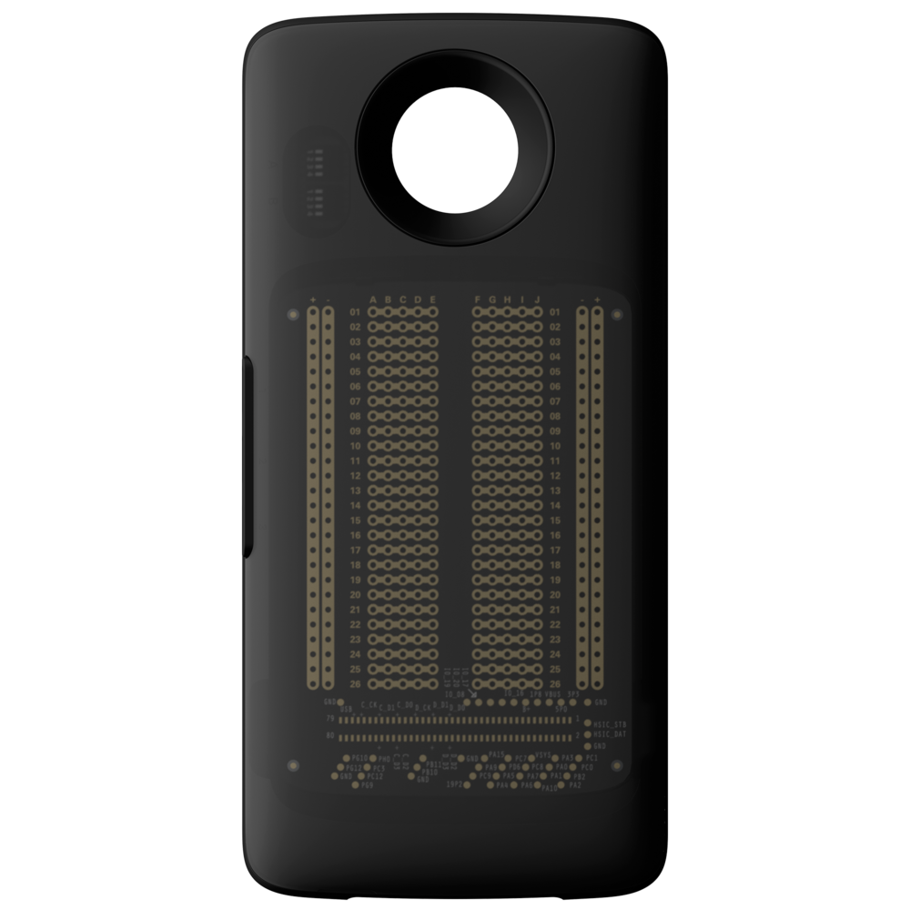

# Explore Platform

## The Moto Mods Platform

Our platform allows you to design and build your own Moto Mods. As a developer, you’ll be able to design Moto Mods that include a superspeed USB device or a small sensor  — and everything in between. Read more about the [system architecture](system-architecture.md).

## The Moto Z

The Moto Mod platform has been meticulously designed to ensure your Moto Z maintains good wireless, audio and imaging performance whenever a commercial Moto Mod is attached.

Every Moto Z comes with a Moto Mod Smart Surface. The Smart Surface is a revolutionary concept that enables connectivity, attachment and alignment of Moto Mods. It supports a hot swap architecture without the clunky look and feel of traditional modular systems. All communication and power travels over a system of pins made from 23K gold with a hydrophobic nano coating. A metallic back plate serves as a magnetic attachment point.

Moto has integrated support for many Moto Mod protocols directly into Android. APIs have also been added to enable developers build their own applications and communicate with their custom-designed Moto Mod.

Developers can host their Android apps in the Google Play store. These apps are automatically downloaded and installed when the associated Moto Mod is attached for first time.

## The Moto Mods

When attached, the capability of the Moto Z is enhanced and extended by the unique hardware in your Moto Mod.

The Moto Mod system is architected around a dual processor computing system that controls your unique hardware and manages communication with the Moto Z. You will need to create your own firmware, customized to your Moto Mod design. To simplify this process, Moto provides an easy-to-learn development environment along with the necessary tools.

Your Moto Mod firmware can also be updated by any Moto Z using a custom Android API. This firmware can be hosted in the cloud or embedded into an Android app enabling you to roll out new experiences, features or bug fixes.

## The MDK

In tandem with this website, the Moto Mods Development Kit (MDK) provides the resources that a developer needs to prototype an idea and develop a commercial Moto Mod.

It includes a [Reference Moto Mod](../build/mdk-user-guide/reference-moto-mod.md), a [Perforated Card](../build/mdk-user-guide/perforated-board.md) for you to solder your own components to, and an example cover.

Together with a Moto Z, the MDK is the ideal starting point for developing your own Moto Mod.

[**System Architecture**](system-architecture.md)

[**Moto Mods SDK for Android**](software/index.md)

**[Moto Mods Firmware](firmware/index.md)**
