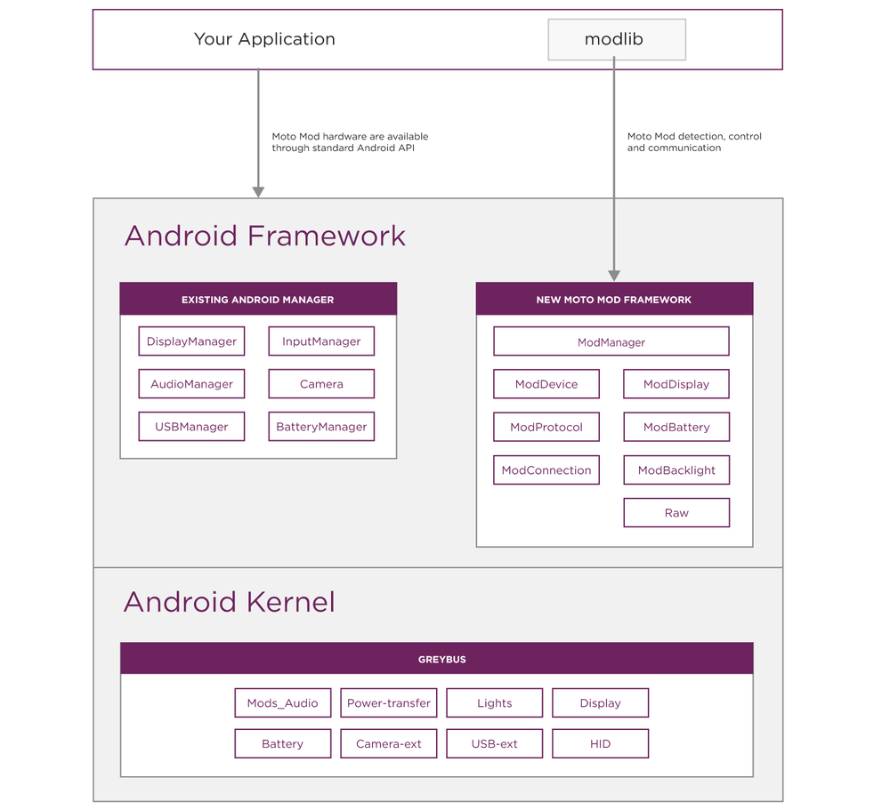

# Moto Mods™ SDK for Android™: Overview

Android applications can discover, communicate and interact with Moto Mods using APIs provided by the Moto Mods SDK for Android. Use the Moto Mods SDK for Android when you want to create a Moto Mod aware application that can observe Moto Mod hotplug events or perform base level I/O with a Moto Mod that is tightly coupled with a specific Moto Mod design.

A Moto Mod aware application typically has to:

1. **Discover** connected Moto Mod devices, using a listener or broadcast intents
2. **Determine** which MotoMod is attached
3. **Retrieve** information on the protocols supported by the attached Moto Mod
4. **Listen, and react to state changes** on an attached Moto Mod

If the Moto Mod supports a custom communication protocol, the application will need to:

1. **Ask the user** for permission to connect to the Moto Mod device
2. **Communicate with the Moto Mod** device by reading and writing data on the appropriate interface endpoints
3. **Close communication** when done

## Android Class Structure

The Moto Mods SDK allows Android applications to detect when a specific Moto Mod device is attached, to communicate directly with the device over a direct messaging channel or configure the device according to settings stored in persistent memory on the Moto Z. A Moto Mod aware application should include the Moto Mods SDK library in its Android Studio project to compile code that accesses the SDK APIs.

## Detection and Configuration

The central components of the Moto Mods SDK are the `ModManager` and `ModDevice` classes.

Using the `ModManager`, an Android application can register to receive the `ATTACH` and `DETACH` broadcast intents sent on every Moto Mod state change. An application can also retrieve the list of current attached Moto Mods with the `getModList()` function and identify which Moto Mod is attached through its Vendor (“`VID`”) and Product (“`PID`”) ID.

An Android application needs to bind to the `ModManager` to retrieve the attached `ModDevice`. From the `ModDevice`, you can enumerate the `ModProtocol` supported by this `ModDevice` to determine its capabilities, and obtain an object or interface to communicate with each component exposed by the Moto Mod.

All certified Moto Mods have a unique combination of `Vendor ID` (`VID`) and `Product ID` (`PID`). If the behavior of your application relies on a specific Moto Mod being attached to the device, your application should use the VID and PID fields to confirm that the Moto Mod attached to your device is the one which your application expects.

The following table describes the Moto Mods SDK classes and APIs in the `com.motorola.mod` package.

To know when a Moto Mod is attached or query the parameters of a Moto Mod, an application needs to use the following classes are provided by the Moto Mods SDK for Android.

<table class="pure-table pure-table-bordered">
<thead>
<tr>
<td>Class</td>
<td>Description</td>
</tr>
</thead>
<tr>
<td><code>ModManager</code></td>
<td>The <code>ModManager</code> class is the central component of the Moto Mods SDK for Android. It broadcasts <code>ATTACH</code>, <code>DETACH</code> intents and provides API for applications to track state changes of a Moto Mod, enumerate the list of Moto Mod currently attached to the phone. </td>
</tr>
<tr>
<td><code>ModDevice</code></td>
<td>
The <code>ModDevice</code> class abstracts the attached Moto Mod and enables an application to retrieve product and protocol details about this Moto Mod.

An application can retrieve the <code>PID</code>, <code>VID</code>, <code>Product Name</code>, <code>Vendor name</code>, <code>serial number</code> and <code>firmware</code> version of the Moto Mod device. An application can query the protocols supported by the device and instantiate a class object for each supported protocol.
</td>
</tr>
<tr>
<td><code>ModProtocol</code></td>
<td>The <code>ModProtocol</code> class describes the protocol supported by a <code>ModDevice</code>. Use this class to query whether the currently attached Moto Mod declares supports a particular protocol.</td>
</tr>
<tr>
<td><code>ModConnection</code></td>
<td>The <code>ModConnection</code> class enables an application to access a Raw device file descriptor.</td>
</tr>
</table>

## Device Control and Communication

In many cases,  developer can use existing Android (AOSP) API. For devices below, there are no new Motorola namespace API to work with and use these standard devices.

<table class="pure-table pure-table-bordered">
<thead>
<tr>
<td>Device Type</td>
<td>Description</td>
</tr>
</thead>
<tr>
<td><code>Displays</code></td>
<td>Display devices are natively supported over the Moto Mod interface and the Android <code>DisplayManager</code> and <code>MediaRouter</code>. Moto has also exposed the ability to customize secondary displays system behavior through the  <code>ModDisplay</code> java class.</td>
</tr>
<tr>
<td><code>Audio</code></td>
<td>Audio devices are natively supported over the Moto Mod interface and the Android <code>AudioManager</code>, without any additional SDK/API.</td>
</tr>
<tr>
<td><code>HID</code></td>
<td>Use the Android standard HID support to work with an HID capable. There are no additional HID API exposed in the Moto Mods SDK.</td>
</tr>
<tr>
<td><code>USB</code></td>
<td>Use the Android standard USB Manager API to work with an USB capable Moto Mod. There are no additional USB API exposed in the Moto Mods SDK.</td>
</tr>
<tr>
<td><code>Battery</code></td>
<td>Your phone will automatically make best use of battery devices when attached</td>
</tr>
</table>

In addition to the generic Moto Mod detection classes, the Moto Mods SDK provides some additional API to control and manage certain types classes.

<table class="pure-table pure-table-bordered">
<thead>
<tr>
<td>Device Type</td>
<td>Description</td>
</tr>
</thead>
<tr>
<td><code>Custom Devices</code></td>
<td>
Custom devices are supported using the <code>Raw</code> protocol. It enables an application to send/receive data directly to a MotoMod outside of a specific hardware class.

The <code>ModProtocol</code>, <code>ModConnection</code> classes let your application request permission to communicate with a Moto Mod over Raw, and obtain <code>FileDescriptor()</code> for the Raw channel.
</td>
</tr>
<tr>
<td><code>Battery Status</code></td>
<td>
The <code>BatteryManager</code> class to track charge and discharge status of an attached battery. This function allows an application to track charge and discharge of an attached Moto Mod battery.
</td>
</tr>
<tr>
<td><code>Backlit Display</code></td>
<td>The <code>ModDisplay</code> class provides API to enable you to turn attached display on and off. The <code>ModBacklight</code> class provides APIs to set brightness of Moto Mod display.</td>
</tr>
</table>

## Android Development Model

Some Moto Mods capabilities integrate seamlessly with Android and won’t require a dedicated Android application. Examples of these include Moto Mods with battery, display, speaker or input hardware. For these, the hardware exposed by a Moto Mod will be immediately available for use when the Moto Mod is attached to a phone.

Most Moto Mod developers will want to create a custom Android application to interact and control their hardware. The extent to which an application uses the Moto Mods SDK depends on its use cases.

<table class="pure-table pure-table-bordered">
<thead>
<tr>
<td>Use Case</td>
<td>SDK Required?</td>
<td>Development Model</td>
</tr>
</thead>
<tr>
<td> You need to know when a specific Moto Mod is attached or detached. </td>
<td><strong>Yes</strong></td>
<td> Use our <code>ModManager</code> and ModDevice classes to listen for Moto Mod attach and detach intents and recognize which Moto Mod is attached.</td>
</tr>
<tr>
<td> You need to send/receive data to your Moto Mod</td>
<td><strong>Yes</strong></td>
<td> Use our <code>ModManager</code>, <code>ModDevice</code>, <code>ModConnection</code> and <code>ModProtocol</code> classes to get access to the Raw device and communicate with the Moto Mod.</td>
</tr>
<tr>
<td> You need to display content on the secondary display in your Moto Mod</td>
<td><strong>No</strong></td>
<td> Moto Mod displays are Android secondary displays,  and always accessible through Android’s  <code>DisplayManager</code> and <code>MediaRouter</code>.</td>
</tr>
<tr>
<td> You need to play content through the speaker of an attached Moto Mod.</td>
<td><strong>No</strong></td>
<td> Audio is automatically routed to/from an Audio Moto Mod based on its declared audio device type. Your application can simply Android’s <code>AudioManager</code> to control content playback.</td>
</tr>
<tr>
<td>You want to power your Moto Z with battery in your Moto Mod</td>
<td><strong>No</strong></td>
<td>Your Moto Mod battery is utilized by a Moto Z based on the battery type defined in the Moto Mod battery-firmware implementation. The Moto Z charging state is reported through Android’s <code>Battery Manager</code> <code>ACTION_BATTERY_CHANGED</code> intent.</td>
</tr>
</table>

[Next Page >
**Mod Management**](mod-management.md)

## Related references

- [Moto Mods SDK for Android API Reference](http://motorolamobilityllc.github.io/motomods_sdk/com/motorola/mod/package-summary.html)
- [Moto Mods SDK for Android API Reference](http://motorolamobilityllc.github.io/motomods_sdk)
- [Index](http://motorolamobilityllc.github.io/motomods_sdk/index.html)
- [ModListener](http://motorolamobilityllc.github.io/motomods_sdk/index.html?com/motorola/mod/ModListener.html)
- [ModBacklight](http://motorolamobilityllc.github.io/motomods_sdk/index.html?com/motorola/mod/ModBacklight.html)
- [ModBattery](http://motorolamobilityllc.github.io/motomods_sdk/index.html?com/motorola/mod/ModBattery.html)
- [ModConnection](http://motorolamobilityllc.github.io/motomods_sdk/index.html?com/motorola/mod/ModConnection.html)
- [ModContract](http://motorolamobilityllc.github.io/motomods_sdk/index.html?com/motorola/mod/ModContract.html)
- [ModDevice](http://motorolamobilityllc.github.io/motomods_sdk/index.html?com/motorola/mod/ModDevice.html)
- [ModDisplay](http://motorolamobilityllc.github.io/motomods_sdk/index.html?com/motorola/mod/ModDisplay.html)
- [ModInterfaceDelegation](http://motorolamobilityllc.github.io/motomods_sdk/index.html?com/motorola/mod/ModInterfaceDelegation.html)
- [ModManager](http://motorolamobilityllc.github.io/motomods_sdk/index.html?com/motorola/mod/ModManager.html)
- [ModProtocol](http://motorolamobilityllc.github.io/motomods_sdk/index.html?com/motorola/mod/ModProtocol.html)
