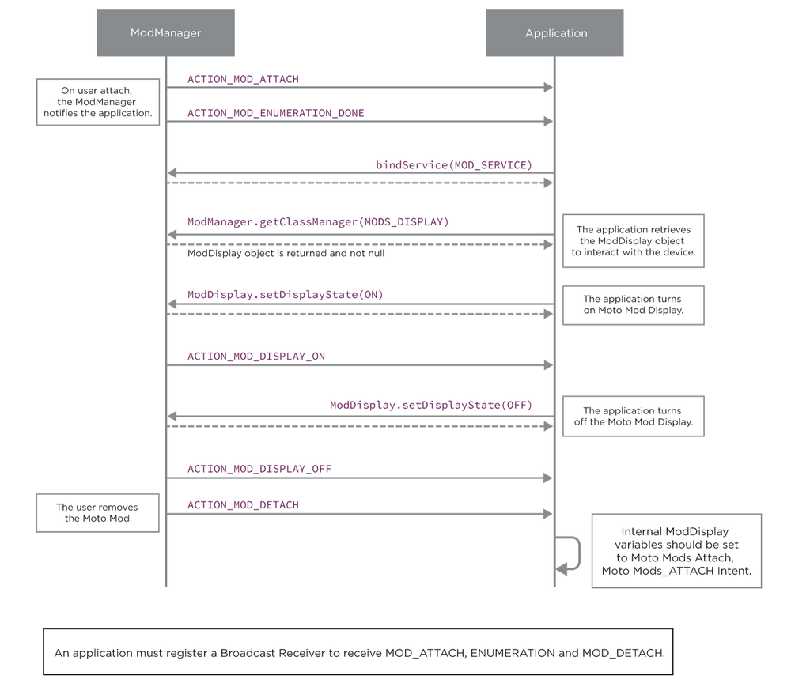

# Moto Z Software: Mod Display

## Introduction {#introduction}

An Android device has a primary display, which is typically the integrated display on the device and provides the primary interface to the user (most commonly, the touch-enabled display on a smartphone). Android also supports transient, additional secondary displays. These are usually connected over a MHL or HDMI port, but on your Moto Z, these secondary displays can be hosted on, or connected through, a Moto Mod.

The Moto Mod platform supports secondary displays over the Moto Mod connector, either using DSI or myDP. To integrate a display, your Moto Mod must support the `Display-ext` protocol as defined in the [Display Protocol](../firmware/display.md) firmware page. To add backlight control to an Moto Mod display your Moto Mod must support the Light protocol, as defined in the [Lights Protocol](../firmware/lights.md) firmware page.

Displays hosted on a Moto Mod present themselves to Android as an secondary display when the Mod attaches and are then available as mirror or presentation displays to Android applications through the standard Android [`DisplayManager`](http://developer.android.com/reference/android/hardware/display/DisplayManager.html) and [`MediaRouter`](http://developer.android.com/guide/topics/media/mediarouter.html) classes.

Moto Mods with the `Display-Ext` protocol will enumerate as secondary display in the Android [`DisplayManager`](http://developer.android.com/reference/android/hardware/display/DisplayManager.html) and [`MediaRouter`](https://developer.android.com/reference/android/media/MediaRouter.html).

In the current Android release (N, or API level 24 and below), the foreground application on the primary display determines the usage of the secondary display when it is connected and powered. The foreground application can choose to display additional media or presentation content on this secondary display through the Android [`Presentation`](http://developer.android.com/reference/android/app/Presentation.html) class. If the foreground applications does not route specific media or presentation objects to the secondary display, then your Android device by default mirrors the primary display’s content on the secondary display.

Any application that is written to utilize an Android secondary display will automatically work with a Moto Mod display without requiring changes to the application.

A developer may optionally use the Moto Mod Android SDK’s `ModDevice`, `ModDisplay` and `ModBacklight` classes in his application to determine whether the attached display is hosted on a Moto Mod and control some additional parameters on the connected secondary display.

## Prerequisites {#prerequisites}

### Android Prerequisites {#android-prerequisites}

#### Set up your development environment {#set-up-your-development-environment}

Before using the `ModManager`, `ModDevice` and `ModDisplay` classes described below in your application, you must have installed the Moto Mod Android SDK on your development device as described in the tool section.

#### Familiarity with the Android Display Manager {#familiarity-with-the-android-display-manager}

Before proceeding, you should be familiar with Android’s [`DisplayManager`](http://developer.android.com/reference/android/hardware/display/DisplayManager.html) and [`Presentation`](http://developer.android.com/reference/android/app/Presentation.html) classes and MediaRouter APIs, as Moto Mod display will be accessible through these standard Android APIs.

### Hardware Prerequisites {#hardware-prerequisites}

Display specific functions exposed through the Moto Mod Android SDK will only be available when a Moto Mod attaches to a Moto Z, powers on and declares support for the `Display-Ext` protocol.

## Android, Moto Mod display and Android secondary Display {#android-moto-mod-display-and-android-secondary-display}

When attached to a Moto Z, a Moto Mod display is automatically recognized as an Android secondary display. The Moto Mod platform leverages the standard Android support for secondary, transient displays.

- A foreground application can use the display hosted on a Moto Mod as a presentation display via Android’s standard secondary displays API. The foreground application thus has the option to either take control of the content shown on the Moto Mod display or mirror the primary display (the default system behavior)
- If the foreground application does not take control of the secondary display, when a display Moto Mod is attached, then Android will automatically **mirror** the content of Android’s primary display on the Moto Mod display

## Display States and Moto Mod Displays



## Detecting Displays with the ModDisplay class {#detecting-displays-with-the-moddisplay-class}

### Detecting when a Moto Mod is attached {#detecting-when-a-moto-mod-is-attached}

Your application can listen to the generic attach (`com.motorola.mod.ModManager.ACTION_MOD_ATTACH`)and enumeration complete (`com.motorola.mod.ModManager.ACTION_MOD_ENUMERATION_DONE`) Intents, as described in the [Mod Manager API](mod-management.md) documentation.

### Detecting whether a Moto Mod has a Display {#detecting-whether-a-moto-mod-has-a-display}

In addition to supporting the Android `DisplayManager`, the Moto Mod SDK provides a set of helper APIs and intents to track and control the physical behavior of an secondary display hosted on a Moto Mod. These additional functions as accessed through the `ModDisplay` and `ModBacklight` class.

After a Moto Mod has completed its enumeration, all the protocols supported by the Moto Mod will be available and ready. An application can determine whether the Moto Mod provides an secondary display by binding to the `ModManager`, accessing the current `ModDevice` with the `ModManager.getModList()` function, and checking that the currently connected ModDevice declares support for the `MODS_DISPLAY` protocol.

```java
if (device.hasDeclaredProtocol(ModProtocol.Protocol.MODS_DISPLAY))
   // The Mod has a Display.

If (device.hasDeclaredProtocol (ModProtocol.Protocol.MODS_BACKLIGHT)) 
  // The Mod display supports independent control of its backlight
```

To control attached MotoMod Display, an application needs to retrieve the corresponding `ModDisplay` object from the attached `ModDevice` using `getClassManager()`.

```java
ModDisplay display = (ModDisplay)mManager.getClassManager(ModProtocol.Protocol.MODS_DISPLAY);
   // your application can control the display state with this ModDisplay

ModBacklight backlight = (ModBacklight) mManager.getClassManager(ModProtocol.Protocol.LIGHTS);
   // your application can control the backlight state with this ModBacklight
```

### Detecting if a Moto Mod Display is ON or OFF {#detecting-if-a-moto-mod-display-is-on-or-off}

While a Moto Mod can host a display, and declare support for the DISPLAY protocol, the display panel hosted on the Moto Mod should be powered ON for this display to be available to Android applications. It is up to your Moto Mod firmware to control the state of a display on initial attachment.

As an example, a Moto Mod could have a separate on/off button on the display which turns the Moto Mod Display on/off or could be a hotplug DisplayPort interface for a monitor. The `ModDisplay` class in the Moto Mod SDK provides a simple intent for your application to monitor the state of a `ModDisplay`.

- When a Moto Mod Display is turned ON, the ModManager service will broadcast Intent `ACTION_DISPLAY_ON` to indicate that the Mod Display has been turned on. The secondary display will be available, and an application can control it through the interface of a standard Android [`Presentation`](http://developer.android.com/reference/android/app/Presentation.html) object.

- When a Moto Mod Display is turned OFF, the ModManager service will broadcast Intent `ACTION_DISPLAY_OFF`. At this point, the Android secondary display will no longer be available.

```java
// register local broadcast receiver for display on/off events

IntentFilter filter = new IntentFilter();
     filter.addAction(ModDisplay.ACTION_DISPLAY_OFF); 
filter.addAction(ModDisplay.ACTION_DISPLAY_ON);
```

### Actively Querying the State of a Mod Display {#actively-querying-the-state-of-a-mod-display}

In addition to intents, the ModDisplay class also provide a method for an application to query or control the secondarynal display state. A `Display-Ext` protocol compliant Moto Mod will allow an application to control its display state. A class-compliant `ModDisplay` can be either in:

- `STATE_OFF : The Moto Mod Display is OFF`
- `STATE_ON : The Moto Mod Display is ON`

The `getModDisplayState()` method lets an application retrieve the state of a `ModDisplay`. A class compliant Moto Mod Display should return its ON/OFF state. If the `ModDisplay` state can not be determined, `getModDisplayState()` will return `STATE_UNKNOWN`.

```java
ModDisplay display = (ModDisplay)mManager.getClassManager(ModProtocol.Protocol.MODS_DISPLAY);
if (display != null)
   return display.getModDisplayState();
```

The `setModDisplayState(int state)` lets an application control the state of a `ModDisplay (STATE_ON or STATE_OFF)`.

```java
display = (ModDisplay)mManager.getClassManager(ModProtocol.Protocol.MODS_DISPLAY);
if (display.setModDisplayState(state))
   // Success
else
   // Failure
```

### Setting the brightness of a ModDisplay {#setting-the-brightness-of-a-moddisplay}

Your application can control the brightness of a `ModDisplay`. The brightness control API is exposed through the LIGHTS greybus protocol, and exposed to application through the `ModBacklight` object. An application which wants to control the brightness of an attached display should use the `setModBacklightBrightness()` method.

```java
If (device.hasDeclaredProtocol (ModProtocol.Protocol.MODS_BACKLIGHT)) 
   // The Mod display supports independent control of its backlight

   backlight = (ModBacklight)mManager.getClassManager(ModProtocol.Protocol.LIGHTS);
   // get the ModBacklight object to control backlights

   backlight.setModBacklightBrightness(128);
   // set the brightness to 128
```

## Secondary Displays Management using Android’s DisplayManager and Media Router {#secondary-displays-management-using-android-s-displaymanager-and-media-router}

When a Moto Mod hosts an external display, that display is visible to and can be controlled by Android’s standard `DisplayManager interface`. Thus, in addition to the `ModDisplay` class, an application can rely on Android’s standard support for external displays, including the intents thrown by the `DisplayService` to indicate availability of external displays.

### Determining whether an external display is present {#determining-whether-an-external-display-is-present}

External displays can be detected by using Android’s `DisplayManager`. Your application first needs to bind to the DisplayManager using the `getSystemService()` and ask for the `DISPLAY_SERVICE`, as shown below:

```
DisplayManager dm = (DisplayManager) getSystemService(DISPLAY_SERVICE);
```

An application can then get a list of all available displays by calling `getDisplays()` without arguments or filter by the display type (`getDisplays(DISPLAY_CATEGORY_PRESENTATION)`) if it is only interested in external displays. If the primary display is not a `Presentation` display, your application will get a list of connected external displays, including the one on the Moto Mod.

```
// Retrieve all attached external displays
Display[] displays = dm.getDisplays(DisplayManager.DISPLAY_CATEGORY_PRESENTATION);
```

### Using the MediaRouter class {#using-the-mediarouter-class}

An alternative to using the DisplayManager directly is to use the MediaRouter system service to determine which routes are active for playback. Your application needs to bind to the `MediaRouter` system service by calling `getSystemService(MEDIA_ROUTER_SERVICE)`. MediaRouter manages the default routes used for media playback on a device. Your application can then use the `getSelectedRoute(MediaRouter.ROUTE_TYPE_LIVE_VIDEO)` function to determine the available path for video output, and the `RouteInfo` object can be used to determine the Presentation Display associated with the route. Your application can also add use a `RouteCallback` to get notified when an external display Moto Mod is attached to your device and is available for video routing.

```
mMediaRouter = (MediaRouter) getSystemService(Context.MEDIA_ROUTER_SERVICE);
```

### Tracking State change of an External Display with a DisplayListener() {#tracking-state-change-of-an-external-display-with-a-displaylistener-}

An application can register a display listener with `DisplayManager.DisplayListener()`. This listener will be called when any external displays are added or removed to your device and can help your application respond to changes in the availability of external displays, including a `ModDisplay`.

```java
private class ModDisplayListener implements DisplayListener {

   // When our Listener detects an external Display has been 
   // added, then we create a new Presentation object and refresh
   // the external display

   @Override 
   public void onDisplayAdded(int displayId) {
      DisplayManager dm = (DisplayManager) getSystemService(DISPLAY_SERVICE);
      Display disp = dm.getDisplay(displayId);
      if (disp != null) {
         mPresentation = new TestPresentation(MainActivity.this, disp);
         mPresentation.show();
      }
   }

   // When our Listener detects an external Display has been 
   // removed, then we clear our Presentation object
   @Override
   public void onDisplayRemoved(int displayId) {
      if(mPresentation != null && mPresentation.getDisplay().getDisplayId() == displayId) {
         mPresentation = null;
      }
   }
}
```

## Displaying Content on an attached Moto Mod Display {#displaying-content-on-an-attached-moto-mod-display}

To display custom content on Moto Mod display, an application need only use the Android Provided `Presentation` display type or `MediaRouter API`. There are no new additional Motorola namespace APIs required. Any Application which natively supports Android secondary display will work with an attached Moto Mod.

### Using a Presentation Display {#using-a-presentation-display}

To control content on an external display, an application needs to use a `Presentation` container. `Presentation` is a subclass of the `Dialog` class, and the content of a `Presentation` object can be displayed on an external display. A developer is recommended to consult Android’s [`Presentation` class documentation](http://developer.android.com/reference/android/app/Presentation.html) for further details.

[< Previous Page
**Mod Raw Devices**](mod-raw-devices.md)

[Next Page >
**Mod Battery**](mod-battery.md)

## Related references

- [Moto Mods SDK for Android API Reference](http://motorolamobilityllc.github.io/motomods_sdk/com/motorola/mod/package-summary.html)
- [Moto Mods SDK for Android API Reference](http://motorolamobilityllc.github.io/motomods_sdk)
- [Index](http://motorolamobilityllc.github.io/motomods_sdk/index.html)
- [ModListener](http://motorolamobilityllc.github.io/motomods_sdk/index.html?com/motorola/mod/ModListener.html)
- [ModBacklight](http://motorolamobilityllc.github.io/motomods_sdk/index.html?com/motorola/mod/ModBacklight.html)
- [ModBattery](http://motorolamobilityllc.github.io/motomods_sdk/index.html?com/motorola/mod/ModBattery.html)
- [ModConnection](http://motorolamobilityllc.github.io/motomods_sdk/index.html?com/motorola/mod/ModConnection.html)
- [ModContract](http://motorolamobilityllc.github.io/motomods_sdk/index.html?com/motorola/mod/ModContract.html)
- [ModDevice](http://motorolamobilityllc.github.io/motomods_sdk/index.html?com/motorola/mod/ModDevice.html)
- [ModDisplay](http://motorolamobilityllc.github.io/motomods_sdk/index.html?com/motorola/mod/ModDisplay.html)
- [ModInterfaceDelegation](http://motorolamobilityllc.github.io/motomods_sdk/index.html?com/motorola/mod/ModInterfaceDelegation.html)
- [ModManager](http://motorolamobilityllc.github.io/motomods_sdk/index.html?com/motorola/mod/ModManager.html)
- [ModProtocol](http://motorolamobilityllc.github.io/motomods_sdk/index.html?com/motorola/mod/ModProtocol.html)
