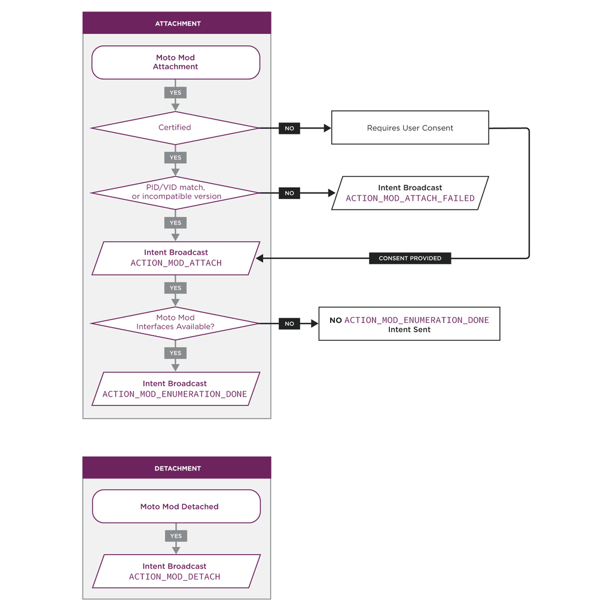
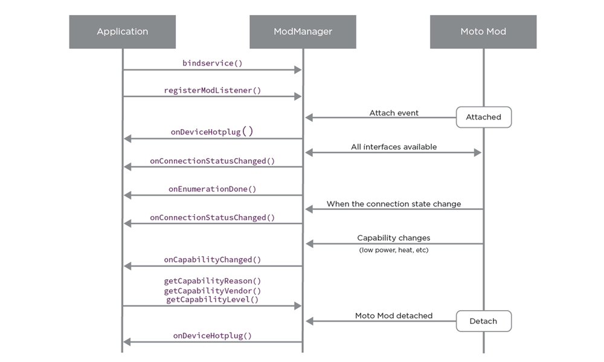

# Moto Mods™ SDK for Android™: Mod Mangement

## ModManagerService and API Overview {#modmanagerservice-and-api-overview}

The `ModManagerService` is the core component of the Moto Mod platform. The `ModManager` class enables third party applications to detect and communicate with Moto Mods. Applications should leverage the ModManager service to detect Moto Mod `ATTACH` or `DETACH` events.

Each Moto Mod attached to your smartphone has a corresponding `ModDevice`. When the Moto Mod is attached, an application can obtain an instance of the attached `ModDevice` through the `ModManagerService`. Once an application has obtained the `ModDevice`, it can retrieve information about the Moto Mod, including its `vendor ID`, `product ID`, `UID` and the `ModProtocol` it supports.

### Development Prerequisites {#development-prerequisites}

You must first install the Moto Mod Android SDK library, configure your Android project to use the SDK’s library and make the requisite changes to your application’s Android manifest. See [Setup Your Development Environment](../../build/tools/setup-environment.md).

### Hardware Prerequisites {#hardware-prerequisites}

To be able to test the functions of the Moto Mod SDK, you will also need the Moto Mod HDK or a protocol-compliant Moto Mod. The protocol-specific functions exposed through the `ModDevice` class will only be available when a protocol-compliant Moto Mod is attached.

### Determining if a device supports Moto Mods {#determining-if-a-device-supports-moto-mods}

If your application must interoperate with generic Android devices in addition to the Moto Z, the Moto Mod SDK enables your app to check at runtime whether `ModServices` are available on the target device.

This runtime check can be performed with the `ModManager.isModServicesAvailable()` function. This function will check whether `ModServices` are available on the device (e.g. whether your device supports the Moto Mod interface), and whether the Moto Mod platform version required by your application -as declared in your manifest- is compatible with the version of the Moto Mod platform currently supported by your device. Before using `isModServicesAvailable()`, your application needs bind to the `ModManagerService`.

```java
if(ModManager.isModServicesAvailable(MainActivity.this) == ModManager.SUCCESS){
  //
  // This device supports Moto Mods
  //
  } else {
  //
  // This device does not support Moto Mods
  }
```

The `isModServicesAvailable()` API performs two checks :

- Whether the `ModManagerService` runs on your device. This is used perform a runtime check of whether the device running your application supports the Moto Mod interface or not.
- Whether the minimal Moto Mod Platform version required by your application is supported by this device. This is a compatibility check based on the minimal Moto Mod platform version specified in your application’s manifest.

### Identifying a Moto Mod {#identifying-a-moto-mod}

Each Moto Mod has a set of hardware identifiers and a hardware manifest. These are programmed in the Moto Mod during manufacturing. The identifier contains the Moto Mod Product ID and Vendor ID, while the manifest declares the functionality supported by the hardware.

#### Product and Vendor Information {#product-and-vendor-information}

On attachment, a Moto Mod will provide the Moto Z with identifying attributes including its vendor id, product id, product name and vector name. An application can retrieve these values with the `ModManager` and the `ModDevice` java classes.

<div class="md-typeset__scrollwrap"><div class="md-typeset__table">
<table class="pure-table pure-table-bordered">
<thead>
<tr>
<td>Identified</td>
<td>Format</td>
<td>Details</td>
</tr>
</thead>
<tr>
<td>Vendor ID</td>
<td>32 bit value</td>
<td>A 32 bit value, unique per vendor, and assigned by Motorola. For example, `296` is `Motorola`.</td>
</tr>
<tr>
<td>Product ID</td>
<td>32 bit value</td>
<td>A 32 bit value corresponding to the Product ID, and assigned by the vendor.</td>
</tr>
<tr>
<td>Vendor Name</td>
<td>String</td>
<td>The vendor name corresponding to the Vendor ID, as a string ('Motorola').</td>
</tr>
<tr>
<td>Product Name</td>
<td>String</td>
<td>The product name, as a string.</td>
</tr>
<tr>
<td>Moto Mod Unique ID</td>
<td>String</td>
<td>The unique UID of the device, use in lieu of serial number for most mods. The UID is read from the Moto Mod processor. For the current design, an example of the UID <code>00000000-2030-3538-5436-500c0059004d</code></td>
</tr>
</table>
</div></div>

For certified Moto Mods, the `vendor ID` is a unique 32 bit INT. Moto Mod `vendor ID` are assigned by Motorola and guaranteed to be unique across vendors. The `product ID` is assigned by the Moto Mod manufacturer and should be distinct for each individual product. (0xFFFFFFFF and 0x00000000 are reserved `Product ID` values).

The `Product name` and `Vendor name` are strings programmed in the Moto Mod hardware manifest by the Moto Mod vendor. These might not correspond to the name under which the product is marketed.

While developing a Moto Mod with the Moto Mod HDK, we recommend that developers who do not have a Motorola assigned Vendor ID self-assign a unique developer VID and PID, and names.

#### Certification Information {#certification-information}

On each attachment of a Moto Mod, the Moto Z also will check whether the attached device is certified or not.

- Devices which are identified as **Certified** (‘Moto Mods’) will be immediately available for use upon attach without additional user consent.
- Devices which can not be validated as certified upon attach will require **additional user consent** after initial attach before being made available for use to the Moto Z. The platform will automatically prompt the user to provide consent.


Please refer to the [PARTNER](../../partner/certification-program.md) section to review the Certification requirements and understand how to work with Motorola to certify your Moto Mod

#### Supported Protocols {#supported-protocols}

A Moto Mod can declare support for one or multiple `greybus protocols` through its hardware manifest. Each protocol a Moto Mod declares support for in its hardware manifest must have the corresponding hardware and firmware on the Moto Mod.

The `ModProtocol` class has a protocol entry for each supported greybus protocol, except the base Control protocol which is common. The supported protocols correspond to the logical interfaces defined in the first version of the Moto Mod platform. The protocol supported in the initial release of the Moto Mod platform, as their corresponding `ModProtocol` values are:

<div class="md-typeset__scrollwrap"><div class="md-typeset__table">
<table class="pure-table pure-table-bordered">
<thead>
<tr>
<td>Logical Interface</td>
<td>Corresponding ModProtocol defined constant</td>
<td>Used for</td>
</tr>
</thead>
<tr>
<td><em>raw</em></td>
<td><code>RAW</code></td>
<td>Direct connection channel between a device and a Moto Mod</td>
</tr>
<tr>
<td><em>power-transfer-protocol</em></td>
<td><code>PTP</code></td>
<td rowspan="2">Batteries and Power-Supplies</td>
</tr>
<tr>
<td><em>battery</em></td>
<td><code>BATTERY</code></td>
</tr>
<tr>
<td><em>display-ext</em></td>
<td><code>MODS_DISPLAY</code></td>
<td>External Displays</td>
</tr>
<tr>
<td><em>audio-ext</em></td>
<td><code>MODS_AUDIO</code></td>
<td>Audio devices</td>
</tr>
<tr>
<td><em>hid</em></td>
<td><code>HID</code></td>
<td>Input devices</td>
</tr>
<tr>
<td><em>usb-ext</em></td>
<td><code>USB-EXT</code></td>
<td>USB devices on a Moto Mod</td>
</tr>
<tr>
<td><em>lights</em></td>
<td><code>LIGHTS</code></td>
<td>Display Backlight or Light</td>
</tr>
</table>
</div></div>

Your Motorola Android device will automatically discover and utilize the services declared by the ModDevice when it is attached.

### Moto Mod SDK primary classes

The primary classes provided by the Moto Mod SDK are:

<div class="md-typeset__scrollwrap"><div class="md-typeset__table">
<table class="pure-table pure-table-bordered">
<thead>
<tr>
<td>Class</td>
<td>Details</td>
</tr>
</thead>
<tr>
<td><em>ModManager</em></td>
<td>The central component of the Moto Mod infrastructure. It notifies applications of Moto Mod events, and provides access to ModDevice.<br/>The ModManager also enables applications to register a ModListener which will be called on state changes on the Moto Mod connection status.</td>
</tr>
<tr>
<td><em>ModDevice</em></td>
<td>A ModDevice represents an individual Moto Mod, its product information and the declared interfaces and protocol.<br/>A ModDevice is enumerated through the ModManager and corresponds to the attached Moto mod. Once an application has obtained the attached ModDevice, it can determine which protocols this device exposes.</td>
</tr>
<tr>
<td><em>ModProtocol</em></td>
<td>The ModProtocol class defines the protocols, or interfaces advertised by a Moto Mod device.</td>
</tr>
<tr>
<td><em>ModConnection</em></td>
<td>The ModConnection contains details on the current connection to the attached ModDevice. It should be used when an application needs to query the state of a connection, or get connection error codes.</td>
</tr>
</table>
</div></div>

### Working Mod Manager Intents {#working-mod-manager-intents}

#### Attach and detach lifecycle {#attach-and-detach-lifecycle}

Moto Mods can be attached and detached from a device at anytime. Android applications can get notified when a Moto Mod is attached to a device. When a Moto Mod is attached to a device, the `ModManagerService` will handle all the following tasks:



1. The `ModManagerService` will detect attachment of an accessory.
2. The `ModManagerService` will perform a certification check as described above.
   - Your device will need to be unlocked (past secure lockscreen) when a Moto mod is attached for the first time.
   - If the Moto Mod is recognized as certified, no user input will be required.
   - If the device is not recognized as certified, the `ModManagerService` will prompt the user for consent before attaching and enumerating the device. None of its functionality will be available until consent has been provided, and no `ACTION_MOD_ATTACH` will be broadcast until consent has been received.
3. The `ModManagerService` will broadcast the `ACTION_MOD_ATTACH` intent to notify applications that a Moto Mod has been attached. This intent announces that a Moto Mod has attached, but does not guarantee that the functions of the device are fully initialized and in an operational state.
4. When all the interfaces advertised by the Moto Mod have been successfully brought up, the `ModManagerService` will broadcast an `ACTION_MOD_ENUMERATION_DONE` intent. An application should listen for `ACTION_MOD_ENUMERATION_DONE` if it needs confirmation that all the interfaces supported by the Moto Mod are available.
5. Any error will result in a `ACTION_MOD_ERROR` intent being broadcast. An application should track the ERROR intent to detect any failure in the Moto Mod attachment.
6. When the user detaches the Moto Mod from the Moto Z, the `ModManagerService` will tear down all active interfaces, and broadcast the `ACTION_MOD_DETACH` to indicate the accessory has been removed.

#### Additional information available in the ACTION_MOD_ATTACH intent {#additional-information-available-in-the-action_mod_attach-intent}

The ModManager service broadcasts a `com.motorola.mod.ModManager.ACTION_MOD_ATTACH` intent whenever a Moto Mod has been attached to the device. The `ACTION_MOD_ATTACH` intent only indicates a Moto Mod has been attached, it does not guarantee its functionality is available for use.

An application which registers to receive the `ACTION_MOD_ATTACH` intent can get additional information about the exact Moto Mod being attached from 6 intent extras. To parse these intent extra safely, your application must include the Moto Mod SDK library.

<div class="md-typeset__scrollwrap"><div class="md-typeset__table">
<table class="pure-table pure-table-bordered">
<thead>
<tr>
<td>Extra</td>
<td>Details</td>
</tr>
</thead>
<tr>
<td><code>EXTRA_VENDOR_ID</code></td>
<td>The vendor ID of the Mod , a 32bit value assigned by Motorola to the Mod Vendor and unique per manufacturer.</td>
</tr>
<tr>
<td><code>EXTRA_PRODUCT_ID</code></td>
<td>The product ID of the Mod , a 32 bit value unique per product.</td>
</tr>
<tr>
<td><code>EXTRA_VENDOR</code></td>
<td>The vendor name, as a string ('StanCo').</td>
</tr>
<tr>
<td><code>EXTRA_PRODUCT</code></td>
<td>The product name, as a string ('Pitchfork').</td>
</tr>
<tr>
<td><code>EXTRA_UNIQUE_ID</code></td>
<td>The UID of the device, use in lieu of serial number for most mods. The UID is read from the Moto Mod processor. It is usually in the <code>00000000203934545232500C00250041</code> format.</td>
</tr>
<tr>
<td><code>EXTRA_MOD_DEVICE</code></td>
<td>The ModDevice corresponding to this Mod, which can be used to query the classes supported by the Moto Mod.</td>
</tr>
</table>
</div></div>

The sample code below shows how to parse the Vendor ID, product ID, Unique ID, Vendor name and product name of a Moto Mod.

```java
String action = intent.getAction();
  if(action != null ){
   if(action.equals(ModManager.ACTION_MOD_ATTACH)){
     int vid = intent.getIntExtra(ModManager.EXTRA_VENDOR_ID,
           INVALID_ID);
     int pid = intent.getIntExtra(ModManager.EXTRA_PRODUCT_ID,
           INVALID_ID); 
     ParcelUuid p = (ParcelUuid)intent.getParcelableExtra(ModManager.EXTRA_UNIQUE_ID);
     UUID uid = p == null? INVALID_UID : p.getUuid();
     String vendor =  intent.getStringExtra(ModManager.EXTRA_VENDOR);
     String product = intent.getStringExtra(ModManager.EXTRA_PRODUCT);
```

Your application can also declare an intent filter to filter for the `com.motorola.mod.ModManager.ACTION_MOD_ATTACH` intent. The following example shows how to declare the intent filter:

```java
<activity ...>
   <intent-filter>
      <action android:name="com.motorola.mod.ModManager.ACTION_MOD_ATTACH" />
    </intent-filter>
</activity>
```

#### Availability of a Moto Mod {#availability-of-a-moto-mod}

After a Moto Mod is attached to a device, and all its declared interfaces are available for use, the ModManager will broadcast the `com.motorola.mod.ModManager.ACTION_MOD_ENUMERATION_DONE` intent. This intent will only be sent after an `ACTION_MOD_ATTACH`, and when all the advertised functionality of a Moto Mod are available for use.

```java
if (ModManager.ACTION_MOD_ENUMERATION_DONE.equals(action)) {
   String vendor = intent.getStringExtra(ModManager.EXTRA_VENDOR);
   String product = intent.getStringExtra(ModManager.EXTRA_PRODUCT);
   String s = "Finished enumeration of " + product + " by " + vendor;
```

#### Detecting Attachment Errors {#detecting-attachment-errors}

##### Attachment failures {#attachment-failures}

If the user attempts to attach a Moto Mod, but the attachment fails, the system will broadcast a `com.motorola.mod.ModManager.MOD_ATTACH_FAILED` intent. The error code can be retrieved from the intent `EXTRA_RESULT_CODE`. The possible value for these error codes are defined in Android’s [OsConstants](https://developer.android.com/reference/android/system/OsConstants.html) class. An application could also check the value of the `ModConnection` state to get additional information about the current state of the Moto Mod’s readiness and availability.

As an example, this intent will be thrown when the Moto Mod has a malformed manifest which can not be parsed.

```java
// After receiving the MOD_ATTACH_FAILED intent

result = intent.getIntExtra(ModManager.EXTRA_RESULT_CODE, -1);
```

##### Failure to bring up some interfaces {#failure-to-bring-up-some-interfaces}

After broadcasting the `ACTION_MOD_ATTACH`, the `ModManagerService` will only broadcast `ACTION_MOD_ENUMERATION_DONE` when all the declared protocols of a Moto Mod are available for use. If an application receives at `ACTION_MOD_ATTACH` but no further `ACTION_MOD_ENUMERATION` intent is broadcast, then one or several interfaces declared by the Moto Mod were not brought up successfully. An application should then examine the `ModConnection` state for the protocols declared by this `ModDevice`.

#### Detaching a Moto Mod {#detaching-a-moto-mod}

The `ModManager` service broadcasts a `com.motorola.mod.ModManager.ACTION_MOD_DETACH` intent when a Moto Mod is detached from the device. An application can get additional information about the detached Mod from the `DETACH` intent extras.

### Working with the Mod Manager {#working-with-the-mod-manager}

The ModManager enables an application to retrieve the list of attached Moto Mods ModDevice, to get access to this ModDevice, to register a listener to track Moto Mod state changes, to determine whether the device your application is running on a device which supports Moto Mods.

#### Binding to the ModManager {#binding-to-the-modmanager}

Applications will need to have the permission `PERMISSION_MOD_ACCESS_INFO` in order to access the `ModManager`. Applications should call `bindService()` with an intent with the `ACTION_BIND_MANAGER` action to bind to the `ModManager` service as detailed in the code sample below:

```java
Intent intent = new Intent(ModManager.ACTION_BIND_MANAGER);
intent.setComponent(ModManager.MOD_SERVICE_NAME);

Context.bindService(intent, new ServiceConnection() {

       @Override
        public void onServiceConnected(ComponentName className,
                IBinder binder) {
            IModManager mMgrSrvc = IModManager.Stub.asInterface(binder);
            mManager= new ModManager(Context, mMgrSrvc);
            ……
        }
            ……
    };
, Context.BIND_AUTO_CREATE);
```

#### Determining whether the device support Moto Mods {#determining-whether-the-device-support-moto-mods}

An application can perform a runtime check with the `ModManager.isModServicesAvailable()` function to determine whether the device supports Moto Mods. This function will check whether `ModServices` are available on the device (e.g. whether your device supports the Moto Mod interface), and whether the Moto Mod platform version required by your application (as declared in your manifest) is compatible with the version of the Moto Mod platform currently supported by your device.

#### Compatibility Check {#compatibility-check}

The `getModPlatformSDKVersion()` and `getModSdkVersion()` API further enable an application to retrieve the version of the Moto Mod platform that is supported by the Moto Z. An application that requires certain APIs or hardware features available only in new release of the Moto Mod Platform and SDK should check the `PlatformSDK` and `ModSDK` version before attempting to use those APIs or features.

- The **ModPlatform SDK** version represents the SDK version supported by the smartphone . The SDK version will only changes with a new release of the Moto Z system software. The Platform SDK version corresponds to a finite set of capabilities, APIs, and device-protocols that are supported by the device. Its purpose is comparable to the use and function of Android platform API levels. Checking the ModPlatform SDK version will enable an application determine whether the Moto Z platform supports the required `ModProtocol` (greybus classes)
- The **ModSDK** version corresponds to the Moto Mod Service SDK version. As the ModManager Service is upgradeable through Play Store, new Moto Mod platform APIs and functionality will be introduced through Play Store updates. The Mod Platform SDK version can be higher than the platform SDK version.

#### Using a Listener to track Moto Mod State Change {#using-a-listener-to-track-moto-mod-state-change}

If your application needs to be notified of state change in the `ModManager`, such as Moto Mod being attached or detached from a device, it can register a `ModListener` via the `com.motorola.mod.ModManager.registerModListener()` API .

This listener will get notified on attachment and removal of a Moto Mod, as well as connection status changes and asynchronous messages coming from the Moto Mod.

```java
mManager.registerModListener(MainActivity.this, new int[] {ModProtocol.PROTOCOL_ALL});
```

The `ModManager` will notify an instance of the `ModListener` of state, connection and capability changes on the attached Moto Mod.

- When a Moto Mod is attached or detached, the `ModManager` will send a notification to each listener via the `onDeviceHotplug()` method
- When all Moto Mod interfaces on the Mod are ready, the `ModManager` will send a notification to each listener via the `onEnumerationDone()` method.
- When the state of a connection between a Moto Mod and the Moto Z changes, the `ModManager` will send a notification to each listener via the `onConnectionStatusChange()` method
- When a Moto Mod reports an asynchronous capability change event, the `ModManager` will send a notification to each listener via the `onCapabilityChanged()` method. The application can get further information on the type of capability change by calling the `getCapabilityVendor()`, `getCapabilityReason()` and `getCapabilityLevel()` methods. A Moto Mod developer can define his own messages to convey to the application through the capability change interface.



#### Retrieving the Moto Mod default package {#retrieving-the-moto-mod-default-package}

A Moto Mod can indicate, in its manifest, a default package (application) name. When a Moto Mod initializes for the first time, it uses this name to prompt the user to download the corresponding package. An application can use `ModManager.getDefaultModPackage(ModDevice mod)` to retrieve the package name from the Mod for informational purposes.

### Working with a ModDevice {#working-with-a-moddevice}

A `ModDevice` represents the actual Moto Mod attached to a Moto Z. Once a device is attached, and available, an application can use the ModDevice class to retrieve information about this particular Moto Mod, and access its functionality.

#### Retrieving the attached ModDevice with getModList() {#retrieving-the-attached-moddevice-with-getmodlist-}

The `getModList()` method enables an application to enumerate all the `ModDevices` which are currently attached to you smartphone, and determine whether they are fully functional or not. After binding to the `ModManager`, an application should call the `ModManager.getModList()` function.

```java
List<ModDevice> mods = mManager.getModList(true);
// will return the Moto Mod which is currently attached to the device
```
> **Note:** In the current release of the Moto Mod platform, only one `ModDevice` can be attached to your Moto Z. `ModManager.getModList()` will return a single element list.

If an application is only needs to determine whether the attached Moto Mod support a specific protocol (such as `BATTERY`), the `getModList()` function also enables to filter the returned Moto Mods by interface type. An application can also use the `getModInterfaceDelegationsByProtocol()` to obtain an interface to the attached `ModDevice`. The `filter_array` used should be an array list of protocols.

```java
Protocols[] List<ModProtocol> filter_array = {Protocol.BATTERY, Protocol.AUDIO };

  List<ModDevice> mods = mManager.getModList(filter_array, false);

  // this will only return Moto Mods which include the battery and audio-ext interfaces
```

#### Getting information from the connected ModDevice {#getting-information-from-the-connected-moddevice}

##### Retrieving Information on the attached Moto Mod {#retrieving-information-on-the-attached-moto-mod}

Once an application has obtained a `ModDevice`, it can use the functions exposed by the ModDevice class to retrieve information on a Moto Mod. `ModDevice.getVendorId()` will return the vendor ID of a Moto Mod while `ModDevice.getVendorName()` will return the Vendor's name. `ModDevice.getProductId()` and `ModDevice.getProductName()` will return the product name.

```java
/* getModList(true) will return a list of currently attached ModDevices */

  List<ModDevice> attachedMods = mManager.getModList(true);
  If (attachedMods != null && attachedMods.size() > 0) {
      ModDevice modDevice = attachedMods.get(0);
      mVendor = modDevice.getVendorId();
      mProduct = modDevice.getProductId();
  }
```

A Moto Mod can specify, in its hardware manifest, a preferred Android application package name. When a Moto Mod initializes for the first time, it will guide the user to download the corresponding application from the device Application store. An application can also retrieve the package name of this associated application from through the `getDefaultModPackage()` call. This is an optional element in the hardware manifest.

##### Getting the list of protocols supported by this device {#getting-the-list-of-protocols-supported-by-this-device}

After getting the currently attached `ModDevice` from the `ModManager`, an application can use the functions exposed by `ModDevice` to retrieve information about a Moto Mod. The `ModDevice.getDeclaredProtocols()` function to retrieve the list of greybus protocols supported by the Moto Mod which is currently attached to the physical device. An application can also use the `hasDeclaredProtocol()` function to determine whether a `ModDevice` has declared a Raw interface.

```java
if (device.hasDeclaredProtocol(ModProtocol.Protocol.RAW)) {
    // Open raw interfaces.
  }

if (device.hasDeclaredProtocol(ModProtocol.Protocol.BATTERY)) {
    // We know this Mod has a battery
  }
```

#### Accessing Protocol specific APIs {#accessing-protocol-specific-apis}

After getting the checking whether the ModDevice supports a specific protocol, your application can use the `mManager.getClassManager()` API to get a specific class object enabling access to the specific protocol API.

```java
if (device.hasDeclaredProtocol(ModProtocol.Protocol.MODS_DISPLAY)) {
   ModDisplay display =
      (ModDisplay)mManager.getClassManager(ModProtocol.Protocol.MODS_DISPLAY);

   // your application can work with the ModDisplay API
  }
```

The following Java classes are defined by the SDK and provide interfaces to the corresponding Moto Mod protocols:

- [`ModBattery`](mod-battery.md)
- [`ModDisplay`](mod-display.md) & [`ModBacklight`](mod-display.md)
- [`Raw`](mod-raw-devices.md)
- [`Audio`](mod-audio.md)
- [`HID`](mod-hid.md)

[< Previous Page
**Overview**](index.md)

[Next Page >
**Mod Raw Devices**](mod-raw-devices.md)

## Related references

- [Moto Mods SDK for Android API Reference](http://motorolamobilityllc.github.io/motomods_sdk/com/motorola/mod/package-summary.html)
- [Moto Mods SDK for Android API Reference](http://motorolamobilityllc.github.io/motomods_sdk)
- [Index](http://motorolamobilityllc.github.io/motomods_sdk/index.html)
- [ModListener](http://motorolamobilityllc.github.io/motomods_sdk/index.html?com/motorola/mod/ModListener.html)
- [ModBacklight](http://motorolamobilityllc.github.io/motomods_sdk/index.html?com/motorola/mod/ModBacklight.html)
- [ModBattery](http://motorolamobilityllc.github.io/motomods_sdk/index.html?com/motorola/mod/ModBattery.html)
- [ModConnection](http://motorolamobilityllc.github.io/motomods_sdk/index.html?com/motorola/mod/ModConnection.html)
- [ModContract](http://motorolamobilityllc.github.io/motomods_sdk/index.html?com/motorola/mod/ModContract.html)
- [ModDevice](http://motorolamobilityllc.github.io/motomods_sdk/index.html?com/motorola/mod/ModDevice.html)
- [ModDisplay](http://motorolamobilityllc.github.io/motomods_sdk/index.html?com/motorola/mod/ModDisplay.html)
- [ModInterfaceDelegation](http://motorolamobilityllc.github.io/motomods_sdk/index.html?com/motorola/mod/ModInterfaceDelegation.html)
- [ModManager](http://motorolamobilityllc.github.io/motomods_sdk/index.html?com/motorola/mod/ModManager.html)
- [ModProtocol](http://motorolamobilityllc.github.io/motomods_sdk/index.html?com/motorola/mod/ModProtocol.html)
