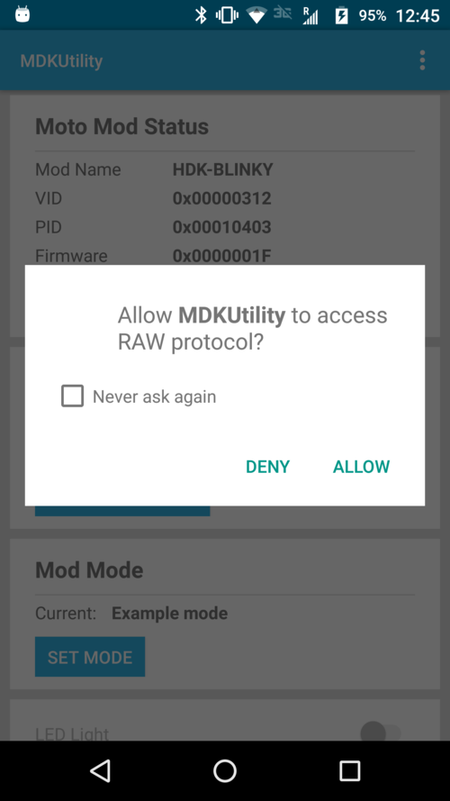
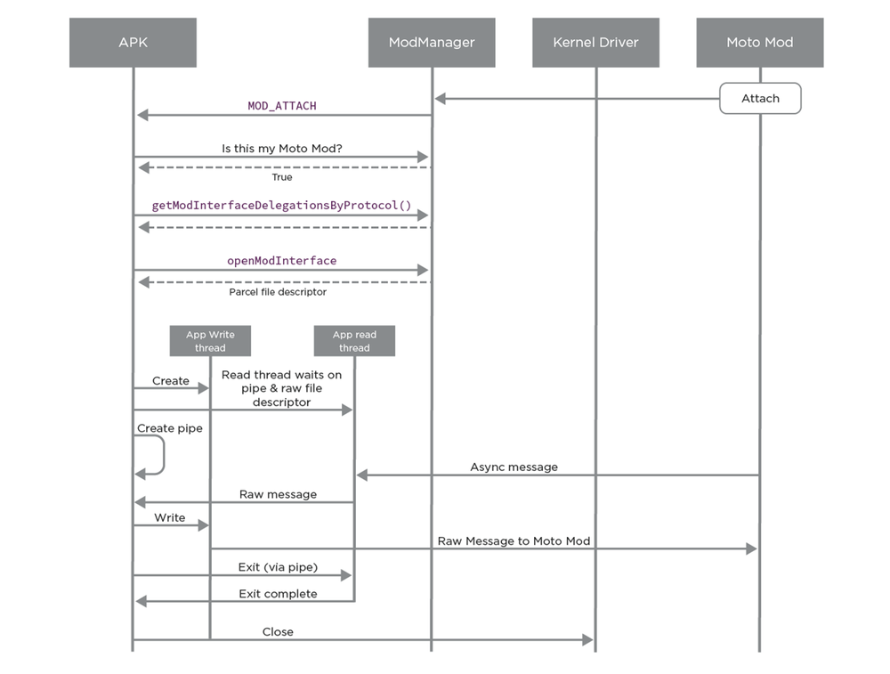

# Moto Z Software: Raw Devices

## API Overview {#api-overview}

The Raw device protocol enables an application to communicate with a Moto Mod over an unstructured data channel. Raw is designed for a wide range of uses, and especially targeted to provide an application direct access to Moto Mod hardware when such access is otherwise not available through standard Android device interfaces.

A application can use the Raw protocol to send and receive data with a Moto Mod. As Raw devices do not appear natively under Android (AOSP) standard API, an application must use the Moto Mod SDK to communicate with a Moto Mod over the Raw protocol.

## Android Prerequisites {#android-prerequisites}

Before using the ModManager classes, you must revise your application’s manifest and add the Mot Mod SDK library to your Android project to link it into your application. See [Setup Your Development Environment](../../build/tools/setup-environment.md).

Applications needing access to the Raw protocol **must declare** the `PERMISSION_USE_RAW_PROTOCOL` permission in their Android manifest.

## Hardware Prerequisites {#hardware-prerequisites}

To be able to test the functions of the Moto Mod SDK, you will also need the Moto Mod MDK as protocol specific functions will only be available if a Moto Mod declaring support for Raw is attached. The Moto Mod must declare support for the greybus Raw interface in its hardware manifest. For more details on the hardware manifest, see the [Firmware section on the Raw protocol](../firmware/raw.md).

## Working with Raw devices {#working-with-raw-devices}

### Raw is an unstructured protocol {#raw-is-an-unstructured-protocol}

The Greybus `Raw` Protocol is used for sending and receiving unstructured data between a Moto Mod device and an Android application on the Moto Z. The data sent is not interpreted by the kernel, but is passed directly to a the application on the device which has gained access to the Raw channel.

The `Raw` protocol should be used to support devices such as streaming sensors, LED arrays, unique hardware on the device, which needs to be driven from a specific APK on the Moto Z.

The Raw channel between a Moto Mod and a device is only available to a single application at a time, to the first application which opens the Raw channel. Communication is not shared between applications. It remains unavailable to another application until it is closed. If an apk tries to open RAW channel while it is in use by another, the open will fail.

As there is no defined data structure for Raw data, it is up to the developer to define it himself and write the code to package and unpackage any data that is transferred between the Moto Mod and a Moto Mod-aware application. Developers who wish to avoid some of the subtle pitfalls of data marshalling, such as differences in machine-to-machine byte ordering and structure alignment, may wish to format raw data in a data interchange medium such as JSON or XML. An application should always verify that the right Moto Mod is attached to the device using the Moto Mod VID and PID, and only open the Raw channel when the matching VID/PID Moto Mod is attached.

### Discovering a Raw device {#discovering-a-raw-device}

Your application can discover a if MotoMod supports Raw devices by listening to an intent to be notified when the user connects a specific MotoMod or by enumerating `ModDevice`.

Enumerating MotoMod devices through the ModManager is useful if you want to get a list of MotoMods which are or have been connected to a device. For more information, refer to the [Mod Management](mod-management.md) documentation.

### Discovering whether a MotoMod supports Raw {#discovering-whether-a-motomod-supports-raw}

Your application can work with the `ModManager` to determine this. After binding to the `ModManager`, an application can use the `ModManager.getModList()` function to retrieve the `ModDevice` which is currently attached to the physical device.

```java
try {
   List<ModDevice> mods = mManager.getModList(false);
   if( mods != null && !mods.isEmpty()){
      // ….
```

After binding to the `ModManager`, an application can use the `ModDevice.getDeclaredProtocols()` function to retrieve the list of supported greybus protocol, `ModDevice.hasDeclaredProtocol()` to check whether this Moto Mod supports Raw, and `getProductID()`/`getVendorID()` to check that the attached Moto Mod VID/PID corresponds to the device they expect to communicate with.

```java
if (device.hasDeclaredProtocol(ModProtocol.Protocol.Raw)) {
    // Yay, this MotoMod has a Raw interface.
```

### Obtaining the Raw Interface {#obtaining-the-raw-interface}

After confirming that the attached `ModDevice` is the one your application wants to communicate with, and that it declares support for the Raw protocol, your application can start communicating with this device over Raw. If an application wants to communicate to a Raw device Moto Mod, it must call `getModInterfaceDelegationsByProtocol(ModProtocol.Protocol.Raw)` to get a handle to the Raw interface.

```java
try {
   List<ModDevice> mods = mManager.getModList(false);
   if( mods != null && !mods.isEmpty()){
     List<ModInterfaceDelegation> devices =
          mManager.getModInterfaceDelegationsByProtocol(mods.get(0),
                ModProtocol.Protocol.Raw);
```

### Obtaining permissions to communicate over Raw {#obtaining-permissions-to-communicate-over-raw}

Before communicating with the Moto Mod device over Raw, your application **must** obtain permission from the user. Your application should always check that it has the `com.motorola.mod.permission.Raw_PROTOCOL` permission before trying to open the Raw device, and ask for a permission grant. If your application does not check and request this permission, you will receive a runtime error if the user denied permission to access the device.

To explicitly obtain permission, first create a [`BroadcastReceiver`](http://developer.android.com/reference/android/content/BroadcastReceiver.html) to listen for the intent that gets broadcast when you call `requestPermission()`. The call to `requestPermission()` displays a dialog to the user asking for permission to access the Raw protocol.



The following sample code shows how to create the use the `requestPermission()` to get permissions to access the Raw interface of a device:

```java
List<ModDevice> devices = mManager.getModList(true);
if (devices != null && !devices.isEmpty()) {
    List<ModInterfaceDelegation> rds =
            mManager.getModInterfaceDelegationsByProtocol(devices.get(0),
            ModProtocol.Protocol.Raw);

    if (rds != null && !rds.isEmpty()) {
        ModInterfaceDelegation raw = rds.get(0);
        if (checkSelfPermission(ModManager.PERMISSION_USE_Raw_PROTOCOL)
                != PackageManager.PERMISSION_GRANTED) {
            requestPermissions(new String[]{ModManager.PERMISSION_USE_RAW_PROTOCOL},
                    RAW_PERMISSION_REQUEST_CODE);
        } else {
            // open raw file descriptor
```

Note: If your Moto Mod enumerates multiple Raw devices, a list of `ModInterfaceDelegation` will be returned and it is up to the application to communicate to the Moto Mod to determine which of the returned interfaces to use.

Once your application has requested permission to access the Raw interface, it needs to handle both cases where permission is either granted or denied by the user as shown below:

```java
public void onRequestPermissionsResult(int requestCode, String[] permissions, int[] grantResults) {
  if (requestCode == RAW_PERMISSION_REQUEST_CODE) {
     if (grantResults[0] == PackageManager.PERMISSION_GRANTED) {
       Log.d(TAG, "Got permission");
       openRawDev(mPendingDevice);
      } else {
     if (DEBUG) Log.e(TAG, "permission "+permissions[0]+" denied");
     }
   ….
```

### Communicating with a Raw device {#communicating-with-a-raw-device}

Once the application has acquired the Raw interface, it can call `openModInterface(raw_interface)` to open the device file corresponding to the raw device. The ModManager will open the device if the application has appropriate permission and return the file descriptor to the app. The app can then read/write directly to the file descriptor.

If another apk has opened this raw channel and has not closed it, the `openModInterface()` call will will return an error.

```java
ParcelFileDescriptor mPfd;

private void openRawDev(ModInterfaceDelegation device){
    try{
        mPfd = mManager.openModInterface(device,
                ParcelFileDescriptor.MODE_READ_WRITE);
        if( mPfd != null){
        // read and write to mPfd
    }
    }catch( RemoteException e){
        Log.e(TAG, "openRawDevice exception " + e);
```

The maximum size of a single write operation is 8192 bytes. Any attempt to write more than 8192 bytes in a single write will result in an error. When reading from the file descriptor, an application must read exactly 8192 bytes. Any attempt to read a different size will fail. The read operation will return the number of bytes actually read.

## Non-Blocking Raw communication

When communicating with a Raw device, an application should set up a read thread and a write thread or an AsyncTask which is different from the main thread, in order not to lock the main UI thread.



### Reading from a Raw device without blocking the main thread {#reading-from-a-raw-device-without-blocking-the-main-thread}

The `read()` on the file descriptor will block until there is data to be read. As long as there is a thread blocking on the read operation, the raw file descriptor cannot be closed.

As shown in the sample code below, we recommend that the application setup a pipe to signal the read thread when it needs to close the file descriptor and the read thread poll on the raw file descriptor and the pipe. If the poll function returns because there is data to be read, the read thread can read the data from the raw file descriptor. But if the poll function returns because of an exit signal from the pipe, the read thread can exit.

```java
//
 // This creates the receiving thread
 //

 private void createReceivingThread(){
  mRecvthread = new Thread() {
    @Override
            public void run() {
                int MAX_BYTES = 8192 ;
                byte[] buffer = new byte[MAX_BYTES];
                FileDescriptor fd = mPfd.getFileDescriptor();
                FileInputStream inputStream = new FileInputStream(fd);
                int ret = 0;
                while(ret >= 0){
                        ret = -1;
                        try{
                            int polltype = blockRead();
                            if( polltype == POLL_TYPE_READ_DATA) {
                                   ret = inputStream.read(buffer, 0, MAX_BYTES);
                              }else if( polltype == POLL_TYPE_EXIT){
                                    Log.d(TAG,"Exiting Read Thread");
                                    break;
                            }
                        }catch(IOException e){
                                    Log.e(TAG, "IOException while reading from raw file " + e);
                        }
                }
                mRecvthread = null;
          };
    mRecvthread.start();
   }

 // 
 // this creates the blocking read thread
 //

 private int blockRead() {
        StructPollfd[] pollfds = new StructPollfd[2];
        StructPollfd readRawFd =  new StructPollfd();
        pollfds[0] = readRawFd;
        readRawFd.fd = mPfd.getFileDescriptor();
        readRawFd.events = (short)OsConstants.POLLIN;

        StructPollfd syncFd = new StructPollfd();
        pollfds[1] = syncFd;
        syncFd.fd = mSyncPipes[0];
        syncFd.events = (short)OsConstants.POLLIN;

        try {
            int ret = Os.poll(pollfds,-1);
            if( ret > 0){
                if( syncFd.revents == OsConstants.POLLIN){
                    //read data
                    byte[] buffer = new byte[1];
                    new FileInputStream(mSyncPipes[0]).read(buffer,0,1);
                    return POLL_TYPE_EXIT;
                }else if(readRawFd.revents == OsConstants.POLLIN){
                    return POLL_TYPE_READ_DATA;
                }else{
                    Log.d(TAG,"unexpected events in blockRead rawEvents:"+readRawFd.revents+
                            " syncEvents:"+syncFd.revents);
                    // error
                    return POLL_TYPE_EXIT;
                }
            }else{
                // error
                Log.d(TAG,"Error in blockRead: "+ret);
            }
        } catch (ErrnoException e) {
            e.printStackTrace();
        } catch (IOException e) {
            e.printStackTrace();
        }
        return POLL_TYPE_EXIT;
    }


 // 
 // this creates the sending thread
 //

 private void createSendingThread(){
    if( mSendingthread == null){
        FileDescriptor fd = mPfd.getFileDescriptor();
        mOutputStream = new FileOutputStream(fd);
        mSendingthread = new HandlerThread("sendingThread");
        mSendingthread.start();
        mHandler = new SendHandler(mSendingthread.getLooper());
   }
 }

//
// This creates the Send Handler
//

private class SendHandler extends android.os.Handler {
  public SendHandler(Looper looper) {
      super(looper);
      }

    @Override
     public void handleMessage(Message msg) {
     switch (msg.what){
               case SEND_MSG:
                   try{
                     byte[] bytes = ((String)(msg.obj)).getBytes();
                        mOutputStream.write(bytes);
                   }catch(IOException e){
                        updateWidgetOnUIThread(mSendingDataLenView, ("Error Sending"));
                       Log.e(TAG, "IOException while writing to raw file" + e);
                    }
                    return;
           }
            super.handleMessage(msg);
        }
    }


//
// To send a message over Raw to the Moto Mod, your application can use
//   Message msg = Message.obtain(mHandler,SEND_MSG);
//   msg.obj = text;
//   mHandler.sendMessage(msg);
//
```

### Terminating communication with a Raw device {#terminating-communication-with-a-raw-device}

A Moto Mod Raw channel is not shared between applications. The ModManager has logic to make sure that a Raw device is only opened by one application at a time. `openModInterface()` will fail if the Raw interface has already been opened.

> **NOTE:** Your application should first signal the read thread on any exit and then call `close()` on the file descriptor when it is done using the Raw interface. **The raw device will not close as long as there is a thread waiting on it**, so the read thread must not be blocked waiting on the read when the application tries to close the raw device. The read thread should use poll to see whether there is data to be read or whether the main thread wants to exit.

```java
void signalReadThreadToExit(){
       FileOutputStream out = new FileOutputStream(mSyncPipes[1]);
        try {
            out.write(EXIT_CODE);
        } catch (IOException e) {
            e.printStackTrace();
        }
    }
```

### Handling Moto Mod Detach Intents {#handling-moto-mod-detach-intents}

A well-behaved Moto Mod-aware application should always listen for the `ACTION_MOD_DETACH` intent and release system resources when it receives the intent.

When a Raw Moto Mod device detaches and has a thread opened to read inbound data on a Raw channel, the application should close the read thread and then close its handle to the Raw channel after the read thread exits. If the application does not have a read thread open, it should still close its Raw channel handle if it is holding one open.

## Structured Raw Example

### Implementing your own protocol on top of Raw

Raw is the simplest form of communication between an application and an MotoMod device. Depending on the type of data exchanged between a MotoMod and its associated APK, a MotoMod developer could augment Raw by providing a more structured message passing on top of the Raw interface.

As an example, assuming the simplest form for messaging is predefined array of bytes for each message, each preceded by a MsgId (to serialize messages) and 4 parameters containing the payload.

<div class="md-typeset__scrollwrap"><div class="md-typeset__table">
<table class="pure-table pure-table-bordered">
<thead>
<tr>
<td>MsgId (2 bytes)</td>
<td>Parameter 1</td>
<td>Parameter 2</td>
<td>Parameter 3</td>
<td>Parameter 4</td>
</tr>
</thead>
<tr>
<td><code>The message ID</code></td>
<td><code>Parameter 1</code></td>
<td><code>Parameter 2</code></td>
<td><code>Parameter 3</code></td>
<td><code>Parameter 4</code></td>
</tr>
</table>
</div></div>

Our application could simply format the message and send as a byte stream over Raw as shown in the code example above. Our application could also use any existing data formatting libraries and send the serialized bytes across Raw. One such option is to pack the message using JSON.

### Sending JSON marshalled content from your Android application {#sending-json-marshalled-content-from-your-android-application}

The application can use the android JSON library for formatting the message and send the output of json.toString() over Raw to the MotoMod. The APK will serialize the JSON content:

```java
JSONObject json = new JSONObject();
json.put(...)
….. // fill in the json object with the data to be sent to AMP 
mOutputStream.write(json.toString().getBytes());
```

### Receiving and decoding serialized JSON content on your Moto Mod {#receiving-and-decoding-serialized-json-content-on-your-moto-mod}

The Moto Mod will recieve content send over the Raw channel and will need to deserialize it.

The Moto Mod firmware can use the [CJSON](https://sourceforge.net/projects/cjson/) library to deserialize the content. In this example, we added the open source CJSON library to our test firmware . To successfully compile CJSON on the Moto Mod firmware, you need to either provide a math library or add the nuttx standard math library to your firmware process by setting `CONFIG_LIBM=y`.

Once CJSON is added to your firmware project, you can decode the received Raw data with the `cJSON_Parse()` API provided by the CJSON library.

```c
static int mods_raw_recv(struct device *dev, uint32_t len, uint8_t data[]){
json=cJSON_Parse(data);
paramObj = cJSON_GetObjectItem(json,name);
value = paramObj->valueint;
}
```

[< Previous Page
**Mod Management**](mod-management.md)

[Next Page >
**Mod Display**](mod-display.md)

## Related references

- [Moto Mods SDK for Android API Reference](http://motorolamobilityllc.github.io/motomods_sdk/com/motorola/mod/package-summary.html)
- [Moto Mods SDK for Android API Reference](http://motorolamobilityllc.github.io/motomods_sdk)
- [Index](http://motorolamobilityllc.github.io/motomods_sdk/index.html)
- [ModListener](http://motorolamobilityllc.github.io/motomods_sdk/index.html?com/motorola/mod/ModListener.html)
- [ModBacklight](http://motorolamobilityllc.github.io/motomods_sdk/index.html?com/motorola/mod/ModBacklight.html)
- [ModBattery](http://motorolamobilityllc.github.io/motomods_sdk/index.html?com/motorola/mod/ModBattery.html)
- [ModConnection](http://motorolamobilityllc.github.io/motomods_sdk/index.html?com/motorola/mod/ModConnection.html)
- [ModContract](http://motorolamobilityllc.github.io/motomods_sdk/index.html?com/motorola/mod/ModContract.html)
- [ModDevice](http://motorolamobilityllc.github.io/motomods_sdk/index.html?com/motorola/mod/ModDevice.html)
- [ModDisplay](http://motorolamobilityllc.github.io/motomods_sdk/index.html?com/motorola/mod/ModDisplay.html)
- [ModInterfaceDelegation](http://motorolamobilityllc.github.io/motomods_sdk/index.html?com/motorola/mod/ModInterfaceDelegation.html)
- [ModManager](http://motorolamobilityllc.github.io/motomods_sdk/index.html?com/motorola/mod/ModManager.html)
- [ModProtocol](http://motorolamobilityllc.github.io/motomods_sdk/index.html?com/motorola/mod/ModProtocol.html)
