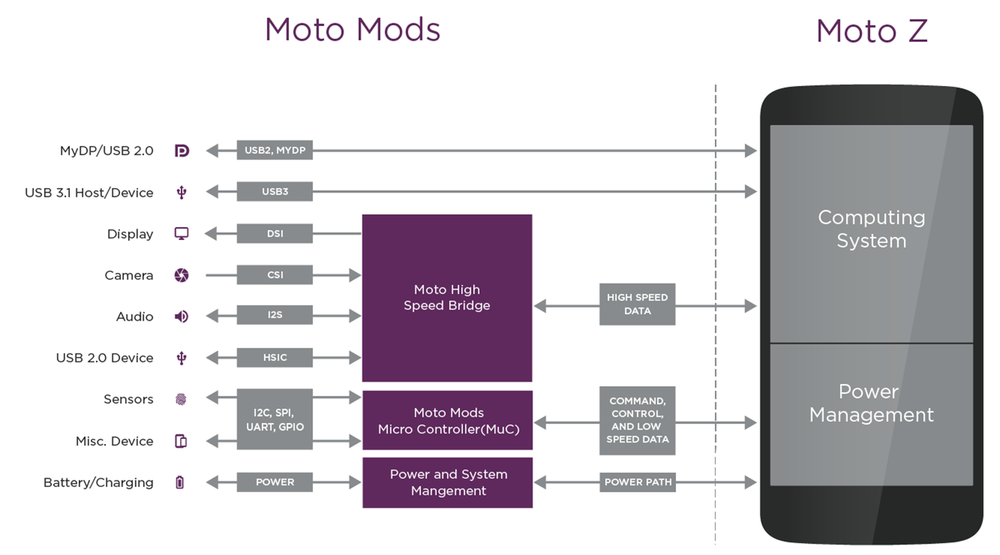
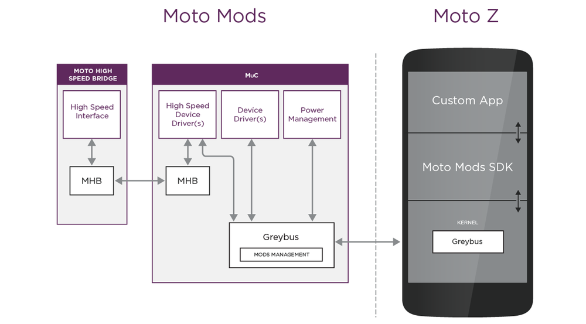

# Moto Mods System Architecture

## Overview

The Moto Mods architecture specifies a uniform and consistent platform for pluggable attachments that act as seamless and natural extensions of the device, the Android OS and the user experience itself.

**The Moto Mods System Architecture**

- Specifies criteria that establish mechanical and electrical interoperability of Moto Mods with the Moto Z smartphone.
- Defines standard interactions between the Moto Z and Moto Mods that cover bootstrap, security, device detection and device enumeration.
- Defines (and the platform delivers) a software stack that extends native Android device interfaces for devices such as display, audio and power to the Moto Mod.
- Defines discrete hardware communication channels to enable control, data and power management information to flow between a Moto Mod and a Moto Z.
- Designates a protocol specifically to allow proprietary communications between a Moto Mod and a Moto Mod-aware application running on the Moto Z.

**The Moto Mods Development Toolkit (MDK)** includes an SDK with the requisite APIs for developing Moto Mod-aware applications that can listen for Moto Mod specific Intents, identify specific Moto Mod types and conduct packet I/O with the Moto Mod directly.

Each Moto Mod has a Moto Mod Microcontroller (MuC). It is responsible for initialization of the Moto Mod interface with the Moto Z, the enumeration of supported protocols, power management and firmware updates. The MuC runs a Moto Mod specific software stack based on the real-time operating system NuttX and Greybus, a network layer designed for modular mobile component architectures.

The Moto High Speed Bridge is used to provide support for high speed, low power interfaces for Moto Mod displays and cameras. High speed data between Moto Bridge and Moto Z travels over a dedicated link. As the MuC is responsible for setting up these high speed links, the Moto Bridge can be powered off when not in use.

At its foundation, the Moto Mods platform uses the Greybus open source protocol to abstract hot-pluggable device drivers into a Moto Mod.  As a network layer, Greybus multiplexes and demultiplexes packets as they flow between the Moto Mod and Moto Z. It enables kernel drivers running on the Moto Mod to be treated as local by the Moto Z application processor.

In many cases, a Moto Mod will behave in a manner that is indistinguishable from a native hardware component on the Moto Z. For example, a Moto Mod speaker system will appear to Android just like any other integrated audio device, and participate in and follow the operating system’s standard audio-routing logic. The Moto Mod system and architecture achieves this by implementing many of the protocols that are native to the Android OS. This relieves the developer from having to write special-purpose Android kernel drivers, framework updates or a unique application to create a fully-functional and commercial-grade Moto Mod.

Conversely, Moto Mods that include custom sensors or USB devices will likely need their own Android application. Your application will link in the [Android SDK](../build/tools/build-from-source.md#build-android-application), and will leverage the [Raw protocol](software/mod-raw-devices.md) to exchange information between your Moto Mod and Moto Z application.

The power path supports the bi-directional flow of power, with the MuC mediating and controlling the flow of power.

## Hardware Interfaces

Moto Mods can be created from a wide variety of interfaces. How you choose to combine them into your custom product is up to you. Table below shows overview of available interfaces and their capabilities.

<table class="pure-table pure-table-bordered">
<thead>
<tr>
<td>Interface</td>
<td>Capabilities</td>
<td>Application</td>
</tr>
</thead>
<tr>
<td><strong>I2C</strong></td>
<td>1 Mbit/s</td>
<td>Low bandwidth, low power</td>
</tr>
<tr>
<td><strong>SPI</strong></td>
<td>15 Mbit/s</td>
<td>Medium bandwidth, low power</td>
</tr>
<tr>
<td><strong>UART</strong></td>
<td>10 Mbit/s</td>
<td>Medium bandwidth, low power</td>
</tr>
<tr>
<td><strong>CSI</strong></td>
<td>6MP raw10 @ 60fps 13MP raw10 @ 24fps</td>
<td>Camera</td>
</tr>
<tr>
<td><strong>I2S</strong></td>
<td>24-bit stereo @ 192kHz</td>
<td>Audio</td>
</tr>
<tr>
<td><strong>DSI</strong></td>
<td>1080p @ 60fps</td>
<td>Video</td>
</tr>
<tr>
<td><strong>MyDP</strong></td>
<td>Video: 4K @ 30fps Audio: 8 channels @ 192kHz</td>
<td>Audio/Video</td>
</tr>
<tr>
<td><strong>USB2.0</strong></td>
<td>480 Mbit/s</td>
<td>USB Devices</td>
</tr>
<tr>
<td><strong>USB3.1</strong></td>
<td>5 Gbit/s</td>
<td>USB Host or Device</td>
</tr>
<tr>
<td><strong>GPIO</strong></td>
<td>General Purpose Input &amp; Output</td>
<td>Interrupts and peripheral control</td>
</tr>
</table>

## Processor Architecture

The Moto Mods platform is built around dual implementations of the Greybus protocol stack, one running on the MuC on the Moto Mod and the other running on the AP on the Moto Z. In this design, the MuC acts as the central point of control, mirroring the role of the AP on the Moto Z.

### MuC Responsibilities

The current MuC is a publicly available ARM7 based Cortex-M4F (including FPU) and supports a variety of flash and RAM sizes. Every Moto Mod developer will need to create unique firmware to control and manage their peripherals.

The MuC handles all attach/detach logic and power control between the Moto Z and Moto Mod. When attached to the Moto Z, the MuC communicates the hardware manifest, describing what Greybus protocols are available. All Greybus protocols terminate at the MuC, which provides the overall control for the Moto Mod. Since some protocols (I2S and USB, for example) can go over multiple pathways, the MuC also communicates the physical path being used, allowing the Moto Z to correctly configure its internal switches.

In many cases, your peripherals will be attached directly to the MuC via standard I2C, SPI, or UART interfaces. Standard GPIOs, analog to digital converters, timers and USB are also available for developers to use. The MuC communicates with these directly and handles translation to the appropriate Greybus protocol.

### Moto High Speed Bridge Responsibilities

Moto provides the current implementation of the high speed bridge in a purpose built IC. The Moto High Speed Bridge is an optional component in the Moto Mod system architecture. It is available to developers who require a high speed interface. The Moto Bridge handles multiplexing and transmission of high-bandwidth interfaces, including DSI, CSI, I2S and HSIC in the most power efficient way.

When your project requires the Moto Bridge, one UART is used for an IPC with the MuC. This link is used by the MuC to set up and control the high speed data link using the Moto Mods High Speed IPC (MHB) protocol. MHB provides data structures and messaging that eliminates the need to customize the Moto Bridge firmware to work with your chosen peripheral. For example, if the display panel you have chosen for your Moto Mod uses DSI messages for brightness control, the MuC will instruct the Moto Bridge to inject the appropriate commands into the DSI stream.

## Terminology

<table class="pure-table pure-table-bordered">
<thead>
<tr>
<td>Acronym</td>
<td>Name</td>
</tr>
</thead>
<tr>
<td><strong>CSI</strong></td>
<td>Camera Serial Interface</td>
</tr>
<tr>
<td><strong>DRM</strong></td>
<td>Digital Rights Management</td>
</tr>
<tr>
<td><strong>DSI</strong></td>
<td>Display Serial Interface</td>
</tr>
<tr>
<td><strong>HID</strong></td>
<td>Human Interface Device</td>
</tr>
<tr>
<td><strong>HSI</strong></td>
<td>High-Speed Synchronous Interface</td>
</tr>
<tr>
<td><strong>HSIC</strong></td>
<td>High-Speed Inter-Chip</td>
</tr>
<tr>
<td><strong>I2C</strong></td>
<td>Inter-Integrated Circuit</td>
</tr>
<tr>
<td><strong>I2S</strong></td>
<td>Integrated Interchip Sound</td>
</tr>
<tr>
<td><strong>IPC</strong></td>
<td>Inter-Process Communications</td>
</tr>
<tr>
<td><strong>MDK</strong></td>
<td>Moto Mods Development Kit</td>
</tr>
<tr>
<td><strong>MHB</strong></td>
<td>Moto High Speed Bridge (IPC Protocol)</td>
</tr>
<tr>
<td><strong>MuC</strong></td>
<td>Moto Mod Microcontroller</td>
</tr>
<tr>
<td><strong>MyDP</strong></td>
<td>Mobility DisplayPort</td>
</tr>
<tr>
<td><strong>SPI</strong></td>
<td>Serial Peripheral Interface</td>
</tr>
</table>

