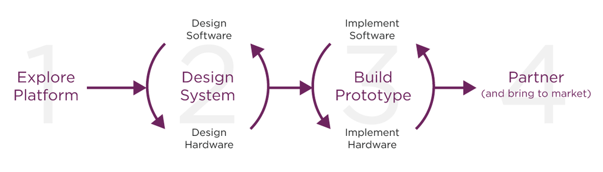
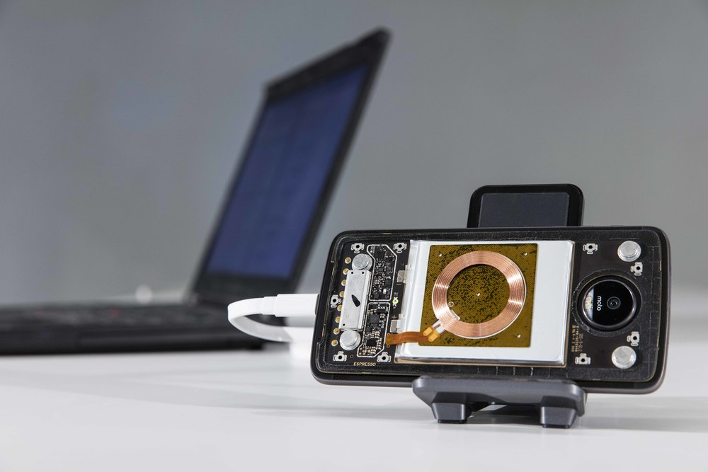

# Moto Mods Developer: Get Started

## Reinvent the smartphone

## Developing with the MDK

Moto provides everything you need to learn about the Moto Mods™ platform, create your product, and take it to market.

To get started, check out the Explore section to learn about the architecture, hardware specs, and software capabilities of the Moto Mods platform.

Bring your idea to life with the Moto Mods Development Kit (MDK). Moto also provides the hardware prototyping platform, an Android SDK to build your own app, and debugging tools to create your prototype.

When you’re ready to take your prototype to market, we’'ve got you covered with our Moto Mod Partner Certification.

## Getting to Hello World!

### To get you started, we've created end-to-end examples that you can use as the basis for your design. These examples include full electrical design, firmware and Android application software for common devices such as a simple sensor, battery, speaker or display. Check out our **[examples](build/examples/index.md)** to learn more.

## Available now

### Sign up for email alerts to be notified of upcoming developer products and news.
