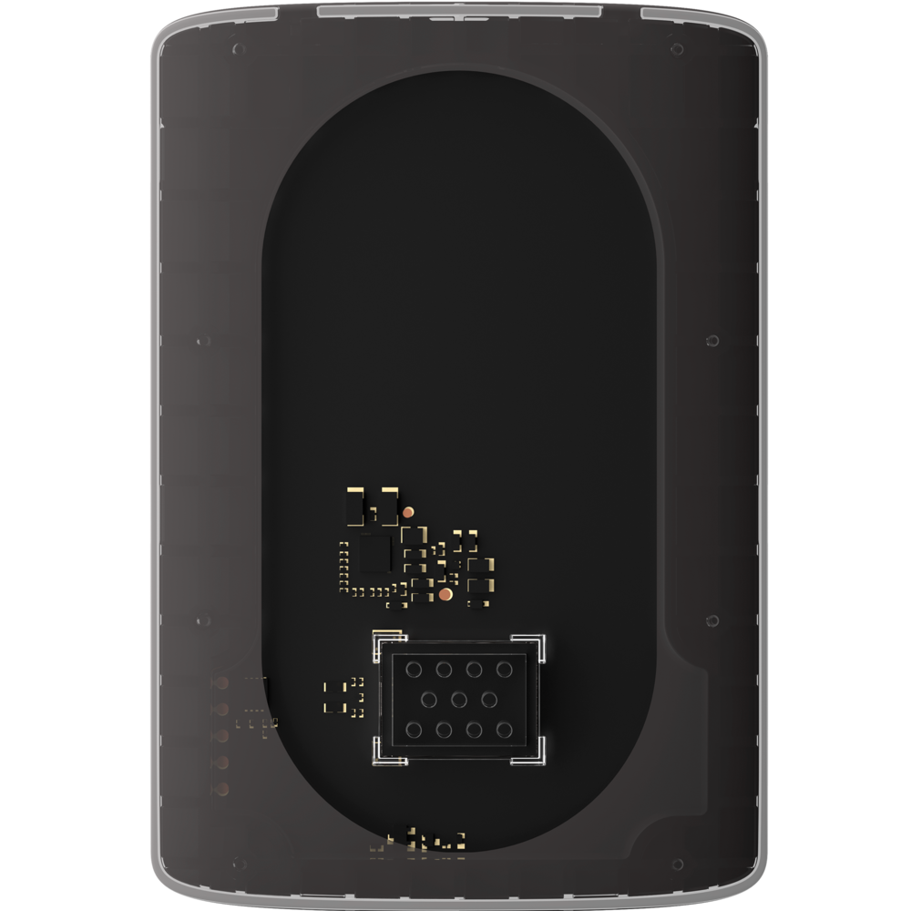
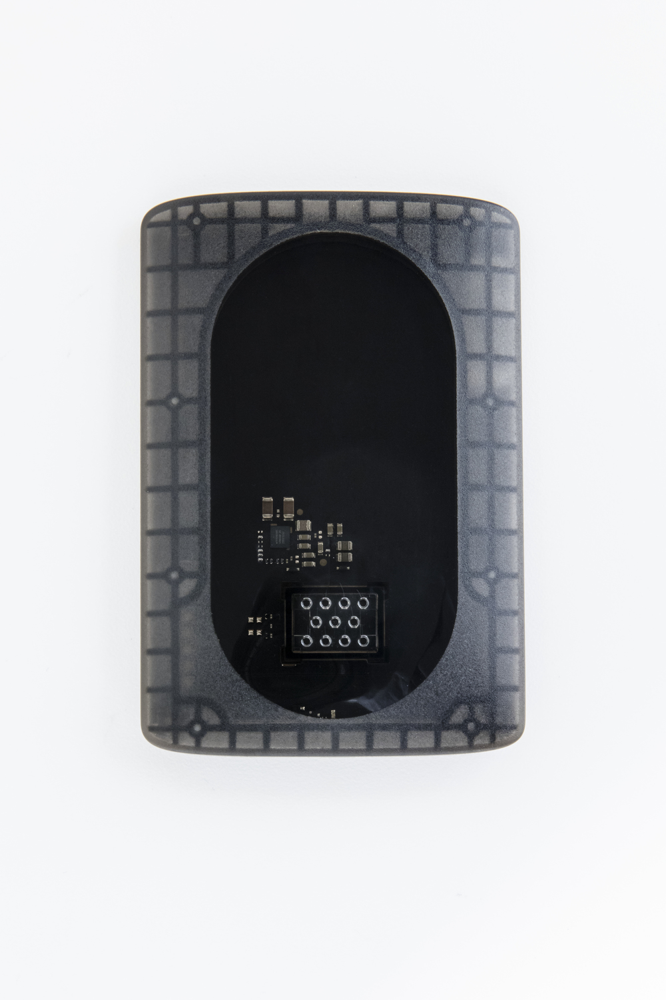
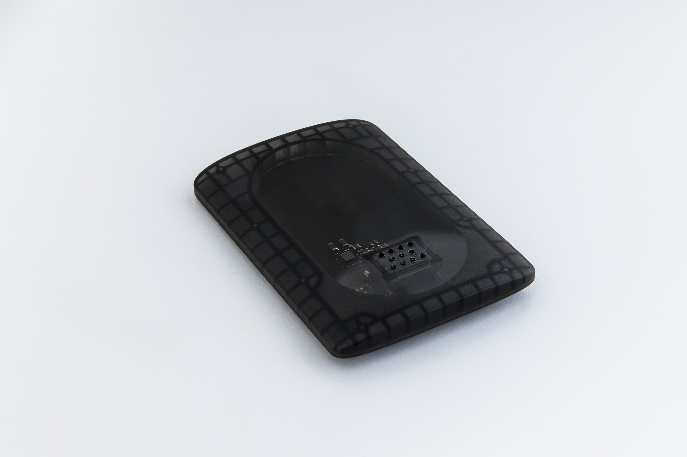

# Audio Personality Card

[← Back to Products](index.md)

## Audio Personality Card

## Audio Personality Card

The Audio Personality Card provides an example of a Moto Mod™ with audio output. The included speaker uses a Class-D amplifier that is controlled using a I2S interface.

This card plugs into the 80 pin connector that comes with the [Reference Moto Mod](mdk.md). While attached, this card will replace the internal [Moto Z](https://jksim.github.io/Moto-Z) loudspeaker. Android audio routing rules remain unchanged, so no 3rd party application is required.

As a developer, you can use this as a reference when designing and building your own Moto Mod prototype that needs it’s own audio connection. The source code for both the Moto Mod firmware and companion Android application is also available for your review and use.

**Documentation**
Technical documentation for this card can be found at the [Build > Examples > **Audio Personality Card** page](../build/examples/audio.md).

**Requirements**
The Audio Personality Card requires a [Moto Z](https://jksim.github.io/Moto-Z) and [Reference Moto Mod](mdk.md).

[< Back to All Products](where-to-buy.md)

Quantity:

Add To Cart
