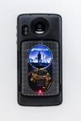
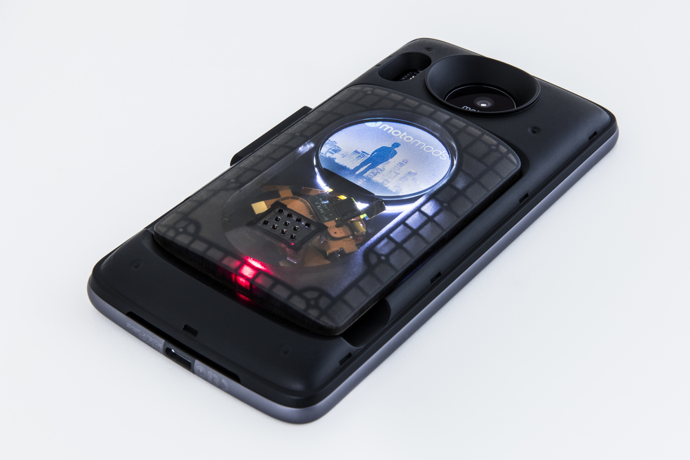
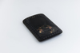

# Display Personality Card

[← Back to Products](index.md)

## Display Personality Card

## Display Personality Card

The Display Personality Card provides an example of a Moto Mod™ with an external display and shows how to interface with and control a display and backlight attached through the Moto High Speed Bridge. The included display uses a single lane DSI with a separate I2C bus used to control the backlight.

This card plugs into the 80 pin connector that comes with the [Reference Moto Mod](mdk.md) and can be used to mirror content or act as a secondary display when using the companion Android application.

As a developer, you can use this as a reference when designing and building your own Moto Mod prototype that needs a secondary display. The source code for both the Moto Mod firmware and companion Android application is also available for your review and use.

**Documentation**
Technical documentation for this card can be found at the [Build > Examples > **Display Personality Card** page](../build/examples/display.md).

**Requirements**
The Display Personality Card requires a [Moto Z](http://www.motomods.com/) and [Reference Moto Mod](mdk.md).

[< Back to All Products](where-to-buy.md)

Quantity:

Add To Cart
