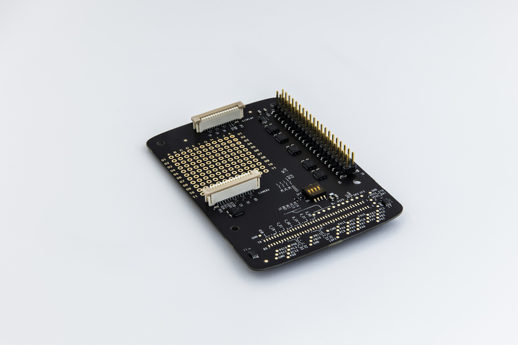

# HAT Adapter Board

[← Back to Products](index.md)

## HAT Adapter Board

## HAT Adapter Board

The HAT Adapter Board enables you to attach a wide variety of Raspberry Pi HATs to your Moto Mods™ Development Kit. It includes the standard 40-pin header, 15-pin camera and 15-pin display header in the exact dimensions and placement.

This card plugs into the 80 pin connector that comes with the [Reference Moto Mod](mdk.md). You will need to port or create the Moto Mod firmware (and associated Android application) to get your chosen HAT up and running.

**Documentation**
Technical documentation for this board can be found at the [Build > MDK User Guide > **HAT Adapter Board**](../build/mdk-user-guide/hat-adapter-board.md) page.

**Requirements**
The HAT Adapter Board requires a [Moto Z](http://www.motomods.com/) and [Reference Moto Mod](mdk.md).

[< Back to All Products](where-to-buy.md)

Quantity:

Add To Cart
