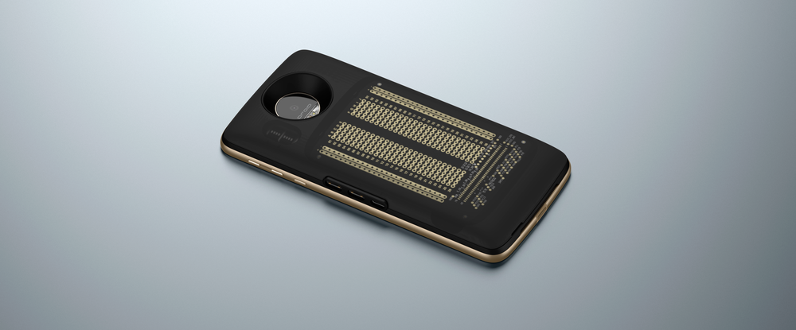
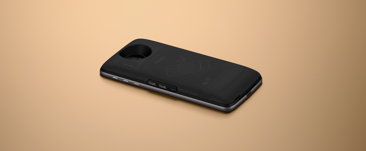
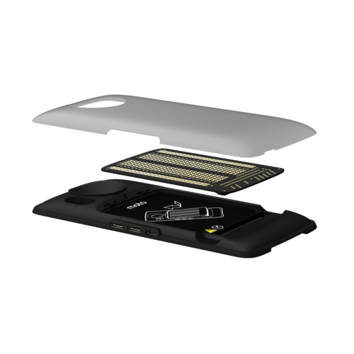

# Moto Mods Development Kit

[← Back to Products](index.md)

## Moto Mods Development Kit

## Moto Mods Development Kit

The Moto Mods Development Kit includes a Reference Moto Mod, a [Perforated Board](perforated-board.md) for you to solder your own components to, and an example cover. Together with a [compatible Moto Z](https://jksim.github.io/Moto-Z), the MDK is the starting point for developing your own Moto Mod prototype.

On the Reference Moto Mod board, we’ve included a µUSB-B port (can also be used for Mobility Display Port), USB-C, and connector interface that exposes all key interfaces.

The Reference Moto Mod includes:

- Mechanical and Electrical Interface to enable connection with Moto Z
- Moto Mod Microprocessor (MuC) with 96k ROM
- Moto High Speed Bridge
- 80 pin connector exposing all developer interfaces

**Documentation**
Technical documentation for the MDK can be found at the following pages:

- [Build > MDK User Guide > **Reference Moto Mod**](../build/mdk-user-guide/reference-moto-mod.md)
- [Build > MDK User Guide > **Perforated Board**](../build/mdk-user-guide/perforated-board.md)

**Requirements**
The Moto Mods Development Kit requires a [Moto Z](https://jksim.github.io/Moto-Z).

[< Back to All Products](where-to-buy.md)

Quantity:

Add To Cart
