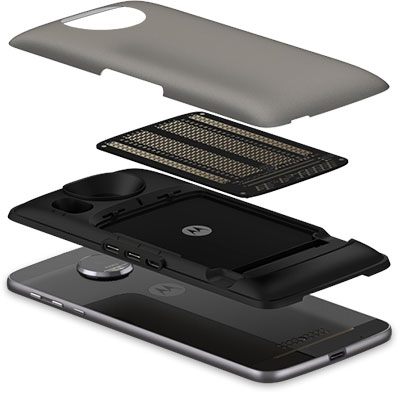
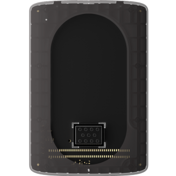
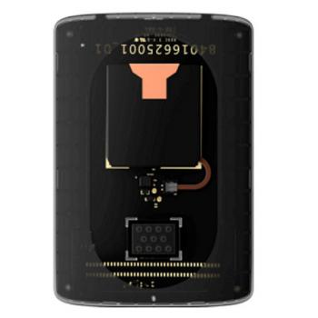
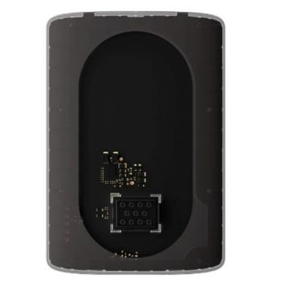

# Tools & Kits

## Moto Mods Development Kit

The Moto Mods Development Kit includes a Reference Moto Mod, a Perforated Board for you to solder your own components to, and an example cover. Together with a compatible Moto Z, the MDK is the starting point for developing your own Moto Mod prototype.

On the Reference Moto Mod board, we've included a µUSB-B port (can also be used for Mobility Display Port), USB-C, and connector interface that exposes all key interfaces.

The Reference Moto Mod includes:

- Mechanical and Electrical Interface to enable connection with Moto Z
- Moto Mod Microprocessor (MuC) with 96k ROM
- Moto High Speed Bridge
- 80 pin connector exposing all developer interfaces

[Documentation](../build/mdk-user-guide/reference-moto-mod.md)

[Buy](https://www.element14.com/community/docs/DOC-82858?ICID=Moto-Mods-Featured-Product)

## MDK Personality Cards

### Temperature Sensor

The Temperature Sensor Personality Card provides an example of a Moto Mod™ with a custom sensor. It incorporates a widely used thermistor.

This plugs into the 80 pin connector that comes with the Reference Moto Mod and displays real-time temperature on the companion Android application.

As a developer, you can use this as a reference when designing and building your own Moto Mod prototype that needs a custom sensor. The source code for both the Moto Mod firmware and companion Android application is also available for your review and use.

[Documentation](../build/examples/sensor.md)

[Buy](https://www.element14.com/community/docs/DOC-82912/l/moto-mods-temperature-sensor-personality-card )

### Battery Personality Card

The Battery Personality Card provides an example of a Moto Mod™ with a rechargeable battery that serves the purpose of extending the battery life of a Moto Z smartphone. It can also be used as an example of how to provide autonomous power to a Moto Mod when not connected to a Moto Z. For this example card, a 300 mAh Lithium Ion battery is included along with a commonly used fuel gauge and charge IC.

This card plugs into the 80 pin connector that comes with the Reference Moto Mod.

As a developer, you can use this as a reference when designing and building your own Moto Mod prototype that needs it’s own battery connection. The source code for both the Moto Mod firmware and companion Android application is also available for your review and use.

[Documentation](../build/examples/battery.md)

[Buy](https://www.element14.com/community/docs/DOC-82910/l/moto-mods-battery-personality-card )

### Audio Personality Card

The Audio Personality Card provides an example of a Moto Mod™ with audio output. The included speaker uses a Class-D amplifier that is controlled using a I2S interface.

This card plugs into the 80 pin connector that comes with the Reference Moto Mod. While attached, this card will replace the internal Moto Z loudspeaker. Android audio routing rules remain unchanged, so no 3rd party application is required.

As a developer, you can use this as a reference when designing and building your own Moto Mod prototype that needs it’s own audio connection. The source code for both the Moto Mod firmware and companion Android application is also available for your review and use.

[Documentation](../build/examples/audio.md)

[Buy](https://www.element14.com/community/docs/DOC-82892/l/moto-mods-audio-personality-card )
