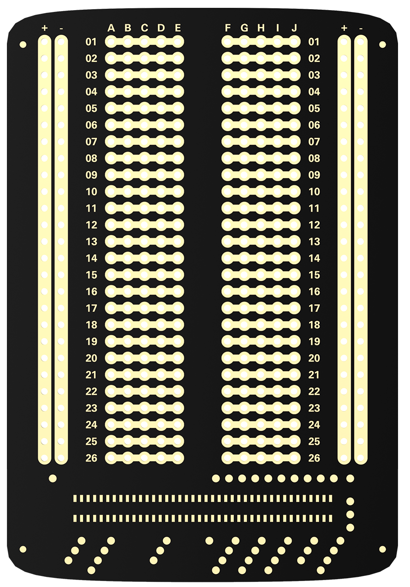
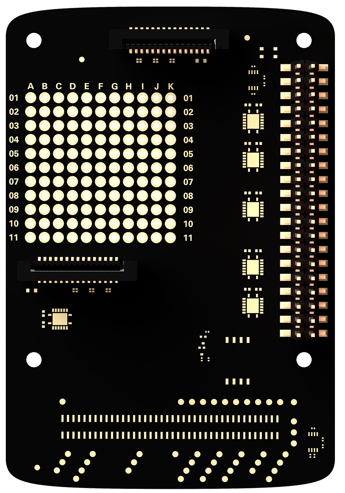
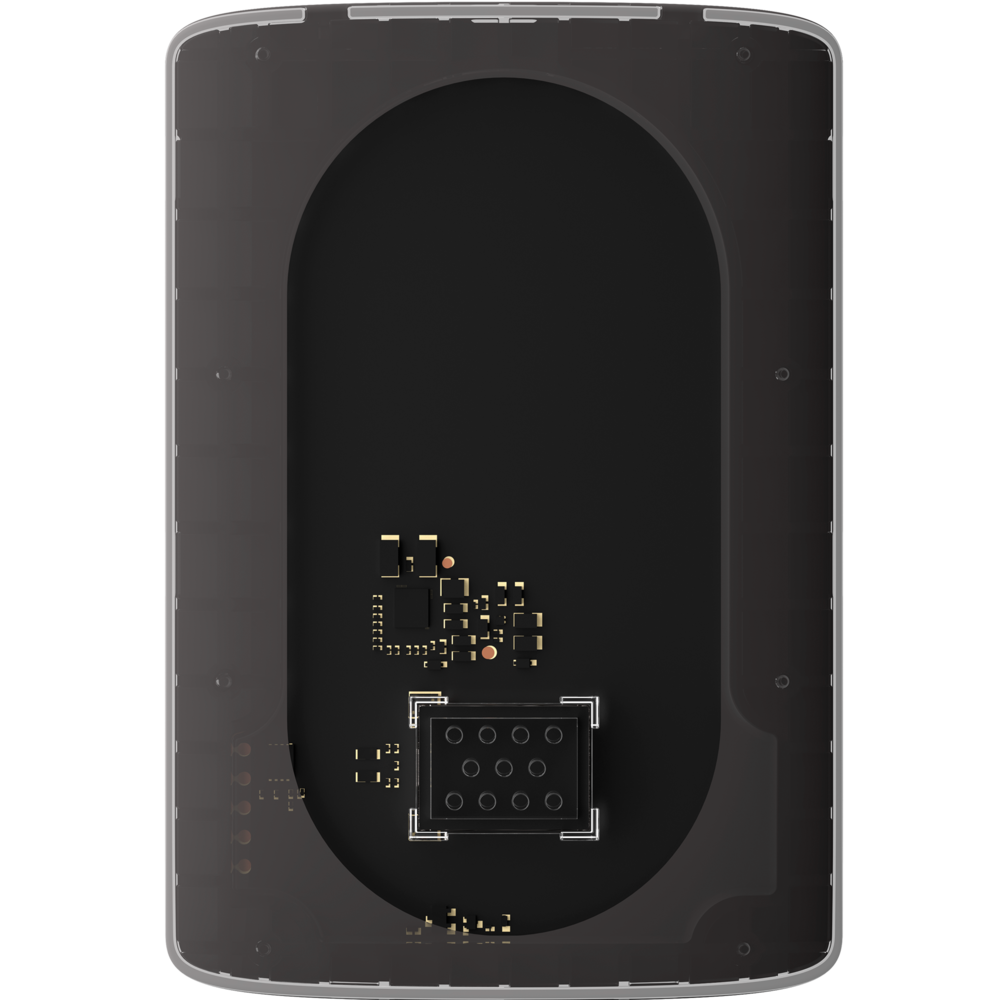
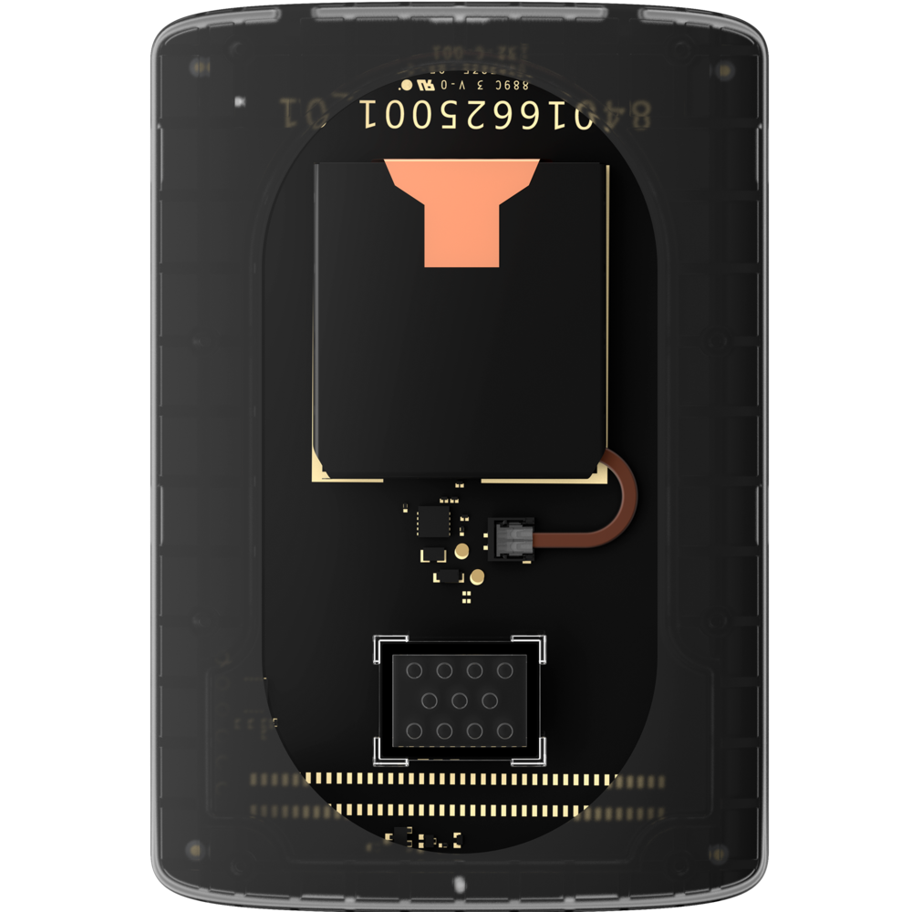
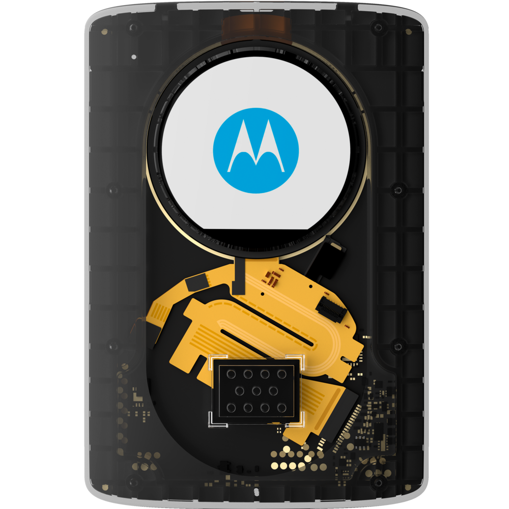
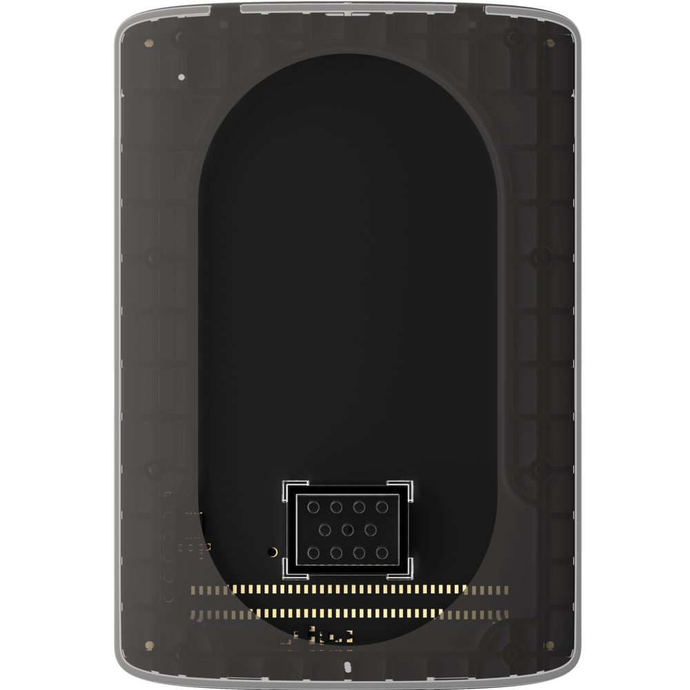

# Moto Mods Developer: Buy

## Moto Mods Development Kit

### The Moto Mods™ Development Kit (MDK) includes a Reference Moto Mod, Perforated Board, and cover. Together with a Moto Z, the MDK is the starting point for developing your own Reference Moto Mod.

## Developing with the MDK requires any Moto Z smartphone.

## Perforated Board

The Perforated Board is the primary vehicle for developing of your MDK Project. One is included with the MDK.

## HAT Adapter Board

The HAT Adapter Board allows you to use existing Raspberry Pi HATs with the MDK.

**Raspberry Pi is a trademark of the Raspberry Pi Foundation*

## Personality Cards

Personality Cards connect directly to the Reference Moto Mod and serve as great examples of how you can build your own prototype.

Each of these Personality Cards is a end-to-end example with Open-Sourced Moto Mod firmware and an Android app.

**Audio Personality Card**

Shows how to integrate a speaker and audio output into your MDK Project.

**Battery Personality Card**

Shows how to integrate a rechargeable battery into your MDK Project.

**Display Personality Card**

Shows how to integrate a display and backlight into your MDK Project.

**Temperature Sensor Personality Card**

Shows how to integrate a custom temperature sensor into your MDK Project.

> ### Sign up for email alerts to be notified of upcoming developer products and news.
