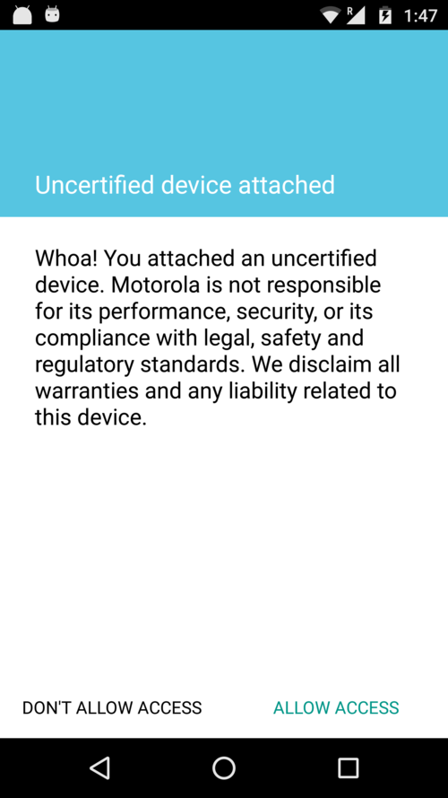

# Partner: Certification Guidelines

[Overview](index.md)

**[Guidelines](certification-guidelines.md)**

[Contact Form](contact.md)

## Partner Certification Guidelines

### Ensuring Safety + Trust

We have opened the full power of Moto Mods™ for you to be able use your innovation and imagination to create amazing experiences. This power comes with responsibility. We have designed the following guidelines to help maintain this trusted ecosystem. Projects that do not adhere to these guidelines will not be certifiable by Moto.

#### User Data {#user-data}

You must be transparent to the end user in how you handle user data, including disclosing the collection, use, and sharing of the data and you must limit use of the data to the description of the intended use.

#### Device and Network Abuse {#device-and-network-abuse}

Your project may not interfere with, disrupt, damage, or access in an unauthorized manner the user’s device, other devices or computers, servers, or networks including carrier’s network.

#### Deceptive or Malicious Behavior {#deceptive-or-malicious-behavior}

We will not certify projects that secretly monitor or harm users, attempt to deceive users or are otherwise malicious.

#### Lawfulness {#lawfulness}

Projects determined to be unlawful in locations where they are intended for use will not be certified. You are solely responsible for determining the legality of your project in its targeted locale

#### Intellectual Property {#intellectual-property}

Projects that impersonate other entities, brands or otherwise infringe on intellectual property rights of others will not be certified.

### Questions About Qualifying for Certification?

[Contact us](contact.md) and we can help you navigate this process - even if you haven’t started developing yet.

### Development Without Certification

You can create a fully working Moto Mod prototype without going through certification. You should contact us to begin certification as you near completion.

There are precautions in place (on Moto Z phones) that prevent non-certified devices from interfacing with the Moto Z. These behaviors and interactions are similar to how Android handles 3rd party APKs that aren’t installed via the Google Play Store. These precautions can be bypassed only if the user gives explicit permission. This allows you, as a developer, to test and use your non-certified prototype with a Moto Z – before any certification takes place.

This screenshot shows what the user sees on the Moto Z when a non-certified prototype or device is attached to a Moto Z:

These behaviors and interactions are similar to how Android handles 3rd party APKs that aren’t installed via the Google Play Store.

### Ready to get started?

Fill out our [partnership form](contact.md) to contact us about the Moto Mods Partner Certification Program.
