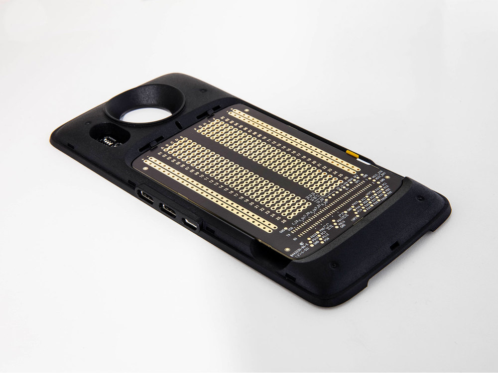
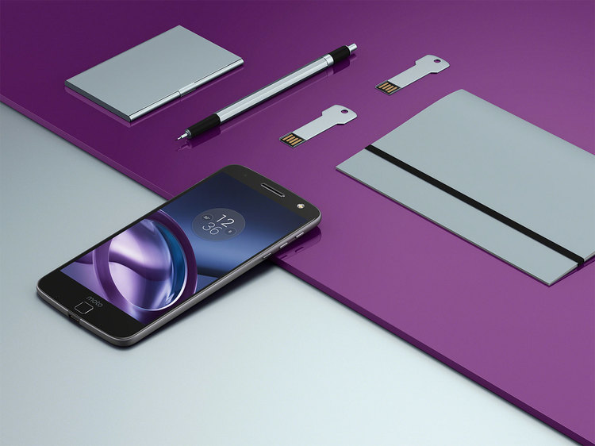

# Moto Mods Developer: Support

## Welcome to Moto Mods support

**Forums**

The official Moto Mods™ Developer forum is available [here](https://www.element14.com/community/groups/moto-mods)

**Documentation**

Visit our **[Explore](../explore/index.md)** and **[Build](../build/index.md)** pages for comprehensive documentation on the hardware and software development available using the Moto Mods Development Kit

Also be sure to check out our [**FAQs**](faq.md)

**Contact Us**

Still having problems or need to get in touch? Contact us at **[mdk-help@motorola.com](mailto:mdk-help@motorola.com)**

Ready to partner with Moto? Head over to our [**contact form**](../partner/certification-program.md) to get in touch

## Available now

### Sign up for email alerts to be notified of upcoming developer products and news.
